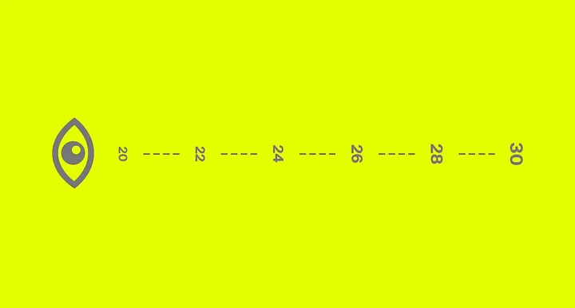
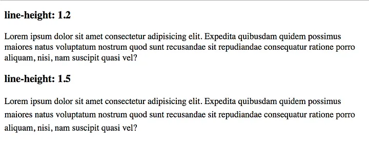
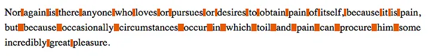

> [Korean FE Article Team](https://kofearticle.substack.com/about?utm_source=substack&utm_medium=email) 에서 번역해주는 FrontEnd 소식을 아카이브 하였습니다.

# 접근성을 고려하여 CSS 작성하기

## 소개

접근성(Accessibility)을 고려하여 개발하는 것은 검색 엔진 최적화와 사용자 경험 향상을 넘어서 법적 요구사항이나 사회적 책임을 이행하는 매우 중요한 업무입니다.

이 글은 특히 CSS를 이용하여 접근성을 향상하는 방법에 대해 소개하고 있습니다. 시리즈로는 “접근성을 고려하여 HTML 작성하기”, “접근성을 고려하여 JavaScript 작성하기”가 있습니다. 2017년에 작성되어 오랜 시간이 지났음에도 여전히 유용한 정보를 제공하고 있어 번역하여 소개하게 되었습니다.

:::info 목차

- 가독성 있는 텍스트에서 읽기 쉬운 텍스트로
- 가상 요소에 콘텐츠 신중하게 사용하기
- 화면만이 유일한 매체가 아니다
- 완전히 지원되지 않는 속성 값에 대한 대안
- 콘텐츠를 숨기는 여러 가지 방법
- 나쁜 대비는 신뢰할 수 없다
- 색상이 정보의 유일한 단서가 되어서는 안 된다
- 순서에 신경 쓰기
- 중요한 것에 집중하기: focus
- 그리드와 평평한 문서 구조

:::

<!--truncate-->

CSS를 사용하여 웹사이트와 앱의 접근성을 향상시키는 데 도움이 되는 팁에 대한 소개입니다.

이 글은 [러시아어](https://medium.com/@ABatickaya/%D0%B4%D1%83%D0%BC%D0%B0%D1%8F-%D0%BE-%D0%B4%D0%BE%D1%81%D1%82%D1%83%D0%BF%D0%BD%D0%BE%D1%81%D1%82%D0%B8-%D0%BF%D0%B8%D1%88%D0%B5%D0%BC-css-9032d7b64fb2)(역자: [Workafrolic](https://medium.com/@ABatickaya)), [포르투갈어](https://maujor.com/tutorial/escrevendo-css-com-acessibilidade-em-mente.php)(역자: [Maujor](https://maujor.com/)), 그리고 [일본어](https://frasco.io/writing-css-with-accessibility-in-mind-4fc82b26aecb)(역자: [Keita Nakanishi](https://twitter.com/nakanishy))로 번역되었습니다.

읽기를 선호하지 않는다면, **CSS Conf Budapest**에서 이 글의 대부분에 대해 이야기한 [녹음본](https://www.youtube.com/watch?v=EOiC2M47GBY)을 들을 수 있습니다.

약 1년 전, 저는 웹 접근성에 좀 더 집중하기 시작했습니다. 저에게 가장 효과적인 학습 방식은 다른 사람들을 가르치는 것입니다. 이것이 바로 제가 [밋업과 컨퍼런스](https://speakerdeck.com/matuzo/)에서 발표하고, 이 주제에 대한 글을 쓰는 이유 중 하나입니다. 저는 **Smashing Magazine**에 [점진적인 향상](https://www.smashingmagazine.com/2017/07/enhancing-css-layout-floats-flexbox-grid/), 그리고 접근성 기초에 대해 **Medium**에 글을 작성했습니다. 이 글은 접근성 팁 모음 시리즈 중 세 번째 글입니다. 관심이 있다면 특별한 순서 없이, [접근성을 고려하여 HTML 작성하기](https://medium.com/alistapart/writing-html-with-accessibility-in-mind-a62026493412)와 [접근성을 고려하여 자바스크립트 작성하기](https://medium.com/@matuzo/writing-javascript-with-accessibility-in-mind-a1f6a5f467b9)를 지금이나 나중에 읽어보면 좋습니다.

<hr/>

접근성을 고려하여 CSS 작성하기

CSS를 사용하여 문제를 해결하는 무한한 방법과 다양한 속성이 우리의 삶을 더 쉽게 만들어주지만, 동시에 사용자의 경험을 악화시킬 수도 있습니다. 사실, [단 세 줄의 CSS](http://outlinenone.com/) 만으로 웹사이트에 접근하기 어렵게 만들 수 있습니다.

이 글에서는 접근성 있는 CSS를 작성하는 데 도움이 될만한 기술과 고려 사항 그리고 접근방식을 모두 모았습니다. 이 컬렉션은 기본 개념과 잘 알려진 속성으로 시작하여, 끝에는 좀 더 새로운 것들을 다룹니다.

## 가독성 있는 텍스트에서 읽기 쉬운 텍스트로

이미지, 아이콘, 동영상은 오늘날 웹 디자인에서 빼놓을 수 없는 요소이지만, 여전히 거의 모든 웹사이트에서는 텍스트가 콘텐츠의 대부분을 차지합니다. 텍스트는 어떤 기기에서든 읽을 수 있어야 하기 때문에, 폰트 속성을 스타일링하고, 테스트하며, 미세 조정하는 데 상당한 시간을 할애하는 것이 중요합니다.

### 글꼴 크기 확대



사용자가 화면에서 떨어진 거리에 따라 글꼴 크기는 확대해야 합니다 ([출처: Marvel](https://blog.marvelapp.com/body-text-small/))

한때 [12px 글꼴 크기가 본문(body) 텍스트의 표준이었지만](https://www.smashingmagazine.com/2011/10/16-pixels-body-copy-anything-less-costly-mistake/), 해상도가 높은 기기의 등장으로 평균 글꼴 크기는 한동안 15에서 18px 사이에 정착했습니다. 최근 몇 년간, 글꼴 크기는 다시 20px 이상으로 상승했으며, 이는 좋은 일입니다. 텍스트는 스마트폰에서 충분히 커야 하며, TV와 같은 큰 화면에서 멀리서도 읽을 수 있도록 화면 크기에 따라 확대해야 합니다.

서체의 특성이 매우 다양하기 때문에 표준의 최소 크기를 정의하는 것은 의미가 없지만, 작은 화면 크기에 좋은 시작점은 아마도 18-20px일 것입니다.

물론 글꼴 크기에 대해 더 많이 말할 수 있지만, 이 글에서 다루기에는 너무 많습니다. 자세한 내용은 [Christian Miller](https://twitter.com/xtianmiller)의 [당신의 Body 텍스트는 너무 작습니다](https://blog.marvelapp.com/body-text-small/)를 읽어보시길 권장합니다.

### 라인 높이(line-height) 설정

브라우저의 기본 라인 높이는 대략 **`1.2`**입니다. [웹 콘텐츠 접근성 지침](https://www.w3.org/TR/2008/REC-WCAG20-20081211/#visual-audio-contrast-visual-presentation)에 따르면, 텍스트 블록 내의 문단에서는 최소 **`1.5`**여야 합니다.



_`line-height`가 1.2인 문단과 1.5인 문단 비교_

문단 내 라인 높이가 조정된 텍스트는 가독성이 향상될 뿐만 아니라, 시각적으로도 꽤 더 매력적입니다.

### 텍스트를 왼쪽 또는 오른쪽으로 정렬



양쪽 정렬된 텍스트의 불규칙한 단어 간격

양쪽 정렬이 왼쪽 또는 오른쪽 정렬된 텍스트보다 보기 좋다고 생각하는 사람들도 있지만, 이는 나쁜 관행으로 간주됩니다. `text-align: justify`는 같은 길이의 줄을 만들기 위해 단어 간격을 조정합니다. 이러한 불균일한 공백은 가독성을 해칠 수 있으며 매우 산만해질 수 있습니다. 필요한 경우 단어를 구분하는 것도 해결책이 될 수 있지만, [CSS 하이픈](https://developer.mozilla.org/en-US/docs/Web/CSS/hyphens?redirectlocale=en-US&redirectslug=CSS%2Fhyphens#Languages_support_notes)은 잘 지원되지 않고 예상대로 작동하지 않을 수 있습니다.

### 문단 너비 정의

여러 출처에 따르면 디자이너들은 [줄당 45에서 85자](https://www.smashingmagazine.com/2014/09/balancing-line-length-font-size-responsive-web-design/#line-length-measure-and-reading)를 유지해야 한다고 합니다. 이상적인 문단 너비는 65자라고 여겨집니다.

텍스트 블록의 너비를 정의할 때 ch 단위가 유용할 수 있습니다. `1ch`는 숫자 0을 나타내는 문자의 너비와 동일합니다. 또한, `font-family` 또는 `font-size`가 변경되면 이에 따라 변경됩니다.

```css
p {
  /* 최대 너비 65자 */
  max-width: 65ch;
}
```

어떠한 종류의 반응형 타이포그래피 기술을 사용한다면, 매우 큰 화면에서 사이트를 테스트해야 합니다. 글꼴 크기에 제한이 없다면, 특정 뷰포트 크기에서 텍스트가 읽기 어려워질 수 있습니다. 제한을 설정하는 방법이나 반응형 타이포그래피에 익숙하지 않다면, [Mike Riethmullers](https://twitter.com/MikeRiethmuller)의 글 [반응형 타이포그래피에 대한 정밀한 제어](https://madebymike.com.au/writing/precise-control-responsive-typography/)를 읽어보시기 바랍니다.

## 가상 요소에 콘텐츠 신중하게 사용하기

우리는 `::before`와 `::after`라는 가상 요소를 사용하여 요소의 맨 처음이나 맨 끝에 CSS를 추가할 수 있습니다. 이것은 디자인 요소를 우리 컴포넌트에 추가하는 매우 일반적이고 편리한 방법을 제공하지만, `content` 속성을 사용하여 내용을 추가하는 것도 가능합니다. 관심사의 분리의 관점에서 보면, 우리는 이렇게 하지 않아야 합니다.
