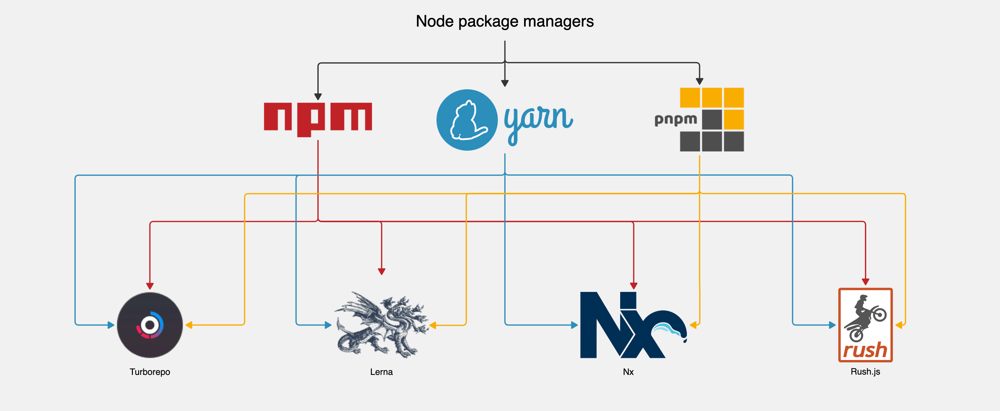
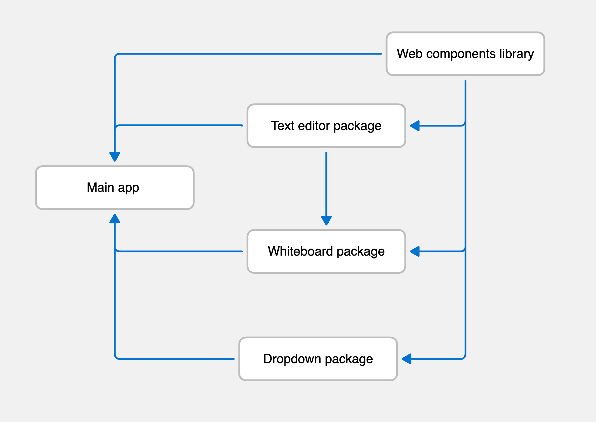

> [Korean FE Article Team](https://kofearticle.substack.com/about?utm_source=substack&utm_medium=email) 에서 번역해주는 FrontEnd 소식을 아카이브 하였습니다.

# 수많은 저장소를 하나로 - 자바 스크립트 코드를 모노레포로 이동하기

- 원문: https://www.aha.io/engineering/articles/monorepo
- 번역글: https://velog.io/@superlipbalm/monorepo?utm_source=substack&utm_medium=email

## 소개

Aha!에 입사한 글쓴이가 왜 모노레포를 필요로 하게 되었는지, 그 과정에서 어떠한 고민들을 했는지, 그리고 어떤 방법을 사용해 모노레포로 전환했는지 자세히 설명하고 있습니다. 모노레포 도입을 고민중이시라면 이 글을 한 번 읽어보시면 도움이 되실겁니다.

:::info 목차

1. 모노레포가 필요한가요?
2. 모노레포가 필요한데 이제 어떻게 하죠?
3. Git 기록 유지 관리
4. 단순함을 유지하기
5. Nx + pnpm
6. pnpm 워크스페이스
7. Turborepo + pnpm
8. 새로 배울 것이 없습니다
9. 잘 작동합니다!

:::

<!--truncate-->

## 모노레포가 필요한가요?

처음 Aha에 입사했을 때 [엔지니어링 온보딩](https://www.aha.io/engineering/articles/engineering-onboarding-at-aha) 프로그램이 굉장히 체계적으로 구성되어 있어 놀랐습니다. 저는 몇 주 동안 모든 팀과 친해지고 시스템의 각 부분을 배우는 데 시간을 보냈습니다. 그 당시엔 사실 이러한 온보딩 과정이 기본적인 기술 지식 이상의 것을 제공한다는 것을 몰랐습니다. 그들은 전체 개발 워크플로에 대한 문을 열어주었죠. 웹 컴포넌트 라이브러리의 간단한 스타일 변경에 두 번의 풀 리퀘스트와 30분이 걸리는 것을 보고 뭔가 이상한 문제점이 있다는 것을 알았습니다.

모든 제품이 하나의 Rails 저장소에 존재하므로 비즈니스 로직, UI 등을 공유하는 다중 프로덕트 [모놀리스(multiproduct monolith)](https://www.aha.io/engineering/articles/from-one-many-building-a-product-suite-with-a-monolith)를 운영한다고 해도 과언이 아닙니다. 따라서 제품과 관계없이 새로운 기능을 쉽고 빠르게 작업할 수 있습니다. 이와 대조적으로, 예전에는 대부분의 자바스크립트 코드가 프라이빗 npm 패키지로 존재했습니다. 프라이빗 패키지는 여러 곳에서 코드를 재사용하는 데는 좋지만, 한 곳에서 주로 사용하는 경우에는 프로세스에 너무 많은 오버헤드가 추가되므로 최선의 선택이 아닙니다. 저희의 경우 대부분의 패키지를 Rails 모놀리스로만 가져왔습니다.

Aha의 엔지니어링팀은 [인터럽트 주도(interrupt driven)](https://www.aha.io/company/the-responsive-method)로, 필요에 따라 컨텍스트를 쉽게 전환하고 버그를 해결하거나 팀원을 지원하거나 다른 작업을 할 수 있는 [도구](https://www.aha.io/engineering/articles/cli-tools-at-aha)를 만들기 위해 큰 노력을 기울이고 있습니다. 프라이빗 npm 패키지를 작업하는 프로세스는 전혀 인터럽트 주도적이지 않았습니다. 프라이빗 패키지 중 하나를 작업해야 한다면 웹 컴포넌트 라이브러리에서 스타일을 변경하는 것처럼 간단한 작업이라도 상당한 시간이 소요될 것이 분명했습니다.

지루할 수도 있지만 수동 프로세스는 매우 간단했습니다.

1. 패키지의 저장소를 복제합니다.
2. 알맞은 node 버전으로 npm 종속성 패키지들을 설치합니다.
3. 로컬 개발 환경을 시작합니다.
4. 코드베이스를 변경합니다.
5. 패키지의 로컬 개발 환경에서 변경 사항을 테스트합니다.
6. yalc를 사용하여 변경 사항이 적용된 패키지를 Rails 앱에 연결합니다.
7. 로컬 앱 환경에서 변경 사항을 테스트합니다.
8. 변경 사항에 만족할 때까지 4단계부터 7단계까지 반복합니다.
9. 프라이빗 패키지 저장소에 새 변경 사항이 포함된 풀 리퀘스트를 만듭니다.
10. 코드 리뷰를 요청합니다.
11. 코드 리뷰가 완료되면 풀 리퀘스트를 머지하고 패키지의 새로운 버전을 npm에 푸시합니다.
12. Rails 앱에서 풀 리퀘스트를 생성하여 패키지 버전을 올립니다.
13. 코드 리뷰를 요청합니다.
14. 코드 리뷰가 완료되면 풀 리퀘스트를 머지하고 프로덕션에 배포합니다.

프라이빗 npm 패키지와 관련된 모든 것을 배포하는 데 걸리는 시간은 생각했던 것보다 훨씬 길었고, 코드 리뷰를 두 번 요청하는 것 또한 리뷰어의 시간을 빼앗는 일이었습니다. 입사 첫 몇 주 동안은 이 문제에 대해 들어본 적도 없었습니다. 하지만 Aha에서 처음 몇 달 동안 여러 프라이빗 npm 패키지로 계속 작업하면서 이것이 개발자 경험을 정말 저하한다는 것을 금방 깨달았습니다.

## 모노레포가 필요한데 이제 어떻게 하죠?

이 문제를 직접 경험하고 나니 어떤 조치든 취해야겠다는 생각이 들었습니다. 저희는 회의가 많지는 않지만 매주 매니저와 함께 회의를 진행합니다. 이 시간은 앞으로 어떤 작업을 하고 싶은지 이야기하기에 완벽한 시간입니다. 저는 현재 아키텍처에서 실현 가능한지 여부를 판단하기 위해 모노레포의 개념 증명(POC) 작업을 자원했습니다. 저희는 모노레포에 대해 매우 구체적인 목표를 세웠습니다.

- Git 히스토리를 유지해야 합니다: 일부 패키지는 몇 년이 지났기 때문에 모든 기록을 잃고 싶지 않았습니다.
- 단순해야 합니다: 이미 복잡한 코드베이스에 복잡성을 더하고 싶지 않았습니다.
- 개발자 경험을 개선해야 합니다: 우리는 부담을 다른 곳으로 옮기고 싶지 않았고 근본적인 해결책을 찾고 있었습니다.
- 호환성이 있어야 합니다: 툴링이나 CI를 크게 변경하고 싶지 않았습니다.

## Git 기록 유지 관리

코드는 살아있는 생명체이며, 모노레포를 적용하기 위해 해결해야 할 주요 문제 중 하나는 그 기록을 유지하는 것이었습니다. 우리는 패키지를 Rails 앱의 루트에 있는 "packages"라는 폴더로 마이그레이션하고 싶었습니다. 저장소 간에 코드를 이동할 때 Git 히스토리를 유지하기 위해 취할 수 있는 몇 가지 옵션이 있지만, 저희는 `git mv`와 `git merge --allow-unrelated-histories`를 조합하는 간단한 방법을 사용하기로 했습니다. 저장소를 Rails 앱으로 이동하기 위해 따랐던 절차는 매우 간단했습니다.

```bash
# 패키지 저장소의 루트에서

# 모든 코드를 packages/[package-name] 이름으로 이동하여 Rails 앱에 머지할 수 있도록 합니다.
git mv -k * packages/[package-name]
git mv -k .* packages/[package-name]

# 변경 사항 커밋 및 푸시
git add --all
git commit -m "package-name: prepare codebase for monorepo"
git push origin master

# Rails 앱의 루트에서

# Rails 앱에 패키지의 원격 저장소 추가
git remote add [package-name] [package-name].git
git fetch [package-name]

# 패키지 저장소를 Rails 앱에 머지
git merge [package-name]/master --allow-unrelated-histories

# 패키지 원격 저장소 제거
git remote remove [package-name]

# 변경 사항 커밋 및 푸시
git add --all
git commit -m "Add package-name to the monorepo"
git push origin master
```

이러한 간단한 명령어를 사용하여 Git 히스토리를 유지하면서 패키지 코드를 Rails 앱으로 옮길 수 있었습니다.

## 단순함을 유지하기

Git 히스토리를 유지할 방법을 파악한 후 다음 작업으로 넘어갔습니다. 솔직히 말하면 가장 중요한 작업은 코드베이스의 복잡성을 많이 증가시키지 않고 모노레포를 구축하는 방법을 알아내는 것이었습니다. 자바스크립트 모노레포에 대한 정보를 검색하면 다음과 같은 내용을 찾을 수 있습니다.



> 모노레포를 관리하기 위한 훌륭한 도구가 많지만, 자바스크립트와 타입스크립트를 염두에 두고 만들어진 도구에만 초점을 맞췄습니다.

요컨대 [Lerna](https://lerna.js.org/), [Nx](https://nx.dev/), [Turborepo](https://turbo.build/repo) 그리고 [Rush.js](https://rushjs.io/)와 같은 도구를 찾을 수 있습니다. 이러한 도구들의 문서를 읽어보면 npm, Yarn 또는 pnpm과 함께 사용할 수 있기 때문에 가능한 조합이 매우 많다는 걸 알 수 있습니다. 따라서 프로젝트의 구성과 필요에 따라 특정 조합이 다른 조합보다 더 적합할 수 있습니다.

저희는 릴리스 간 큰 변경에 대한 걱정 없이 몇 년 동안 성장할 수 있는 도구를 선택하고 싶었습니다. 또한 사용하기 쉬운 인터페이스가 필요했습니다. 하지만 모든 도구를 다 사용해 보지 않으면 어떤 도구가 자신에게 적합한지 알기 어렵겠죠? 저희는 처음에 사용해 보고 싶었던 도구 목록에서 Lerna와 Rush.js를 제외했습니다. Nx의 배후에 있는 회사가 [Lerna의 관리권](https://dev.to/nrwl/lerna-is-dead-long-live-lerna-3jal)을 인수했기 때문에 Nx와 Lerna 중에서 Nx만 사용해 보고 싶었습니다. Rush.js는 많은 기능을 갖춘 훌륭한 도구이지만 수백 개의 패키지가 있는 모노레포에서 빛을 발하도록 설계되었기 때문에 우리에게는 적합하지 않았습니다. 우리는 [Nx](https://nx.dev/)와 [Turborepo](https://turbo.build/repo)를 평가하는 POC를 진행하기로 했습니다. 모노레포에서 원했던 것을 고려했을 때 매력적인 유사한 기능들을 공유하기 때문입니다. 여기에는 다음이 포함됩니다.

- 로컬 컴퓨팅 캐싱
- 로컬 작업 오케스트레이션
- 분산 컴퓨팅 캐싱
- 영향을 받는 프로젝트/패키지 탐지
- 작업 공간 분석
- 종속성 그래프 시각화

필요하지 않은 도구는 사용하고 싶지 않았기 때문에 POC에 pnpm 작업 공간도 포함했습니다. 이러한 기능이 많지는 않지만, 당시에는 모노레포에 이러한 모든 기능이 필요한지 여부가 불분명했습니다. POC를 수행한 후 각 도구의 장단점을 더 잘 이해할 수 있었습니다.

## Nx + pnpm

저희가 처음 살펴본 도구는 [Nx](https://nx.dev/)였습니다. 매우 강력하고 확장 가능한 도구이긴 하지만 코드베이스에 불필요한 복잡성을 더했습니다. 엔지니어가 작업을 수행하기 위해 배워야 하는 또 다른 레이어를 추가하고 싶지 않았습니다. [Nx에서 작업을 정의하는 방식과 타깃의 개념](https://nx.dev/core-features/run-tasks#define-tasks)은 이해하기 쉽지만, 독특합니다. 따라서 한 번 선택한 후 다른 도구로 전환할 때 어려움을 겪을 수 있습니다. 확장성이 있긴 하지만 플러그인 에코시스템이 있다는 것은 다른 사람의 코드를 사용하거나 모노레포를 더욱 커스터마이징하고 싶다면 직접 플러그인을 만들 수 있다는 것을 의미합니다. 기능은 있었지만 플러그 앤 플레이 방식은 아니었습니다. 또한 Nx 전용 설정으로 인한 러닝 커브도 다소 까다로워서 시간과 리소스 투자를 정당화하기가 어려웠습니다.

## pnpm 워크스페이스

Nx에서 설정한 매우 높은 기준을 가지고 저희는 [pnpm 워크스페이스](https://pnpm.io/workspaces)을 사용해 보았습니다. 훌륭하게 작동하고 사용하기 쉬우며 작동을 위해 아무것도 추가할 필요가 없습니다. 몇 분 안에 설정할 수 있는 것을 찾고 있다면 아마도 최고의 선택 중 하나일 것입니다. 하지만 저희 모노레포에서 사용하기에는 로컬 컴퓨팅 캐싱이나 로컬 작업 오케스트레이션과 같은 기본적인 기능이 부족했습니다. 따라서 로컬 또는 CI에서 모노레포를 관리하는 데 도움이 되지 않았기 때문에 사용을 정당화하기는 어려웠습니다. 저희는 모노레포를 관리하기 위한 맞춤형 툴을 구축하고 싶지 않았습니다. 그리고 이것이 가장 마찰이 적은 접근 방식이었지만 40명 이상의 엔지니어로 구성된 팀에게는 최선의 선택이 아니었습니다.

## Turborepo + pnpm

마지막으로 [Turborepo](https://turbo.build/repo)를 사용해 보았습니다. 이 시점에 우리는 Nx가 원하는 기능을 제공하지만 매우 독특하고 학습 곡선이 가파르다는 것, 그리고 pnpm 워크스페이스에는 일상적인 작업에서 시간을 절약할 수 있는 기본 기능이 부족하지만, 몇 가지 새로운 개념만 익히면 간단하고 이해하기 쉽다는 것을 알았습니다. 로컬 컴퓨팅 캐싱, 로컬 작업 오케스트레이션, 영향을 받는 프로젝트/패키지를 감지하는 기능 등 Nx에서 마음에 들었던 모든 기능을 Turborepo가 제공하면서도 pnpm 워크스페이스보다 별로 복잡하지 않다는 사실을 알게 되어 매우 좋았습니다. 가파른 학습 곡선 없이 원하는 모든 것을 이미 갖춘 이 간단한 추가 레이어를 사용하면 윈-윈할 수 있었습니다.

## 새로 배울 것이 없습니다

POC는 툴을 확정하기 전에 짧은 기간 동안 많은 것을 시도해 볼 수 있는 좋은 기회였습니다. 결국 저희는 현재 빌드 시스템에서 잘 작동하고 사용하기 매우 쉽다는 점 때문에 Turborepo를 선택했습니다. 개발자 경험의 관점에서 보면 우리가 이미 하고 있던 작업과 매우 유사합니다. 모노레포를 도입하기 전에는 프런트엔드 개발 서버를 시작하려면 `yarn start`를 실행해야 했습니다. 이제 모노레포에서는 `pnpm start`를 실행하면 끝입니다. 모노레포 패키지나 구성을 적극적으로 변경하지 않는 엔지니어라면 다른 것은 알 필요 없이 사용할 수 있습니다. 고급 Turborepo 기능 중 일부를 사용하려면 해당 문서를 확인하고 커맨드에 플래그를 추가하면 됩니다.

다시 말하지만, 우리 팀에게는 가능한 한 마찰이 없는 도구를 선택하는 것이 가장 중요했습니다. 저희는 Rails를 사랑합니다. 새로운 것을 추가할 때는 일반적으로 설정 원칙에 기반한 컨벤션을 따르려고 노력하는데, 모노레포에서도 마찬가지였습니다.

Turborepo는 다음과같이 간단한 방법으로 모든 파이프라인을 정의하는 `turbo.json`이라는 단일 JSON 파일로 설정됩니다.

```json
{
  "$schema": "https://turbo.build/schema.json",
  "pipeline": {
    "build": {
      "cache": true,
      "outputs": ["dist/**"],
      // 워크스페이스의 `build` 커맨드는 dependencies 또는 devDependencies의
      // `build` 커맨드가 먼저 완료된 후 실행됩니다
      "dependsOn": ["^build"]
    },
    "start": {
      // 워크스페이스의 `start` 커맨드는 long-running 프로세스입니다
      "persistent": true,
      "dependsOn": ["^build"]
    },
    "test": {
      // 워크스페이스의 `test` 커맨드는 워크스페이스의
      // `lint`와 `build` 커맨드가 완료된 후 실행됩니다"
      "dependsOn": ["lint", "build"]
    },
    "deploy": {
      // 워크스페이스의 `deploy` 커맨드는 워크스페이스의
      // `build`와 `test` 커맨드가 완료된 후 실행됩니다"
      "dependsOn": ["build", "test"]
    },
    // 워크스페이스의 `lint` 명령에는 종속성이 없습니다
    "lint": {}
  }
}
```

각 파이프라인의 이름은 각 패키지에서 실행될 `pnpm script`의 이름입니다(종속성 그래프에 정의된 순서를 따름). 이 파일을 설정하기 위한 여러 가지 옵션이 있지만 `dependsOn`, `outputs`, `cache` 그리고 `persistent` 가장 관련성이 높습니다.

1. `dependsOn`: 작업이 종속되는 작업 목록
2. `outputs`: 작업의 캐시 가능한 파일 시스템 출력에 대한 글로브 패턴 집합입니다.
3. `cache`: 작업 `outputs`를 캐시 할지 여부
4. `persistent`: 개발 서버 또는 --watch 모드와 같이 long-running 프로세스인 경우 작업을 persistent로 지정할 수 있습니다.

`turbo.json` 파일 설정만 신경 쓰면 됩니다. `dependency graph`는 자동 생성되므로 무엇이 무엇에 종속되는지 Turborepo에 알려줄 필요가 없습니다. 다음과 같은 간단한 종속성 그래프가 있습니다.



위의 `turbo.json` 파일과 `dependency graph`를 예로 들어보면, Turborepo는 `start` 파이프라인을 실행할 때마다 다음을 수행합니다.

1. Web components 라이브러리 빌드
2. Text editor 패키지 빌드
3. Whiteboard 패키지 빌드
4. Dropdown 패키지 빌드
5. 모든 패키지에 대한 watch server 시작
6. 메인 앱의 watch server 시작

Turborepo를 사용하면 무슨 일이 일어나고 있는지 매우 쉽게 이해할 수 있으며, 새로운 개념을 배우거나 복잡한 아이디어를 생각할 필요가 없습니다. 팀원 모두가 이 기능을 사용하기 위해 내부 작동 방식을 이해할 필요는 없습니다. 하지만 turborepo와 turborepo의 개념은 간단하기 때문에 누구든 모노레포를 변경하고자 하는 경우 복잡한 작업이 필요하지 않습니다.

## 잘 작동합니다!

저는 2022년 1월에 Aha!에 합류했고, 2023년 3분기 초에 모노레포를 적용했습니다. 그 이후로 팀원 모두가 프로덕션 환경과 로컬 환경 모두에서 문제 없이 작동하고 있습니다. CI와 빌드 시스템에 약간의 변경이 필요했지만 미미했습니다. 그리고 대부분의 경우 과거에 실행하던 코드를 단순화하는 것으로 끝났습니다. Turborepo가 제공하는 모든 기능을 사용하지 않고 필요한 기능만 사용하고 있습니다. 사용을 강제하지 않고 원하는 도구만 사용할 수 있는 점이 정말 만족스럽습니다.

모노레포를 도입한 이후 약 450개의 풀 리퀘스트에서 패키지 변경 사항을 포함한 2,500개에 가까운 커밋을 푸시했습니다. 이 블로그의 서두에서 저는 프라이빗 패키지의 변경 사항을 릴리스하는 기존 프로세스가 아주 작은 변경 사항을 적용할 때도 느리다고 이야기했습니다. 보수적으로 계산하면, 모든 풀 리퀘스트가 모노레포까지 평균 30분이 더 걸렸다고 할 수 있습니다. 따라서 매달 55시간에 가까운 개발 시간, 더 정확하게는 화면 앞에서 기다리는 시간을 절약할 수 있었습니다.

결국, 시간 절약뿐만 아니라 일상적인 업무에서 느끼는 좌절감을 없애는 것이 더 중요합니다. 걱정할 일이 하나 줄어들면 정말 중요한 것, 즉 고객을 위한 멋진 기능을 출시하는 데 더 많은 시간을 할애할 수 있습니다.
