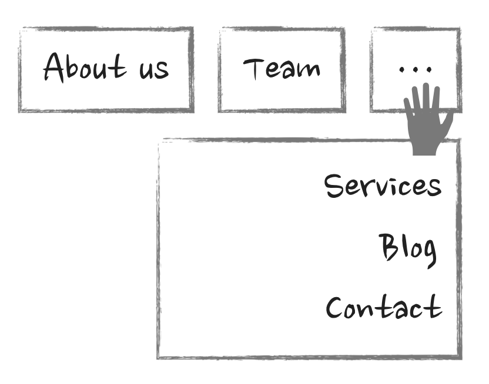
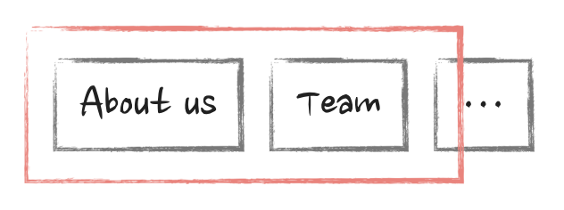
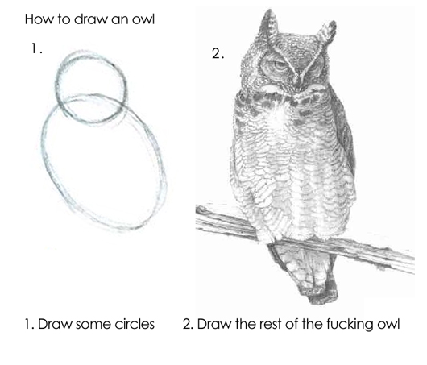
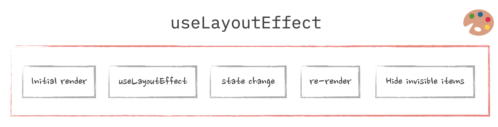
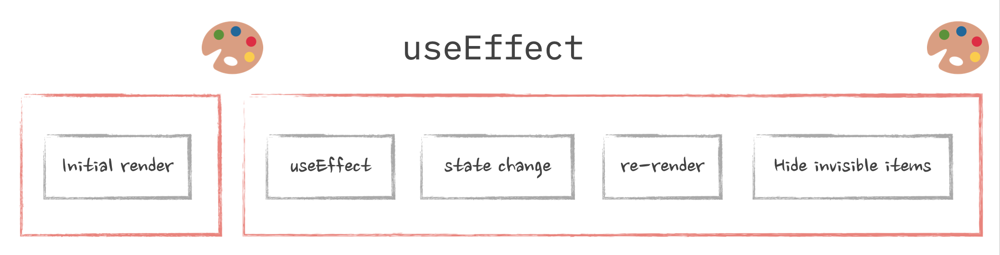
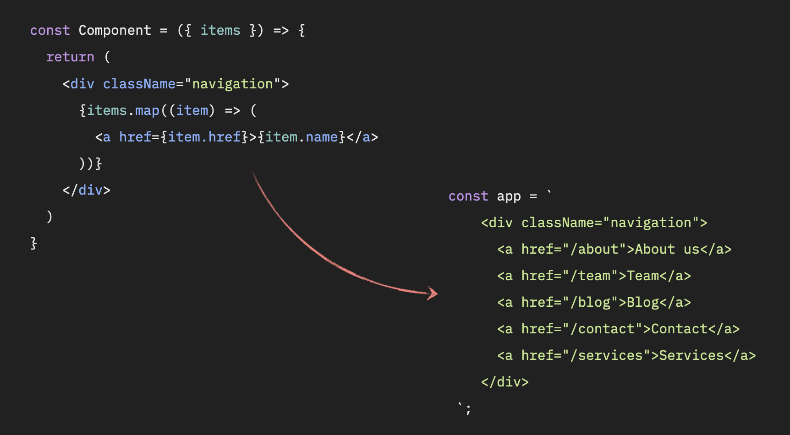

import FlickeringCodeSandBoxIframe from '@site/blog/components/2024-03-16-nomore-flickering-ui/flickeringCodeSandBoxIframe.jsx';
import NonFlickeringCodeSandBoxIframe from '@site/blog/components/2024-03-16-nomore-flickering-ui/nonFlickeringCodeSandBoxIframe.jsx';
import BlockingPaintingCodeSandBoxIframe from '@site/blog/components/2024-03-16-nomore-flickering-ui/blockingPaintingCodeSandBoxIframe.jsx';
import NonBlockingPaintingCodeSandBoxIframe from '@site/blog/components/2024-03-16-nomore-flickering-ui/nonBlockingPaintingCodeSandBoxIframe.jsx';

> [Korean FE Article Team](https://kofearticle.substack.com/about?utm_source=substack&utm_medium=email) 에서 번역해주는 FrontEnd 소식을 아카이브 하였습니다.

# "깜빡이는" UI를 거부하세요. useLayoutEffect, 페인팅 그리고 브라우저 이야기


- 원문: https://www.developerway.com/posts/no-more-flickering-ui
- 번역글: https://velog.io/@tap_kim/no-more-flickering-ui?utm_source=substack&utm_medium=email

## 소개

이번 글은 평소 사용하는 리액트의 useEffect를 사용할 때 발생하는 깜빡인 현상을 주제로 평소 사용하는 브라우저의 주요 개념인 동기/비동기 개념을 중심으로 useEffect와 useLayoutEffect에 대해 깊이 있게 설명하는 글입니다.

자바스크립트의 관점으로 리액트에선 두 effect를 통해 어떤 방식으로 사용되는지, 쓰임새와 성능, 더불어 SSR까지 흐름으로 두 effect 훅에 대해 딥 다이브하기 좋은 글이 될 것 같습니다.

:::info 목차

1. useEffect의 문제점이 뭘까요?
2. useLayoutEffect로 수정하기
3. 해결법이 효과적인 이유: 렌더링, 페인팅과 브라우저

- useEffect와 useLayoutEffect 비교로 돌아가기
- useEffect에 대해 좀 더 자세히 알아보기

4. Next.js의 useLayoutEffect와 기타 SSR 프레임워크들
   :::

DOM 측정값을 기반으로 요소를 변경하는 방법에 대해 살펴봅니다. useEffect의 문제는 무엇이며, 그 문제를 useLayoutEffect로 어떻게 해결하는지, 브라우저 페인팅이 무엇이며, 여기서 SSR은 어떤 역할을 하는지 알아보겠습니다.

[이 게시글은 비디오 형식으로도 제공됩니다.](https://youtu.be/__tm1dyMi4A)

리액트의 DOM 접근에 관해 좀 더 이야기해 봅시다. 이전 글[(리액트의 Refs: DOM 접근에서 명령형 API까지)](./2024-03-16-refs-from-dom-to-api.md)에서 Ref를 사용하는 법과 Ref와 관련된 모든 것을 배웠습니다. 그러나, DOM 처리에 관한 주제로 또 다른 중요한 주제가 있습니다. 바로, 요소의 크기나 위치 같은 DOM의 실제 측정 결과를 기반으로 요소를 변경하는 것입니다.

그래서, 정확히 무엇이 문제이고 왜 "일반적인" 방법으로는 충분하지 않을까요? 앞으로 코딩을 해보면서 알아보도록 하겠습니다. 이 과정에서 `useEffect` 대신에 `useLayoutEffect`를 언제, 왜 사용해야 하는지와 브라우저는 어떻게 리액트 코드를 렌더링하는지 그리고 페인팅이 무엇이고, 왜 이 모든 것들이 중요한지 및 SSR이 어떤 역할을 하는지 알아보겠습니다.

## useEffect의 문제점이 뭘까요?

이제 코딩 시간입니다! 오늘은 반응형 네비게이션 컴포넌트를 멋지게 만들어보겠습니다. 네비게이션 컴포넌트는 링크의 행을 렌더링하고 컨테이너 크기에 따라 링크의 수를 조정할 수 있습니다.


그리고 만약 일부 링크가 화면에 맞게 나타나지 않는다면, 클릭하면 드롭다운 메뉴가 보이는 "더 보기" 버튼을 보여줍니다.



이제 컴포넌트를 살펴보겠습니다. 아래 컴포넌트는 데이터를 배열로 받고 적절한 링크를 렌더링하는 컴포넌트입니다.

```jsx
const Component = ({ items }) => {
  return (
    <div className="navigation">
      {items.map((item) => (
        <a href={item.href}>{item.name}</a>
      ))}
    </div>
  );
};
```

그러면 어떻게 반응형으로 만들 수 있을까요? 여기서 문제는 사용 가능한 공간에 맞는 아이템의 수를 계산해야 한다는 것입니다. 그러기 위해선 렌더링 될 컨테이너의 너비와 모든 항목의 크기가 필요합니다. 예를 들어, 문자 수를 세는 것과 같이 여기서부턴 어떤 것도 미리 가정할 수 없습니다. 브라우저에서 텍스트가 렌더링 되는 것은 사용된 글꼴, 언어, 브라우저에 많은 영향을 받을 뿐만 아니라 그 밖에 다양한 이유로 예측할 수 없는 결과들이 발생할 수 있습니다.

여기서 실제 크기를 얻는 유일한 방법은 브라우저가 그 아이템들을 렌더링하게 한 다음, `getBoundingClientRect`와 같은 네이티브 자바스크립트 API를 통해 크기를 추출하는 것입니다.

이를 위해 몇 가지 단계를 거쳐야 합니다. 먼저 요소에 접근해서 Ref를 생성하고 항목들을 감싸는 div에 할당할 수 있습니다.

```jsx
const Component = ({ items }) => {
  const ref = useRef(null);

  return (
    <div className="navigation" ref={ref}>
      ...
    </div>
  );
};
```

Refs와 DOM이 어떻게 동작하는지 익숙하지 않다면 [리액트의 Refs: DOM 접근부터 명령형 API까지](./2024-03-16-refs-from-dom-to-api.md)를 참고해 주세요.

두 번째로, `useEffect`에서 div 요소를 가져온 뒤 크기를 가져옵니다.

```jsx
const Component = ({ items }) => {
  useEffect(() => {
    const div = ref.current;
    const { width } = div.getBoundingClientRect();
  }, [ref]);

  return ...
}
```

세 번째로, div의 자식 컴포넌트를 순회하며 그 너비를 추출해 배열에 담습니다.

```jsx
const Component = ({ items }) => {
  useEffect(() => {
    // 이전과 동일 한 코드
    ...

    // div의 하위 항목을 배열로 변환
    const children = [...div.childNodes];
    // 모든 너비 값들
    const childrenWidths = children.map(child => child.getBoundingClientRect().width)
  }, [ref]);

  return ...
}
```

이제 모든 배열을 순회하면서 하위 컴포넌트의 너비를 더한 뒤, 그 합계를 상위 div와 비교하여 결과적으로 마지막으로 표시되는 항목을 찾아야 합니다.

그러나 여기서 놓친 것이 하나 있습니다. 바로 "더 보기" 버튼과 그 너비도 고려해야 합니다. 그렇지 않으면 몇 가지 상황에선 괜찮지만 "더 보기" 버튼으로 인해 문제를 겪을 수 있습니다.



다시 말하지만, 우리는 브라우저에서 렌더링된 경우에만 너비를 얻을 수 있습니다. 따라서, 초기 렌더링 동안 버튼을 명시적으로 추가해야 합니다.

```jsx
const Component = ({ items }) => {
  return (
    <div className="navigation">
      {items.map(item => <a href={item.href}>{item.name}</a>)}
      <!-- 링크 뒤에 "더 보기" 버튼을 명시적으로 추가해 주세요. -->
      <button id="more">...</button>
    </div>
  )
}
```

모든 너비 계산 로직을 함수로 추상화한다면 아래와 같은 `useEffect`를 갖게 됩니다.

```jsx
useEffect(() => {
  const itemIndex = getLastVisibleItem(ref.current);
}, [ref]);
```

`getLastVisibleItem` 함수는 모든 계산을 수행하고 단일 숫자, 즉, 사용할 수 있는 공간에 맞는 마지막 링크의 인덱스를 반환합니다. 이번엔 로직 자체에 대해 깊게 다루지 않을 것입니다. 이를 수행하기 위한 수백만 가지의 방법이 있고, 추후에 최종 코드 예제에서 이를 볼 수 있습니다.

여기서 중요한 것은 마지막 링크의 인덱스를 가지고 있다는 것입니다. 리액트 관점에서 다음에 무엇을 해야 할까요? 이걸 그대로 둔다면, 모든 링크와 "더 보기" 버튼이 보일 것입니다. 여기에는 한 가지 해결책만 있습니다. 컴포넌트를 업데이트하고 존재하면 안 되는 컴포넌트들은 모두 제거해야 합니다.

그리고 이를 수행할 유일한 방법은 해당 인덱스를 얻었을 때 인덱스 상태를 저장하는 것입니다.

```jsx
const Component = ({ items }) => {
  // 초깃값을 -1로 설정하여, 아직 계산을 실행하지 않았음을 나타냅니다.
  const [lastVisibleMenuItem, setLastVisibleMenuItem] = useState(-1);

  useEffect(() => {
    const itemIndex = getLastVisibleItem(ref.current);
    // 실제 인덱스 상태 업데이트합니다.
    setLastVisibleMenuItem(itemIndex);
  }, [ref]);
};
```

그런 다음 메뉴가 렌더링 될 때 다음 사항을 고려하세요.

```jsx
const Component = ({ items }) => {

  // 첫 번째 패스와 여전히 기본값인 경우 모든 것을 렌더링합니다.
  if (lastVisibleMenuItem === -1) {
    // 이전과 동일하게 여기서 모두 렌더링합니다.
    return ...
  }

  // 마지막으로 표시할 항목이 배열의 마지막 항목이 아닌 경우 "더 보기" 버튼을 표시합니다.
  const isMoreVisible = lastVisibleMenuItem < items.length - 1;

  // 인덱스가 마지막으로 표시된 항목보다 큰 항목을 필터링합니다.
  const filteredItems = items.filter((item, index) => index <= lastVisibleMenuItem);

  return (
    <div className="navigation">
      <!-- 보이는 항목만 렌더링 -->
      {filteredItems.map(item => <a href={item.href}>{item.name}</a>)}
      <!-- "더 보기"를 조건부 렌더링 -->
      {isMoreVisible && <button id="more">...</button>}
    </div>
  )
}
```

이게 다입니다! 이제 상태가 실제 인덱스로 업데이트된 후에는, 네비게이션이 다시 렌더링 되고 리액트가 항목들을 다시 렌더링하고 표시되지 않은 항목들을 제거할 것입니다. "적절한" 반응형 경험을 위해 resize 이벤트를 수신하고 인덱스를 다시 계산해야 하지만, 그것을 구현하는 것은 여러분에게 맡기겠습니다.

아래 코드 샌드박스에서 전체 작동 예제를 확인하세요. 크기를 조정해가면서요😊. 이상한 점을 발견하셨어도 너무 흥분하지 마세요. 여기에는 사용자 경험에 있어 한 가지 큰 결함이 있습니다.

<FlickeringCodeSandBoxIframe />

특히 CPU 속도가 느려진 상태에서 새로고침을 몇 번 시도해 보세요. 불행하게도 여기엔 끔찍한 깜빡이는 동작이 있습니다. 모든 항목과 "더 보기" 버튼이 표시되는 초기 렌더링이 명확하게 보입니다. 운영에 들어가기 전 반드시 수정해야 합니다.

## useLayoutEffect로 수정하기

깜빡이는 증상의 원인은 명백합니다. 불필요한 컴포넌트를 제거하기 전에 렌더링하고 표시하기 때문입니다. 그렇지 않으면 첫 렌더링 시 멋진 반응성이 작동하지 않습니다. 이를 수정할 방법의 하나는 여전히 첫 번째 패스를 렌더링하되 눈에 보이지 않게 하는 것입니다. 투명도를 0으로 설정하거나 눈에 보이지 않는 영역 어딘가에 있는 어떤 div에 렌더링하는 것입니다. 그리고 여러 영역과 매직 넘버를 추출한 후에만 그것들을 보이게 만듭니다. 이것은 과거에 이런 경우를 처리하던 방식입니다.

리액트 ~16.8 버전부터는(훅이 있는 버전) 모든 useEffect를 useLayoutEffect로 교체하기만 하면 됩니다.

```jsx
const Component = ({ items }) => {
  // 정확히 모든 것이 똑같고, 훅 이름만 다릅니다.
  useLayoutEffect(() => {
    // 여기에 똑같이 코드를 작성하세요.
  }, [ref]);
};
```

이건 더 이상 초기 깜빡임이 없는 코드입니다. 확인해 보세요.

<NonFlickeringCodeSandBoxIframe />

그렇다면 이것을 사용하는 것이 안전한가요? 왜 `useEffect` 대신에 그냥 모든 곳에서 `useLayoutEffect`를 사용하지 않는 걸까요? 문서에선 `useLayoutEffect`는 [성능 저하](https://react.dev/reference/react/useLayoutEffect)를 일으킬 수 있으므로 피해야 한다고 명시적으로 나와 있습니다. 왜 그럴까요? 이는 "브라우저가 화면을 리페인팅하기 전"에 실행된다고 하는데 이는 `useEffect`가 이후에 실행된다는 의미입니다. 그러나 정확히 이게 무슨 의미일까요? 이제 간단한 드롭다운을 작성할 때도 브라우저 페인팅과 같은 저수준의 개념까지 생각해야 한다는 것을 의미할까요🤯?

이 질문에 답하자면, 잠시 리액트를 벗어나 브라우저와 오래된 자바스크립트에 관해 이야기해야 합니다.

## 해결법이 효과적인 이유: 렌더링, 페인팅과 브라우저

여기서 가장 필요한 것은 "브라우저 렌더링"입니다. 리액트 세계에서는 리액트의 렌더링과 구별하기 위해 "페인팅"이라고도 알려졌지만 그건 매우 다릅니다! 이 아이디어는 비교적 간단합니다. 브라우저는 화면에 실시간으로 표시되는 모든 것들을 지속해서 업데이트하지 않습니다. 화이트보드에 선을 긋고, 지우고, 글을 쓰거나 올빼미를 그리는 것과는 다릅니다.

대신에 사람들에게 슬라이드를 보여주는 것과 비슷합니다. 하나의 슬라이드를 보여주고, 사람들이 그 기발한 아이디어를 이해할 때까지 기다린 후 다음 슬라이드로 전환하는 방식입니다. 만약 아주 느린 브라우저가 올빼미를 그리도록 요청받았다면, 아주 형편없는 그림이 될 수 있습니다.



그들은 매우 매우 빠르게 해냅니다. 일반적으로 최신 브라우저에는 60FPS 속도, 초당 60프레임을 유지하려고 합니다. 한 슬라이드가 다음 슬라이드로 바뀌는 데는 약 13밀리초가 걸립니다. 이것이 리액트에서 "페인팅"이라고 부르는 것입니다.

슬라이드를 업데이트하는 정보는 "작업(task)"으로 나뉩니다. 해당 작업은 대기열에 추가됩니다. 브라우저는 대기열에 있는 작업을 가져와 실행합니다. 시간이 더 있다면 다음 작업을 실행하고 ~13ms 간격으로 더 이상 시간이 남지 않을 때까지 계속 실행한 다음 화면을 새로 고칩니다. 그리고 트위터에서 무의미하게 스크롤링과 같은 중요한 작업을 수행하는 데 드는 노력을 알지 못한 채 수행할 수 있도록 계속해서 쉬지 않고 작업합니다.

"작업"은 무엇일까요? 일반적인 자바스크립트인 경우, `script` 태그에 넣고 동기적으로 실행하는 모든 것을 말합니다. 다음 코드를 참고해 보세요.

```jsx
const app = document.getElementById("app");
const child = document.createElement("div");
child.innerHTML = "<h1>Heyo!</h1>";
app.appendChild(child);

child.style = "border: 10px solid red";
child.style = "border: 20px solid green";
child.style = "border: 30px solid black";
```

우선, id로 요소를 가져와 변수 app에 할당한 뒤 div를 생성합니다. 그런 다음 HTML을 업데이트하고 app의 div에 추가한 뒤 div의 테두리(border)를 세 번 변경합니다. 브라우저에서는 모든 작업을 하나의 작업으로 간주합니다. 모든 행을 실행하고, 최종 결과물로 검은 테두리(border)가 있는 div를 그립니다.

우리는 화면에서 빨강-초록-검정 전환을 보지 못합니다.

"작업"이 13ms보다 오래 걸리면 어떻게 될까요? 글쎄요, 안타깝네요 🤷🏻‍♀️. 브라우저는 이를 중지하거나 분리할 수 없습니다. 완료될 때까지 계속한 다음 최종 결과물을 그릴 것입니다. 테두리 업데이트 사이에서 1초간 동기 지연을 추가하는 경우는 아래와 같습니다.

```jsx
const waitSync = (ms) => {
  let start = Date.now(),
    now = start;
  while (now - start < ms) {
    now = Date.now();
  }
};

child.style = "border: 10px solid red";
waitSync(1000);
child.style = "border: 20px solid green";
waitSync(1000);
child.style = "border: 30px solid black";
waitSync(1000);
```

여전히 "중간" 결과를 볼 수 없습니다. 브라우저가 그것을 정렬할 때까지 빈 화면만 바라보다가 마지막에 검은색 테두리가 생기는 것을 볼 수 있습니다. 이것이 우리가 말하는 "렌더링 차단" 또는 "페인팅 차단" 코드라고 부르는 것입니다.

<BlockingPaintingCodeSandBoxIframe />

리액트는 단지 자바스크립트일 뿐이지만 단일 작업으로 실행되지는 않습니다. 만약 그렇다면 인터넷은 견딜 수 없을 것입니다. 그렇게 되면 우리는 모두 외부에 실행되고 직접 상호작용 해야 할 텐데, 누가 그것을 원할까요? 전체 앱을 렌더링하는 거대한 작업을 작은 작업으로 "분할"하는 방법은 콜백, 이벤트 핸들러, 프로미스 등 다양한 "비동기"적 방법을 사용하는 것입니다.

이러한 스타일 조정을 `setTimeout`으로 감싸기만 하면 됩니다. 지연 시간을 0으로 설정해도 됩니다.

```jsx
setTimeout(() => {
  child.style = "border: 10px solid red";
  wait(1000);
  setTimeout(() => {
    child.style = "border: 20px solid green";
    wait(1000);
    setTimeout(() => {
      child.style = "border: 30px solid black";
      wait(1000);
    }, 0);
  }, 0);
}, 0);
```

그럼 모든 timeout 로직은 새로운 "작업"으로 간주할 것입니다. 따라서 브라우저는 하나의 작업을 마친 후 다음 작업을 시작하기 전에 리페인팅할 수 있습니다. 그리고 3초 동안 하얀 화면에서 명상하는 것이 아니라, 느리지만 아름답게 빨간색에서 초록색으로, 다시 돌아오는 전환을 볼 수 있게 됩니다.

<NonBlockingPaintingCodeSandBoxIframe />

이건 리액트가 우리를 위해 하는 일입니다. 기본적으로 이 엔진은 엄청나게 복잡하고 매우 효율적인 엔진으로, 자체 코딩과 수백 개의 npm 종속성으로 구성된 거대한 덩어리를 브라우저가(이상적으로) 13ms 이내에 처리할 수 있는 가능한 가장 작은 덩이로 분할합니다.

물론, 지금까지의 설명은 매우 간략하고 단순화된 소개에 불과합니다. 이 모든 것을 다루려 한다면 글이 아니라 책으로 변할 것입니다. 브라우저의 이벤트 루프와 큐 주제에 대해 매우 훌륭하고 포괄적인 가이드는 여기 있습니다. [(브라우저 이벤트 루프: 마크로 및 마크로 테스크, 콜 스택, 렌더 큐: 레이아웃, 페인트, 합성)](https://blog.xnim.me/event-loop-and-render-queue)

## useEffect와 useLayoutEffect 비교로 돌아가기

마지막으로 `useEffect` vs `useLayoutEffect`로 돌아와 처음에 가졌던 질문에 답을 하겠습니다.

`useLayoutEffect`는 리액트가 컴포넌트를 업데이트하는 동안 동기적으로 수행되는 것입니다. 다음 코드를 살펴보세요.

```jsx
const Component = () => {
  useLayoutEffect(() => {
    // 어떤 코드들
  })

  return ...
}
```

컴포넌트 내부에서 무엇을 렌더링하든 `useLayoutEffect`에선 동일한 "작업"으로 실행됩니다. 리액트는 이를 보장합니다. 비록 일반적으로 비동기 작업이라고 생각하는 `useLayoutEffect` 내부에서 상태를 업데이트 하더라도 리액트는 여전히 전체 흐름이 동기적으로 실행되도록합니다.

처음에 구현한 "네비게이션" 예제로 돌아가면 브라우저 관점에서 이는 단지 하나의 "작업"일 뿐입니다.



이 상황은 우리가 볼 수 없었던 빨강-초록-검정 테두리 전환과 정확히 일치합니다!

반면에 `useEffect`의 흐름은 두 가지 작업으로 나뉩니다.



첫 번째는 모든 버튼에 있는 네비게이션의 "초기" 패스를 렌더링합니다. 두 번째는 필요 없는 하위 항목을 제거합니다. 그사이 리페인팅이 진행됩니다! timeout 내에서 테두리를 사용하는 상황과 정확히 일치하는 상황입니다.

그래서 처음에 가졌던 질문에 답을 하자면. `useLayoutEffect`를 사용해도 안전한가요? 네! 성능이 저하될 수 있나요? 물론이죠! 마지막으로 필요한 것은 전체 리액트 앱이 하나의 거대한 동기식 "작업"으로 바뀌는 것입니다.

요소의 실제 크기에 따라 UI를 조정해야하기 때문에 발생하는 시각적 "결함"을 제거해야하는 경우에만 `useLayoutEffect`를 사용하세요. 다른 모든 경우에는 `useEffect`를 사용하세요. 그리고 이펙트가 필요하지 않을 수 있습니다. [(당신은 이펙트가 필요하지 않을 수 있다 - 리액트)](https://react.dev/learn/you-might-not-need-an-effect)

## useEffect에 대해 좀 더 자세히 알아보기

`setTimeout` 내부에 실행되는 `useEffect`의 멘탈 모델은 그 차이점을 이해하는데 편리하지만, 기술적으로는 옳지 않습니다. 우선 구현 세부 사항을 명확하게하기 위해 리액트는 `postMessage`와 `requestAnimationFrame` 트릭을 함께 사용합니다. 저도 이런 방법을 몰랐습니다. 세부 사항을 좋아하는 사람들은 여기 설명을 참고하세요. [리액트: 어떻게 리액트는 브라우저가 페인트할 기회를 얻은 후에 `useEffect`가 호출되는 것을 확인 할 수 있을까요?](https://stackoverflow.com/questions/56727477/react-how-does-react-make-sure-that-useeffect-is-called-after-the-browser-has-h/56727837#56727837)

두 번째, 실제로 비동기가 동작한다는 보장이 없습니다. 리액트는 가능한 한 최적화하려고 하지만 브라우저가 페인트 전에 동작하여 결과적으로는 차단될 수도 있습니다. 이러한 현상 중 하나는 `useLayoutEffect`가 이미 어딘가 업데이트 체인을 가지고 있는 경우입니다. 추론과 작동 방식을 이해해야 한다면 많은 세부 사항에 대한 아주 좋은 연구가 있습니다. [useEffect는 가끔 페인트 전에 실행됩니다.](https://blog.thoughtspile.tech/2021/11/15/unintentional-layout-effect/)

## Next.js의 useLayoutEffect와 기타 SSR 프레임워크들

저수준의 자바스크립트와 브라우저에 대한 내용은 충분하고 운영 코드로 돌아갑시다. 왜냐하면 "실생활"에선 이런 것들이 자주 신경 쓸 필요가 없기 때문입니다. "실생활"에서 우리는 아름다운 반응형 네비게이션 코드를 작성하고 Next.js와 같은 아주 멋진 프레임워크를 통해 훌륭한 사용자 경험을 구축하길 원합니다.(또는 다른 프레워크, 이건 Next.js 프로모션 아티클이 아닙니다😅.)

그리고 우리가 시도할 때, 우리가 가장 먼저 알아차릴 것은 그것이 미친 듯이 동작하지 않은 것입니다. 여전히 결함은 존재하고, 더 이상 마법 같은 것은 없습니다. [이 예제](https://codesandbox.io/p/devbox/simple-nextjs-uselayout-example-forked-y26hsp?workspaceId=2a1e6848-71ef-4937-b540-01f02d417e4a)를 보고 페이지를 몇 번 새로고침 해보세요. 또는 Next.js 앱이 있는 경우 이전에 수정한 네비게이션을 복사-붙여 넣기 해보세요.

무슨 일이죠?? 🤨

SSR(Server-side rendering)은 일부 프레임워크에서 기본적으로 지원하는 멋진 기능입니다. 그리고 이와 같은 일이 생길 때 정말 고통스럽습니다.

SSR을 사용한다면 첫 단계로 코드가 브라우저에 도달하기 전에 리액트 컴포넌트를 렌더링하고 모든 생명주기 이벤트는 서버에서 호출합니다. 만약 SSR 작동 방식에 익숙하지 않다면, 백엔드의 어딘가에 있는 일부 메서드가 `React.renderToString(<App />)`과 같은 것을 호출한다는 것을 의미합니다. 그런 다음 리액트는 앱의 모든 컴포넌트를 살펴보고, 이를 "렌더링"(단지 함수를 호출하기만 하는 함수)한 다음 해당 컴포넌트를 나타내는 HTML을 생성합니다.



그런 다음, 이 HTML은 브라우저로 보낼 페이지에 삽입되고 종료합니다. 예전처럼 모든 것이 서버에서 생성되고 메뉴를 열 때만 자바스크립트를 사용했습니다. 그 후, 브라우저에서는 페이지를 다운로드하여 우리에게 보여주고, 모든 스크립트를 다운로드하고(리액트 포함), 실행하여(다시 리액트 포함), 리액트는 미리 생성된 HTML을 거쳐 약간의 상호작용을 합니다.

여기서 문제는 첫번째 HTML 생성 시 브라우저가 아니라는 것입니다. 따라서 요소의 실제 크기를 계산하는 것과 관련된 모든 작업(`useLayoutEffect`와 같은)은 서버에서 간단하게 작동하지 않습니다. 아직 너비가 있는 요소는 없으므로, 그건 단지 문자에 불과합니다. 그리고 `useLayoutEffect`의 전체적인 목적은 요소들의 크기에 접근하는 것이므로 서버에서 실행하는 것에 큰 의미는 없습니다. 그리고 리액트도 그렇게 하지 않습니다.

결과적으로 브라우저가 아직 상호작용하지 않은 페이지를 표시할 때 처음 로드 중에 우리가 보는 것은 컴포넌트의 "첫 번째 패스" 단계에서 렌더링한 것입니다. "더 보기" 버튼을 포함합니다. 브라우저가 모든 것을 실행할 기회를 얻고 리액트가 활성화되면 마침내 `useLayoutEffect`를 실행할 수 있고, 버튼은 숨겨집니다. 하지만 거기엔 시각적 결함이 있습니다.

이를 해결하는 방법은 사용자 경험의 문제이고 "기본적으로" 사용자에게 무엇을 표시할지는 전적으로 당신에게 달려 있습니다. 메뉴 대신에 "로딩" 상태를 보여 줄 수 있습니다. 또는 항목을 완전히 숨기고 클라이언트에서만 렌더링할 수도 있습니다. 그건 당신에게 달려 있습니다.

이를 수행하는 한 가지 방법은 "shouldRender" 상태 변수를 도입하고 `useEffect`에서 "true"로 바꾸는 것입니다.

```jsx
const Component = () => {
  // SSR에서 window가 있는지 확인합니다.
  if (typeof window === undefined) return <SomeNavigationSubstitude />;

  return <Navigation />;
};
```

기술적으로 `typeof window === undefined`는 SSR 환경(서버에는 window가 없음)을 나타내지만, 이 방식은 제대로 동작하지 않습니다. 리액트는 서버에서 내려준 HTML과 첫번째 렌더링 결과가 정확히 일치해야함을 요구합니다. 그렇지 않으면 앱이 술에 취한 것처럼 동작합니다. 이 주제에 대한 또 다른 자세한 내용을 원하신다면 여기 설명을 참고하세요. [(재수화의 위험)](https://www.joshwcomeau.com/react/the-perils-of-rehydration/)

<hr />

아, "이봐, 쉽고 멋진 속임수구나"라고 가볍고 산뜻하게 생각했던 아티클이 어쩐지 거의 렌더링 심층 분석으로 바뀌었습니다. 이 모든 일이 끝난 후에도 여전히 저와 함께 있기를 바라며, 😅 아래는 더 깊이 파고드는 데 도움이 될 수 있는 참고 자료입니다.

- [Dan Abramov의 리액트의 UI 런타임](https://overreacted.io/react-as-a-ui-runtime/), 이를 위해 당신의 모든 저녁 시간을 내주세요.
- [GitHub - acdlite/react-fiber-architecture](https://github.com/acdlite/react-fiber-architecture): 리액트의 새로운 핵심 알고리즘인 리액트 Fiber에 대한 설명
- [브라우저 이벤트루프](https://blog.xnim.me/event-loop-and-render-queue): 마이크로, 마이크로 테스크, 콜 스텍, 렌더 큐: 레이아웃, 페인트, 합성
- [렌더링 성능](https://web.dev/rendering-performance/)
- 재[수화의 위험성](https://www.joshwcomeau.com/react/the-perils-of-rehydration/)
- [useEffect는 가끔 페인트 전에 실행합니다.](https://blog.thoughtspile.tech/2021/11/15/unintentional-layout-effect/)
- [Effect가 필요하지 않을 수도 있습니다 - 리액트](https://react.dev/learn/you-might-not-need-an-effect)
- [렌더와 커밋 - 리액트](https://react.dev/learn/render-and-commit)

유튜브를 통해 지식을 확고히 해보세요. 때로는 3초짜리 애니메이션이 두 단락의 텍스트보다 상황을 더 잘 설명할 수 있습니다.

[Youtube - "깜빡이는" UI를 거부하세요: useLayoutEffect의 페인팅 및 브라우저 이야기](https://youtu.be/__tm1dyMi4A)

다음에 또 봐요!
