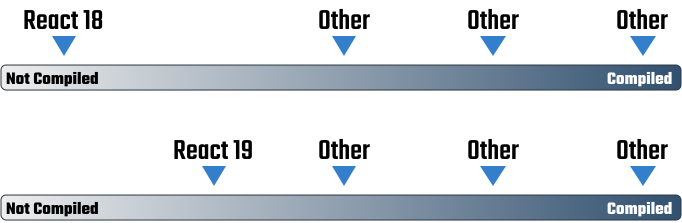

import ReactChangesTwitterPost from '@site/blog/components/2024-03-18-react-19-will-be-compiled/reactChangesTwitterPost.jsx'
import CorrectionReactChangesTwitterPost from '@site/blog/components/2024-03-18-react-19-will-be-compiled/correctionReactChangesTwitterPost.jsx'

> [Korean FE Article Team](https://kofearticle.substack.com/about?utm_source=substack&utm_medium=email) 에서 번역해주는 FrontEnd 소식을 아카이브 하였습니다.

# 리액트가 컴파일될 예정입니다

- 원문: https://reacttraining.com/blog/react-19-will-be-compiled
- 번역글: https://substack.com/redirect/aad98d01-4d75-4355-956a-074e85d384a5?j=eyJ1IjoiMnFrMnA0In0.QVVOJaKabmmX5ASbNU2omf9CA-dCFAH4QXVPLzr-_K4

## 소개

최근 리액트 팀은 리액트 19의 릴리즈를 발표한 블로그 게시물에서 리액트 컴파일러를 함께 발표하여 현재 리액트 컴파일러는 프론트엔드 개발자들의 뜨거운 관심을 받고 있습니다.

이 글에서는 리액트 컴파일러가 나오기 전까지의 과정과 컴파일에 대한 의미를 소개하고 있습니다. 리액트 컴파일러가 나오기 전과 후의 과정들에 대해 관심을 가지고 계시다면 가볍게 읽어보시길 추천드립니다. 🙂

:::info 목차

1. 컴파일된 리액트는 hooks의 주요 문제를 해결합니다
2. 메모된 리액트
3. 메모이제이션에 의존
4. 우리는 항상 리액트를 컴파일 해왔습니다
5. 컴파일은 스펙트럼입니다
6. 자동 메모이제이션을 위한 컴파일

:::

<!--truncate-->

> 어떤 면에서는 항상 그랬습니다. 하지만 이제 메모이제이션을 몰라도 됩니다.

어제 리액트 팀은 [해당 블로그 게시글](https://react.dev/blog/2024/02/15/react-labs-what-we-have-been-working-on-february-2024)을 통해서 리액트를 위해 작업해 온 내용을 발표했습니다. 리액트 팀의 Andrew Clark이 변경 사항을 자세히 설명해 주었습니다.

<ReactChangesTwitterPost />

[정정] 이전에 컴파일될 버전은 v19가 될 것이라고 말씀드린 바 있습니다. 리액트 팀은 발표에서 컴파일된 리액트에 대해 언급했고, 저는 다른 사람들과 동일하게 이것이 v19를 의미한다고 생각했습니다. 게시글에 언급된 많은 기능이 v19에 포함될 것으로 보이지만, 컴파일되는 버전은 아마도 그 다음 버전이 될 것입니다(Andrew가 언급한 대로 올해 2024년 말 쯤).

<CorrectionReactChangesTwitterPost />

버전이야 어찌됐건, 이 글이 리액트가 "컴파일"된다는 것이 무엇을 의미하는지에 대해 혼란스러워하는 모든 분들에게 도움이 되기를 바랍니다. 이 주제는 많이 논의되어 왔고, 특히 리액트의 전체 스토리를 보지 못했다면 따라가기 어려울 수 있기 때문에 여기까지 오게 된 과정의 예시와 역사적 맥락을 보여드리고자 합니다.

## 컴파일된 리액트는 hooks의 주요 문제를 해결합니다

계속해서, 다음의 리액트 원칙들이 리액트를 컴파일할 때도 변치 않음을 명심하세요.

- 리액트 상태는 불변입니다
- UI는 상태의 함수입니다
- 상태가 변경되면 리렌더링하여 새로운 UI를 생성합니다

버전 번호를 제외하면, 리액트는 뚜렷한 세 가지 시대가 있다고 생각합니다.

- **클래스 컴포넌트 시대**(추상화를 위한 원시성이 없음)
- **훅의 시대**(메모 필요)
- **컴파일 시대**(자동 메모이제이션)

이제 곧 컴파일 시대로 접어드는데, 어떻게 여기까지 왔을까요?

클래스 컴포넌트로 프로젝트를 만들어본 사람이라면 코드를 추상화하고 재사용하려고 할 때 클래스가 주는 문제를 기억할 것입니다. 리액트에는 코드를 재사용할 수 있는 "원시성"이 없었기 때문에 커뮤니티에서 Hoc 및 Render Props와 같은 패턴을 만들었는데, 이는 [이상적이지 않았습니다.](https://gist.github.com/bradwestfall/4fa683c8f4fcd781a38a8d623bec20e7) 원시성을 만들 때의 문제점은 클래스 자체가 필요한 수준의 합성을 제공하지 못한다는 것이었습니다. 그래서 리액트 팀은 클래스에서 벗어나 함수형 컴포넌트에 관심을 갖기 시작했습니다.

당시에는 함수형 컴포넌트가 존재했지만 클래스처럼 상태나 다른 생명주기를 가질 수 없었기 때문에 무상태 함수형 컴포넌트라고 불렀습니다. 리액트 팀은 함수형 컴포넌트가 우리에게 필요한 원시성을 제공하는 방법이라고 생각했습니다. 함수형 컴포넌트를 리액트 생명주기에 "연결(hook)"할 수 있는 방법을 알아낼 수만 있다면요 😉

네, "hooks"라는 용어는 바로 여기서 유래했습니다.

저는 2018년 hooks가 발표된 컨퍼런스 자리에 있었습니다. 발표 직후 Ryan Florence가 [모두가 보는 앞에서 "render-props를 hooks로" 리팩터링](https://www.youtube.com/watch?v=wXLf18DsV-I) 했던 것이 기억에 남습니다. Hooks, 특히 커스텀 훅은 우리가 놓치고 있던 원시성을 되찾을 수 있었습니다.

당시에는 모든 코드를 하나의 함수로 통합하면 합성이 쉬워질 수 있지만 모든 코드를 메모해야 한다는 단점이 있다는 사실을 깨닫지 못했습니다. 리렌더링의 특성을 고려할 때, 본질적으로 클래스가 메모이제이션으로 부터 우리를 보호해준다는 사실을 깨닫지 못했습니다.

클래스 컴포넌트에서 render 메서드는 해당 코드를 다른 [생명주기 메서드](https://projects.wojtekmaj.pl/react-lifecycle-methods-diagram/)로부터 격리하므로 리렌더링해도 렌더링 단계와 격리되지 않은 코드에 부정적인 영향을 미치지 않습니다. 이것은 아마도 디자인적인 결정이라기보다 클래스가 작동하는 방식의 특징에 가깝습니다. 🧐 이 이야기를 꺼내는 것 자체가 불필요해 보이지만, 앞으로 다가올 진화에서 중요한 역할을 합니다.

## 메모된 리액트

클래스 컴포넌트는 솔직히 끔찍했습니다. 이틀간의 워크샵 커리큘럼을 hooks로 바꿨을 때 절반 이상의 주제가 증발했던 것을 기억합니다. 왜냐하면 클래스 컴포넌트는 더 이상 가르칠 필요가 없을 정도로 앱에 너무 많은 복잡성을 가져왔기 때문입니다.

제출 시 처리할 메서드가 있는 클래스 컴포넌트를 만들면 해당 메서드를 "메모화"할 필요가 없습니다. 함수형 컴포넌트로 비슷한 작업을 수행하면 어떻게 되는지 살펴보겠습니다.

```jsx
function App() {
  const [state, setState] = useState();
  function onSubmit() {
    // Submit 로직
  }
  return <form onSubmit={onSubmit}></form>;
}
```

바로 알아차리지 못했을 수도 있지만, 이 함수는 리렌더링이 있을 때마다 다시 생성될 것입니다. 즉, 메모리에서 완전히 새로운 함수가 될 것입니다. 함수가 스스로 다시 생성되는 것은 일반적으로 문제가 되지 않으며 이 예시에서는 문제가 발생하지 않습니다. 하지만 렌더 단계와는 별개의 메서드였기 때문에 클래스에서는 이런 일이 발생하지 않는다는 점에 주목할 필요가 있습니다.

또한 자바스크립트에서 무언가를 다시 만들어야 한다는 일반적인 개념이 리액트에만 국한되지 않는다는 점도 주목할 필요가 있습니다. 함수와 객체를 다시 생성하는 2008년의 jQuery 코드를 보여드리겠습니다. 농담입니다. 2008년에 만든 코드가 어디 있는지 모르겠네요.

이제 코드를 약간 리팩터링해 보겠습니다.

```jsx
function App() {
  const [state, setState] = useState()
  function onSubmit() {
    // Submit 로직
  }
  return <Form onSubmit={onSubmit} />
}

const Form = ({ onSubmit }) {
  // ...
}
```

렌더링할 때마다 `onSubmit`이 새로운 함수가 되는 것은 여전히 문제가 되지 않습니다.

이 경우, `App`이 리렌더링되면 `Form`이 리렌더링됩니다. 컴포넌트의 props가 변경되어야 컴포넌트가 리렌더링된다고 말하는 사람도 있습니다. 그건 사실이 아닙니다. `App`이 리렌더링될 때, `Form`은 props와 관계없이 리렌더링됩니다. 현재로서는, `onSubmit` prop이 변경되는지 여부는 중요하지 않습니다. 이 예시는 지나치게 단순하지만 `Form`을 메모화한다고 가정해 보겠습니다.

```jsx
// 이제 Form은 App이 리렌더링되는 모든 경우에 리렌더링이 되는 것이 아닌
// 특정 props가 변경된 경우에만 리렌더링합니다.
const Form = React.memo(({ onSubmit }) {
  // ...
})
```

이제 문제가 생겼습니다.

리액트는 변수가 변경되었는지 확인하기 위해 `===`와 `Object.is()`를 사용하여 이전 항목과 새로운 항목을 비교하는 멋지고 [엄격한 동등성 검사](https://reacttraining.com/blog/state-in-react-is-immutable) 방법에 크게 의존합니다. 문자열과 같은 자바스크립트 원시값을 `===`로 비교하면 자바스크립트는 값으로 비교합니다(이미 알고 계셨을 겁니다). 하지만 자바스크립트가 배열, 객체 또는 함수를 비교할 때, `===`를 사용하는 것은 이들의 아이덴티티, 즉, 메모리 할당을 비교하는 것입니다. 이것이 자바스크립트에서 `{} === {}`가 `false`인 이유입니다. 메모리에서 서로 다른 두 개의 객체 아이덴티티가 존재하기 때문입니다.

`Form = React.memo(fn)`는 이렇게 말하는 것과 같습니다.

> 리액트, 아이덴티티 확인을 통해 props가 실제로 변경된 경우에만 Form을 리렌더링해줘.

`App`이 리렌더링될 때마다 `onSubmit`이 변경되기 때문에 문제가 발생합니다. 이로 인해 `Form`은 항상 리렌더링하게 되므로 메모이제이션이 아무 소용 없습니다. 이 시점에서 이는 리액트에게는 무의미한 오버헤드입니다.

이제 다시 돌아가서 `App`이 리렌더링할 때 `onSubmit`의 아이덴티티가 변경되지 않도록 해야 합니다.

```jsx
function App() {
  const [state, setState] = useState();

  const onSubmit = useCallback(() => {
    // Submit 로직
  }, []);

  return <Form onSubmit={onSubmit} />;
}
```

`useCallback`을 사용하여 함수의 아이덴티티가 변경되지 않도록 함수를 고정합니다. 어떻게 보면 일종의 메모이제이션이라고 할 수 있습니다. 지나치게 단순한 용어로 메모이제이션은 함수의 응답을 "기억" 또는 "캐시"하는 것을 의미합니다.

이는 이렇게 말하는 것과 같습니다.

> 리액트, 내가 useCallback에 전달하는 함수의 아이덴티티를 기억해. 리렌더링할 때마다 매번 새로운 함수를 제공하지만, 처음 호출했을 때의 원래 함수의 아이덴티티를 알려줘.

`onSubmit` 함수를 메모하는 것은 일반적으로 필요하지 않지만, `Form`이 메모되어 `onSubmit`을 prop으로 받게 되면서 필요해졌습니다. React Training에서는 이것을 "구현 출혈(implementation bleed)"라고 부릅니다.

문제는 여기서 끝나지 않습니다. 더 많은 코드를 추가해 보겠습니다.

```jsx
function App() {
  const [state, setState] = useState();

  const settings = {};
  const onSubmit = useCallback(() => {
    const x = settings.x;
    // ...
  }, []);

  // ...
}
```

`settings` 객체는 `App`을 렌더링할 때마다 자체적으로 다시 생성됩니다. 이것은 그 자체로는 문제가 되지 않지만, 리액트를 잘 알고 있다면 이 경우, 린터가 `useCallback`의 의존성 배열에 `settings`을 넣으라고 요청할 것이라는 것을 알고 있을 것입니다.

```jsx
const settings = {};
const onSubmit = useCallback(() => {
  const x = settings.x;
  // ...
}, [settings]);
```

이렇게 하는 것은 아래처럼 말하는 것과 같습니다.

> 렌더링할 때마다 변경되지 않고 안정적인 `onSubmit`를 원합니다. 하지만 이 의존성 배열의 항목 중 하나라도 변경되면 `onSubmit`을 다시 생성하기 위해 `useCallback`을 사용해야 합니다.

"왜 `onSubmit`을 변경해야 할까?"라고 스스로에게 물어볼 수도 있습니다.

변경할 필요가 없을 것 같다고 동의하지만, 리액트에서는 `useCallback`이나 `useMemo`와 같이 의존성 배열이 변경될 때 반환값에 대한 새로운 아이덴티티를 다시 메모하고 생성해야 하는 상황이 많이 있습니다. 이 경우, 린터는 `onSubmit`이 **절대 달라지기를 원하지 않는다**는 것을 알지 못합니다.

린터는 거의 항상 옳지만, 린터가 원하는 것을 우리가 원하지 않을 수도 있다는 것을 보여주기 위해 이 예시를 직접 선택했습니다.

린터에 집중하고 의존성 배열에 `settings`를 넣으면 다음과 같은 일이 발생합니다.

- `App`이 리렌더링할 때...
- `settings`는 새로운 객체가 되고 `===`로 이전 렌더링의 객체와 비교합니다.
- 의존성 배열은 값이 변경되지 않았는데도 `===`에 따라 `settings`가 다른 것으로 간주합니다.
- 의존성 배열의 변경은 `useCallback`이 `onSubmit`에 대한 새로운 아이덴티티를 반환한다는 것을 의미합니다.
- `onSubmit`의 변경으로 인해 `Form`이 리렌더링 됩니다.

한마디로 `Form`의 메모이제이션은 쓸모가 없습니다. App이 리렌더링될 때마다 항상 다시 렌더링됩니다. 이제 `onSubmit`의 메모를 그대로 유지하기 위해 `useMemo`로 `settings`를 메모이제이션해야 하므로 구현 상의 더 많은 출혈이 발생합니다.

다시 한 번 이 질문으로 돌아가 보겠습니다.

> 왜 `onSubmit`을 변경해야 할까요? 이 경우, 린터를 비활성화하면 안될까요?

물론, 이 경우에는 의존성 배열에서 `settings`를 생략하거나 그냥 메모해 둘 수 있다고 생각합니다. 또는 애초에 메모된 Form이 필요 없었다면 이러한 혼란을 방지할 수 있었다는 주장을 할 수도 있습니다. 이것은 요점이 아니라 단지 예시일 뿐입니다. 요점은 리액트에서 메모를 하면 구현에서 종종 연쇄적인 출혈로 이어진다는 것입니다.

의존성 배열에 대한 주제와 린터가 그 안에 무언가를 넣기 원하는 이유는 이 게시글의 범위를 훨씬 벗어납니다. 이 주제는 많은 뉘앙스가 있는 방대한 주제이기 때문에 몇 시간 동안 이야기할 수 있을 것입니다. 사실, 린터는 일반적으로 옳고 좋은 의도를 가지고 있습니다. 문제는 많은 리액트 개발자들이 그 이유를 이해하지 못하고 린터가 단지 작은 제안일 뿐이라고 생각한다는 것입니다. 제 경험상, 린터를 무시하면 버그가 발생할 가능성이 높습니다.

여기에 완벽한 예시가 있습니다. 몇 년 전 트위터에서 어떤 사람과 이야기를 나누었는데, `useEffect` 의존성 배열이 때때로 무한 루프를 생성하는 경우가 있기 때문에 함수를 의존성 배열에 넣지 않는다고 말한 적이 있습니다. 저는 "해당 함수들에 useCallback을 사용하면 루프를 방지할 수 있습니다. 문제는 함수가 너무 자주 변경되는 것입니다."와 같이 말했습니다.

그 사람은 "useCallback이 뭐죠?"라고 물었습니다.

사람들이 메모이제이션이나 리액트를 충분히 이해하지 못해서 좌절하는 경우가 종종 있습니다.

## 메모이제이션에 의존

리액트에서 충분히 작업해 본 사람이라면 의존성 배열을 다루는 것이 어려울 수 있다는 것을 알고 있을 것입니다. 린터는 배열에 무언가를 넣으라고 지시하는데 결과가 마음에 들지 않을 수 있습니다(예시: 루프). 린터에게 화를 내기 쉽지만 린터가 옳았습니다. 물론 리액트가 무한 루프를 "원하기" 때문이 아니라, 그 순간 무언가를 메모해야 했기 때문입니다.

의존성 배열은 모든 코드가 리렌더링되는 함수형 컴포넌트에 함께 배치되어 있고, 시간에 따른 변수의 변경을 모니터링하기 위한 방법입니다. 때로는 의존성 배열에 객체, 배열 및 함수를 넣는 경우가 있으므로 메모이제이션을 통해 고정해야 합니다.여기에서 "고정적"이라는 설명의 의미는 "사용자가 원하지 않는 한 변경되지 않는 변수" 입니다.

코드를 통해 이를 시연해 보겠습니다.

```jsx
function App() {
  const [misc, setMisc] = useState();
  const [darkMode, setDarkMode] = useState(false);
  const options = { darkMode };

  return <User options={options} />;
}

function User({ options }) {
  useEffect(() => {
    // user 조회
  }, [options]);

  // ...
}
```

`App`의 `misc` 상태가 변경되면 연쇄적인 결과로 `options`가 변경되고 따라서 이펙트가 `misc`상태와 아무 관련이 없는데도 `useEffect`가 다시 실행되는 것을 볼 수 있습니다. 따라서 해당 `options` 변수를 `useMemo`로 감싸는 것이 좋습니다. 그렇게 하면 린터는 의존성 배열에 `darkMode`를 넣으라고 요청합니다.

```jsx
const [darkMode, setDarkMode] = useState(false);
const options = useMemo(() => {
  return { darkMode };
}, [darkMode]);
```

이렇게 하는 것은 아래처럼 말하는 것과 같습니다.

> 다크모드가 변경될 때까지 options가 고정적으로 유지되기를 바랍니다. 그런 다음 새로운 아이덴티티로 다시 고정합니다. 하지만 misc 상태가 변경될 때는 배열에 없으므로 아무 작업도 하지 마세요(우리는 그것에 의존하지 않습니다).

좋습니다. 리액트는 메모이제이션에 의존한다는 점을 이해하셨기를 바랍니다. 올바르게 설정하지 않으면 버그나 성능 문제가 발생할 수 있습니다.

## 우리는 항상 리액트를 컴파일 해왔습니다

용어에 대한 정의에 따라 리액트에는 항상 컴파일 단계(JSX)가 있었다고 주장할 수 있습니다. 제가 보기에는 기본적으로 작성하는 코드가 브라우저에서 실행되는 코드와 다르다는 것을 의미하는 자바스크립트의 느슨한 용어인 것 같습니다.

제가 리액트를 처음 경험한 것은 2015년이었습니다. 대부분의 개발자에게는 아직 바벨과 리액트가 상당히 생소했습니다. 어떻게 보면 그들의 인기는 서로 맞물려 성장했습니다. 리액트는 함수 호출로 JSX를 컴파일하는 것으로 유명합니다. 그래서 저는 리액트가 기술적으로는 컴파일되지만 항상 작은 문법적 설탕이라고 느꼈고 하나의 JSX 요소의 의미가 매우 예측 가능한 함수가 된다는 것은 저에게는 상당히 "가벼운" 컴파일이라고 생각했습니다.

오늘날에는 타입스크립트를 자바스크립트로 컴파일하기도 하는데, 이 경우에는 저장할 때 우리가 작성했던 모든 타입스크립트가 증발하고 남은 코드는 자바스크립트라는 의미이기 때문에 재미있습니다. 하지만 여전히 "쓰는 대로, 얻는 대로"라는 제 정의에 부합하는 것 같아요.

## 컴파일은 스펙트럼입니다

저에게 "컴파일된 프레임워크"는 일부는 조금 컴파일되고 일부는 많이 컴파일되는 스펙트럼중 어딘가에 있는 것이라고 느껴집니다.



리액트는 다른 최신 자바스크립트 프레임워크에 비해 "그다지 많지 않은"편에 속하는 것처럼 느껴집니다. 저에게는 "보이는 것이 곧 얻는 것"이라는 규칙이 이 스펙트럼의 어느 지점에 있는지를 결정합니다. JSX는 리액트가 어느 정도 컴파일된다는 것을 의미하지만, 제가 작성한 다른 코드는 리액트에 의해 전혀 컴파일되지 않습니다.

반면, 스벨트는 제작자가 [더 이상 자바스크립트가 아니라고 표현](https://gist.github.com/Rich-Harris/0f910048478c2a6505d1c32185b61934)할 정도로 많이 컴파일되어 있습니다. 스벨트는 실제로 프로그래밍 언어에 가깝습니다. 왜냐하면 작성하는 내용의 의미는 자바스크립트로 변환될 때 얻는 의미와는 거리가 멀기 때문입니다.

이 글을 비교 포스팅으로 만들거나 한 가지 방법이 다른 방법보다 낫다거나, 컴파일이 좋다 나쁘다를 말하려는 것이 아닙니다. 단순히 다른 자바스크립트 프레임워크가 더 적게 컴파일되거나, 더 많이 컴파일되거나, 더 이상 자바스크립트가 아닌 정도로 컴파일되는 스펙트럼처럼 느껴진다는 것을 말하는 것입니다.

리액트 팀의 발표에 따르면 리액트는 이전보다 더 많이 컴파일될 예정입니다. 다른 서비스보다 더 많이 될까요? 잘 모르겠습니다. 이 스펙트럼의 끝이 어디일지는 저에게 중요하지 않습니다. 더 중요한 것은 컴파일하는 이유입니다. 다른 것과는 다른 이유가 있습니다.

## 자동 메모이제이션을 위한 컴파일

리액트가 불변성에서 벗어나 관찰 가능성을 향해 나아가고 있는 것은 아닙니다. 여전히 아이덴티티 확인과 의존성 배열이 있습니다. 따라서 컴파일된다는 것이 리액트가 다른 것들과 비슷하게 느껴지게 하지는 않습니다. 자동 메모이제이션이 가능하도록 컴파일될 것입니다. 리액트는 과거와 동일하지만, hooks와 함수형 컴포넌트의 주요 문제 중 하나였던 수동 메모이제이션의 단점이 없어지는거죠.

개인적으로 저는 JSX 상단의 로직이 그대로 유지되는 것에 익숙합니다. 이번 변화는 대부분 수동 메모이제이션 측면에서 생각하는 방법을 배우지 않는 것입니다. 컴파일러가 올바른 결정을 내릴 수 있도록 신뢰해야 하며, 컴파일러가 "It Just Works™"와 비교하여 어느 정도까지 안내해야 할지는 여전히 불확실합니다. 저는 낙관적이고 흥미롭게 생각하고 있습니다.

요약하자면, 이 아이디어가 갑자기 튀어나온 것이 아니라는 점에 주목할 필요가 있습니다. 우리는 [Xuan Huang이 React Conf 2021에서 이 아이디어를 소개](https://www.youtube.com/watch?v=lGEMwh32soc)한 이후 3년 동안 리액트에서 이것이 실현 가능할지 논의해왔습니다. 몇 년 전부터 트위터의 리액트 커뮤니티에서 화제가 되었던 적도 있습니다.

여러분이 이러한 대화를 아직 알지 못했다면 이 게시글을 통해 우리가 어떻게 여기까지 왔는지에 대한 적절한 예시와 맥락을 파악할 수 있기를 바랍니다. 읽어주셔서 감사합니다!
