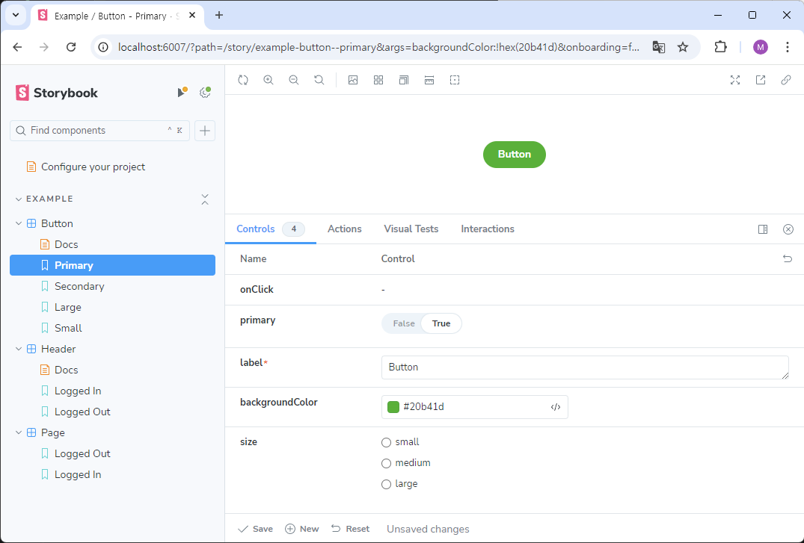

# Storybook으로 UI 문서화, UI Component 테스트 적용하기 (with. Next.js)

## 소개

UI Component를 문서화하여 보기 쉽게 정리하고 각 컴포넌트별로 변경사항을 따로 확인하도록 하여 디자이너와 좀 더 빠르고 명확하게 커뮤니케이션 하기 위해 회사 FrontEnd에 Storybook을 도입하였다. 이번 내용은 Storybook의 적용 방법을 간단히 작성하고 아직 해결되지 않은 문제를 정리한 내용이다.

:::info 목차

1. [Storybook이란?](#storybook이란)
2. [기존 프로젝트에 Storybook 설치하기](#기존-프로젝트에-storybook-설치하기)
3. [Components 데모 만들기](#components-데모-만들기)
4. [UI 수정 미리보기](#ui-수정-미리보기)
5. [Mocking data](#mocking-data)
6. [아직 해결되지 않은 문제들](#아직-해결되지-않은-문제들)

:::

<!--truncate-->

## Storybook이란?

Storybook은 Frontend UI를 컴포넌트/페이지 별로 분리하여 빌드할 수 있는 툴이다. 전체 앱을 다시 빌드하거나 실행하지 않아도 화면에 대한 변경사항을 분리하여 보거나 테스트할 수 있고 문서화 기능도 제공해준다. 무료 오픈소스로 제공되어 많은 회사에서 사용중이다.

## 기존 프로젝트에 Storybook 설치하기

> Next.js 프로젝트에 Storybook 적용하기

### init Storybook

#### 프로젝트에 스토리북이 없을 경우

```bash
npx storybook@latest init
```

#### 프로젝트에 이미 스토리북이 추가되어 있는 경우

```bash
npx storybook@latest upgrade
```

### Migration

#### Framework 설치

```bash
npm install --save-dev @storybook/nextjs
```

#### .storybook/main.ts 파일 변경

위 command를 입력하면 `.storybook/`, `storybook/` 폴더가 생성된다. `.storybook/main.js|ts` 파일을 확인해보자

```ts
import { StorybookConfig } from "#storybook/nextjs";

const config: StorybookConfig = {
  // ...
  // framework: '@storybook/react-webpack5', 👈 Remove this
  framework: "@storybook/nextjs", // 👈 Add this
};

export default config;
```

이전에는 아래의 애드온들을 필수로 추가해주어야 했지만 최신 버전에서는 아래 애드온들을 따로 추가해주지 않아도 기본적으로 적용된다.

```ts
import { StorybookConfig } from "@storybook/nextjs";

const config: StorybookConfig = {
  // ...
  addons: [
    // ...
    // 👇 These can both be removed
    // 'storybook-addon-next',
    // 'storybook-addon-next-router',
  ],
};

export default config;
```

### Tailwind 적용하기

Tailwind를 사용해 css를 적용한 경우 storybook 화면이 깨지는 것을 볼 수 있다. tailwind를 적용하려면 아래의 단계를 따라 적용하여야 한다.

#### import globals.css

tailwind 지시문이 추가된 css 파일을 불러온다. `Next.js` yarn cli 를 통해 프로젝트를 생성한 경우 `@/app/globals.css`에 작성 되어있다.

```tsx title=".storybook/previews.ts"
//...
import '../app/globals.css'; // Import tailwindcss styles

//...
//...

const preview: Preview = {
  //...
```

## Components 데모 만들기

데모를 생성할 Component를 불러와 `ComponentName.Stories.tsx` 파일을 생성해준다. `stories` 파일에는 `default export`와 `named exports`가 포함되어야 한다. `default export`의 경우 Storybook 목록과 애드온에 사용될 정보를 제공하고 `named exports`의 경우 Components의 데모가 될 stories를 정의한다. `args`, `parameters`, `decorators` 등의 옵션 값들을 통해 필요한 속성을 설정할 수 있다.

아래는 `LoginForm`을 통해 input field가 비어있는 경우, 채워져 있는 경우 두가지 데모를 생성하는 예시이다.

### LoginForm Component

```tsx title="@/app/LoginForm.tsx"
//...
export default function LoginForm() {
  const handleSubmit = async (event: FormEvent<HTMLFormElement>) => {
    //...
    //...
  };

  return (
    <form onSubmit={handleSubmit}>
      <section>
        <h1>로그인</h1>
        <label>
          이메일
          <input
            data-testid="email"
            type="email"
            placeholder="이메일을 입력하세요"
          />
        </label>
        <label>
          비밀번호
          <input
            data-testid="password"
            type="password"
            placeholder="비밀번호를 입력하세요"
          />
        </label>
        <SignupButton />
      </section>
      <button type="submit">로그인</button>
    </form>
  );
}
```

### Stories.tsx

```tsx title="LoginForm.stories.tsx"
import type { Meta, StoryObj } from "@storybook/react";
import { userEvent, within } from "@storybook/test";

import LoginForm from "@/app/login/components/LoginForm";

const meta: Meta<typeof LoginForm> = {
  component: LoginForm,
};

export default meta;
type Story = StoryObj<typeof LoginForm>;

export const EmptyForm: Story = {};

export const FilledForm: Story = {
  play: async ({ canvasElement }) => {
    const canvas = within(canvasElement);

    // 👇 Simulate interactions with the component
    await userEvent.type(canvas.getByTestId("email"), "email@provider.com");

    await userEvent.type(canvas.getByTestId("password"), "a-random-password");
  },
};
```

## UI 수정 미리보기

Storybook을 도입하게 된 이유 중 가장 큰 부분을 차지한게 이 기능이었다. 현재 회사는 Mouse Hover, Active 등 여러 UI에 Interaction에 대한 디자인이 없고, 기획 단계에서도 화면에 필요한 요소들을 두루뭉실하게 말로만 설명해서 이후 다시 수정하는 일이 빈번했다.

이에 각 요소들의 크기나 애니메이션 효과들을 직접 수정해보며 확인할 수 있는 데모를 만들어 즉각적인 피드백을 받을 수 있는 Component demo 를 도입하게 되었다.

### Args를 통한 Controller 설정

반응형으로 수정 가능한 UI를 구성하기 위해 가장 간단한 방법으로 `Pros`를 통해 추가해주는 방법이 있다. React Components의 property로 수정 가능한 요소들을 입력받고 `Stories`의 `Args`에서 해당 요소들에 대한 컨트롤러를 설정해주어 UI를 변경 해볼 수 있는 데모 화면을 생성할 수 있다.

아래는 storybook init을 통해 생성되는 기본 `Button`으로 보는 예시이다.

#### Button Component

```tsx title="./Button.tsx"
import React from "react";

import "./button.css";

export interface ButtonProps {
  /** Is this the principal call to action on the page? */
  primary?: boolean;
  /** What background color to use */
  backgroundColor?: string;
  /** How large should the button be? */
  size?: "small" | "medium" | "large";
  /** Button contents */
  label: string;
  /** Optional click handler */
  onClick?: () => void;
}

/** Primary UI component for user interaction */
export const Button = ({
  primary = false,
  size = "medium",
  backgroundColor,
  label,
  ...props
}: ButtonProps) => {
  const mode = primary
    ? "storybook-button--primary"
    : "storybook-button--secondary";
  return (
    <button
      type="button"
      className={["storybook-button", `storybook-button--${size}`, mode].join(
        " "
      )}
      {...props}
    >
      {label}
      <style jsx>{`
        button {
          background-color: ${backgroundColor};
        }
      `}</style>
    </button>
  );
};
```

#### Stories.tsx

```tsx title="Button.stories.tsx"
import type { Meta, StoryObj } from "@storybook/react";
import { fn } from "@storybook/test";

import { Button } from "./Button";

// More on how to set up stories at: https://storybook.js.org/docs/writing-stories#default-export
const meta = {
  title: "Example/Button",
  component: Button,
  parameters: {
    // Optional parameter to center the component in the Canvas. More info: https://storybook.js.org/docs/configure/story-layout
    layout: "centered",
  },
  // This component will have an automatically generated Autodocs entry: https://storybook.js.org/docs/writing-docs/autodocs
  tags: ["autodocs"],
  // More on argTypes: https://storybook.js.org/docs/api/argtypes
  argTypes: {
    backgroundColor: { control: "color" },
  },
  // Use `fn` to spy on the onClick arg, which will appear in the actions panel once invoked: https://storybook.js.org/docs/essentials/actions#action-args
  args: { onClick: fn() },
} satisfies Meta<typeof Button>;

export default meta;
type Story = StoryObj<typeof meta>;

// More on writing stories with args: https://storybook.js.org/docs/writing-stories/args
export const Primary: Story = {
  args: {
    primary: true,
    label: "Button",
  },
};

export const Secondary: Story = {
  args: {
    label: "Button",
  },
};

export const Large: Story = {
  args: {
    size: "large",
    label: "Button",
  },
};

export const Small: Story = {
  args: {
    size: "small",
    label: "Button",
  },
};
```

#### 실행 화면



## Mocking data

Next.js로 개발을 하면 Context Provider나 API Data 등 Component 외부에서 데이터를 받아와 표시해줘야 하는 경우가 많다.

이러한 데이터를 UI 테스트 환경에서는 가져올 수 없으므로 Mocking을 통해 대체해주어야 한다.

:::info

[출처: 모킹(Moking) 이란? - 개발자맛 치즈볼 블로그](https://cheeseb.github.io/testing/react-testing-mocking/)

### Moking 이란?

> 단위 테스트를 작성할 때, 해당 코드가 의존하는 부분을 가짜(mock)로 대체하는 기법

특정 컴포넌트를 테스트할 때, 테스팅 범위가 아니지만 의존성이 있는 다른 모듈이 있을 수 있다.
이를 실제 모듈로 불러와서 테스트 한다면 다음과 같은 문제가 생길 수 있다.

- 아직 개발되지 않은 모듈에 의존한다면 테스팅/개발이 어려움
- 다른 모듈에 의해 테스트 결과가 바뀔 수 있어, 해당 컴포넌트에 대해서만 독립적인 테스트를 할 수 없음

  - 특정 기능만 분리해서 테스트한다는 ‘단위’ 테스트의 의미에 적합하지 않음

- 테스트 실행 속도가 떨어지고, 이는 프로젝트 규모가 커져서 한번에 실행할 테스트 케이스가 많아지면 더 큰 이슈가 될 수 있음
  - CI/CD 파이프라인의 일부로 테스트가 자동화되어 자주 실행되어야 한다면 더 큰 문제가 됨

:::

### Context Provider Mocking

현재 회사 코드의 경우 데이터 구조가 복잡하지 않아 Context Provider를 통해 공통 state의 상태를 관리하고 있다. 이러한 데이터들은 아래와 같은 방법으로 대체한다.

#### 전역 Provider

Theme 과 같은 `stories`에 공통으로 사용되는 공급자를 제공해주는 방식이다. `preview.tsx`에 `decorators` 옵션을 추가해 `<Story />`를 부모요소로 생성해준다. 아래는 공식문서에 작성된 기본 작성법이다.

```tsx title=".storybook/preview.tsx"
import React from "react";

import { Preview } from "@storybook/react";

import { ThemeProvider } from "styled-components";

const preview: Preview = {
  decorators: [
    (Story) => (
      <ThemeProvider theme="default">
        {/* 👇 Decorators in Storybook also accept a function. Replace <Story/> with Story() to enable it  */}
        <Story />
      </ThemeProvider>
    ),
  ],
};

export default preview;
```

#### 개별 Provider

Component 개별로 각각 공급자를 추가해줘야하는 경우도 있다. 이러한 경우 해당 `Context`를 가져와서 initial state를 입력해주는 방식으로 작성할 수 있다.

아래는 직접 작성한 예시이다.

##### Context Provider

```tsx title="@/context/StateContext.tsx"
"use client";

import { createContext, useContext, useState } from "react";

interface SomeContextType {
  someState: string;
}

const SomeContext = createContext<SomeContextType>({
  someState: "",
});

const useSomeContext = () => useContext(ApplyContext);

interface SomeyStateProviderProps {
  children: React.ReactNode;
  initialState?: { someState: string };
}

const SomeStateProvider: React.FC<SomeStateProviderProps> = ({
  children,
  initialState = { someState: "" },
}) => {
  const [someState, setSomeState] = useState<string>(initialState.someState);

  return (
    <SomeStateContext.Provider
      value={{
        someState,
      }}
    >
      {children}
    </SomeStateContext.Provider>
  );
};

export { SomeStateProvider, useSomeStateContext };
```

##### Stories.tsx

```tsx title="@/stories/SomeComponent.stories.tsx"
import type { Meta, ReactRenderer, StoryObj } from "@storybook/react";
import { ApplyStateProvider } from "@/context/ApplyContext";
import type { PartialStoryFn } from "storybook/internal/types";
import { http, type HttpHandler, HttpResponse } from "msw";

import Component from "@/app/main/components/ApplyDetailHistory";

const meta: Meta<typeof Component> = {
  component: Component,
};

export default meta;
type Story = StoryObj<typeof Component>;

const SomeStateProviderMock = ({
  someState,
  children,
}: {
  someState: string;
  children: React.ReactNode;
}) => {
  return (
    <SomeStateProvider initialState={{ someState }}>
      {children}
    </SomeStateProvider>
  );
};

const SomeStateDecorator = (
  Story: PartialStoryFn<ReactRenderer>,
  context: { parameters: { someState: string } }
) => {
  const { someState } = context.parameters;
  return (
    <SomeStateProviderMock someState={someState}>
      <Story />
    </SomeStateProviderMock>
  );
};

export const EmptyForm: Story = {};

/*
 * See https://storybook.js.org/docs/writing-stories/play-function#working-with-the-canvas
 * to learn more about using the canvasElement to query the DOM
 */
export const FilledForm: Story = {
  decorators: [SomeStateDecorator],
  parameters: {
    someState: "any data",
  },
};
```

### Network Mocking

## 아직 해결되지 않은 문제들

### SWR Cashing
