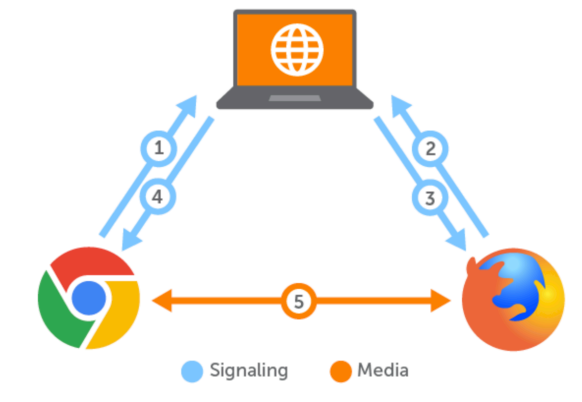
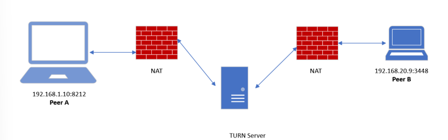
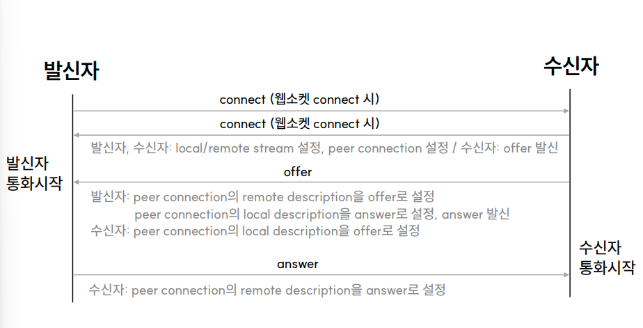
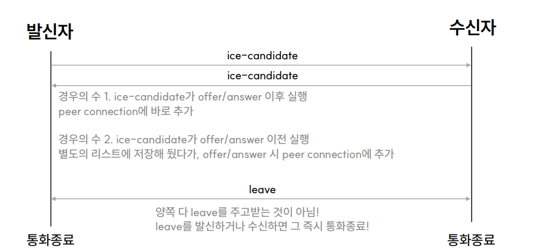
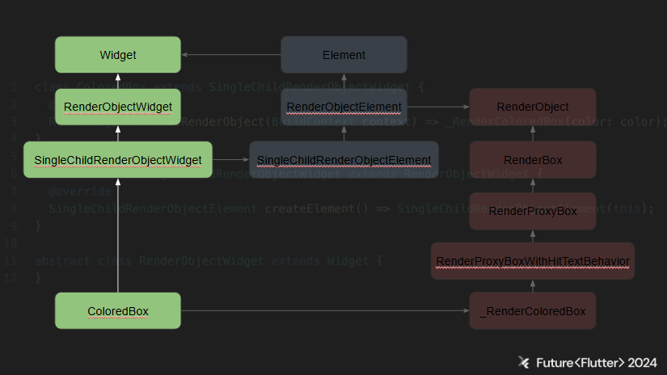
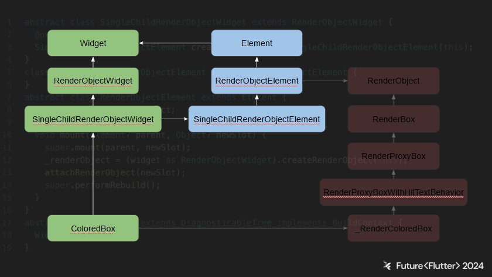

# Future Flutter 컨퍼런스 후기

## 소개

조금 늦었지만, 2024년 9월 28일 진행된 Flutter 컨퍼런스 Future Flutter에서 들었던 내용을 정리하고, 실제 회사에 적용해보며 겪었던 이슈들에 대한 내용을 정리한 글이다.

:::info 목차

1. [FFI로 연결하는 고(Go)와 플러터](#ffi로-연결하는-고go와-플러터)
2. [Flutter WebRTC](#flutter-webrtc)
3. [ShoreBird 작동 방식](#shorebird-작동-방식)
4. [풍성한 디자인 요청사항에 대응하기](#풍성한-디자인-요청사항에-대응하기)
5. [플러터 렌더링 해부학](#플러터-렌더링-해부학)
6. [Flutter web을 활용하여 제품 개발 환경 개선하기](#flutter-web을-활용하여-제품-개발-환경-개선하기)
7. [어느날 갑자기 앱이 터졌을 때](#어느날-갑자기-앱이-터졌을-때)
8. [Flutter Bloc을 제품 개발에 야무지게 적용하기](#flutter-bloc을-제품-개발에-야무지게-적용하기)

:::

<!--truncate-->

## FFI로 연결하는 고(Go)와 플러터

멀티 플랫폼에 대응하는 앱을 만들기 위해 Go 언어와 플러터를 활용하며 기본적인 UI 디자인을 적용하며 고성능의 앱을 개발하는 방법에 대해 고민하며 적용한 내용에 대한 발표였다.

### 왜 Go 인가?

고언어를 채택한 장점에는 크게 3가지의 이유가 있었다.

#### 크로스 플랫폼 개발

Windows, macOS, Linux 와 같은 다양한 운영체제와 x86, ARM 등의 아키텍쳐로 크로스 컴파일이 가능하여 보다 빠르게 다양한 플랫폼 지원을 간편하게 한다.

#### 빠른 컴파일과 실행

Go언어는 머신코드로 바로 컴파일 가능하기 때문에 고성능의 앱 개발에 유리하다. 실행속도가 빠를 뿐만아니라 컴파일 속도도 빨라, 수정사항을 빠르게 적용하여 테스트 가능하고 이로인해 개발 속도를 빠르게 가져갈 수 있다.

#### 가벼움과 확장성

고루틴과 채널이라 알려진 동시성 기능을 지원하여 많은 작업들을 성능저하 없이 동시에 처리 가능하다. 효율성과 확장성을 필요로하는 고성능 어플리케이션 개발에 이상적이다.

### 왜 플러터인가?

#### 크로스 플랫폼 개발

하나의 코드 베이스로 안드로이드, IOS, Windows desktop, Web 등 여러 플랫폼 개발이 가능하다. 이로인해 적은 인원과 시간으로 다양한 플랫폼에 대응하는 App.을 개발할 수 있다.

#### 유용한 개발도구

플러터의 핫리로드, 핫리스타스 같은 기능과 유용한 개발 도구를 지원해 개발 속도를 빠르게 한다.

#### 빠르고 아름다운 애플리케이션

플러터는 자체적으로 기본적인 애니메이션과 인터렉션에 대한 처리가 되어있어 보다 간편하게 고퀄리티의 사용자 경험을 제공한다. 또한 각 플랫폼에 맞게 컴파일되어 효율적으로 동작하도록 해준다.

### FFI 란?

Foreign Function Interface (FFI)는 C언어로 짜여진 함수를 다트나 플러터에서 사용하는 방법으로 플러터에서는 `dart:ffi` 패키지를 사용한다.

C뿐만 아니라 Go, C++, Rust 등의 **C 인터페이스를 제공하는 언어**라면 Dart에서 사용이 가능하다.

### 플러터에서 FFI 사용하기

```bash
flutter create --platforms=android,ios,macos,windows,linux --template=plugin ffi native add
```

위 커맨드로 프로젝트를 생성하면 `lib`폴더 아래에 `Dart` 코드, `src` 폴더 아래에 `C` 코드가 생성된다.

#### 고언어 라이브러리 생성하기

##### 고언어 코드 작성

1. `src`폴더 안에 `go.mod` 파일 생성
    > **`go.mod` 파일이란?** 모듈 이름, 버전, 의존성 등을 정의하는 파일

2. `sum.go` 파일을 생성하고 고언어 코드를 작성
    ```go
    // sum.go file
    package main

    import "C"          // cgo 문법으로 
                        // export <함수명> 주석을 이용해서 sum이라는 함수를 C로 export

    // export sum
    func sum(a C.int, b C.int) C.int {      // C에서 사용해야하기 때문에 Go의
        return a + b                        // 타입이 아닌 C 타입으로 C.int 를 사용
    }

    func main() {}
    ```

#### 고언어 라이브러리를 안드로이드용으로 컴파일

최신 안드로이드 단말기들을 지원하기 위해서는 `arm64`와 `x86_64` 아키텍처를 지원하도록 크로스 컴파일 되어야함

```bash
export ANDROID_OUT=../android/src/main/jniLibs
export ANDROID_SDK=$HOME/Library/Android/sdk
export NDK_BIN=$ANDROID_SDK/ndk/23.1.777.9620/toolchains/llvm/prebuilt/darwin-x86_64/bin

# x86_64 아키텍처로 컴파일 해서 android/src/main/jniLibs/x86_64 폴더에 libsum.so 생성
CGO_ENABLED=1 \
GOOS=android \
GOARCH=and64 \
CC=$NDK_BIN/x86_64-linux-android21-clang \
go build -buildmod=c-shared -o $ANDROID_OUT/x86_64/libsum.so

# arm64 아키텍처로 컴파일 해서 android/src/main/jniLibs/arm64-v8a 폴더에 libsum.so 생성
CGO_ENABLED=1 \
GOOS=android \
GOARCH=arm64 \
CC=$NDK_BIN/aarch64-linux-android21-clang \
go build -buildmode=c-shared -o $ANDROID_OUT/arm64-v8a/libsum.so
```

#### 고언어 라이브러리를 IOS용으로 컴파일

기본적인 컨셉은 안드로이드용 빌드와 동일하나 약간의 추가과정이 필요함

* IOS는 static 라이브러리로 컴파일 해야함
* 시뮬레이터용 `arm64`와 *`arm64` 빌드*와 *아이폰용 `arm64` 빌드*, 총 세개의 라이브러리로 컴파일
* 시뮬레이터용 라이브러리 두개를 통합하기 위해 lipo라는 도구를 사용
* 빌드된 모든 라이브러리를 `xframework`패키지로 통합

### 플러터에서 사용하기

#### FFIgen을 사용해서 바인딩 만들기

`C`라이브러리를 `Dart` 코드에서 사용할 수 있게 하는 바인딩을 `ffigen`이라는 도구를 이용해서 자동생성. `ffigen`을 돌리기 위해 `ffigen yaml` 작성

```yaml
# Run with `flutter pub run ffigen --config ffigen.yaml`.
name: NativeLibrary
description: Bindings to `src/sum.h`.
output: `lib/generated_bindings.dart`
headers:
  entry-points:
    -`src/libsum.h`
preamble: |
  // ignore_for_file: always_specify_types
  // ignore_for_file: camel_case_types
  // ignore_for_file: non_constant_identifier_names
  // ignore_for_file: unused_field
  // ignore_for_file: unused_element
comments:
  style: any
  lenght: full
```

#### 다트코드에서 사용하기

이제 라이브러리를 다트에서 로드하고 `generated_bindings.dart` 파일에 `C` 함수로 바인딩된 다트 함수를 호출 가능

```dart
// lib/native_add.dart
import 'dart:ffi';
import 'dart:io';
import 'generated_bindings.dart';

int sum(int a, int b) => _bindings.sum(a, b);

const String _libName = 'native_add';

/// The dynamic library in which the symbols for {NativeAddBindings} can be found.
final DynamicLibrary _dylib = () {
  if (Platform.isAndroid || Platform.isLinux) {
    return DynamicLibrary.open('libsum.so');
  }
  throw UnsupportedError('Unknown platform: ${Platform.operatingSystem}');
}();

/// The bindings to the native functions in [_dylib].
final NativeLibrary _bindings = NativeLibrary(_dylib);
```

### 정리

* `C` 인터페이스를 제공하는 언어라면 `Dart`에서 **FFI**를 통해 사용 가능함
* `ffigen`을 이용하면 `.h`를 읽어 자동으로 바인딩 코드를 생성해줌
* `Go` 언어의 크로스 컴파일러를 이용해 쉽게 크로스 플랫폼 라이브러리 생성 가능

:::info title=Next Step

* IOS / macOS / Windows / Linux 등 안드로이드 외 다른 플랫폼 빌드
  * 예시는 Android / IOS / macOS 까지만 동작
* 웹에서도 동작하도록 빌드 (힌트: WebAssembly)
* 메모리 공유나 비동기 처리등의 고급 사용예제
:::

## Flutter WebRTC

Flutter에서 WebRTC를 어떻게 다루는지에 대한 내용을 기대하였지만, 기대했던 내용과는 달리 단순히 WebRTC에 대한 설명만 진행하였다. WebRTC에 대해 잘 알지 못하여 이 내용 또한 유익한 시간이었다.

### 서론

발표자분께서 현재 회사에 영상통화 솔루션을 개발하며 얻은 Flutter WebRTC 지식을 공유해주셨다. WebRTC에 대한 기본 개념과 Flutter 환경에서 WebRTC로 화상 통화를 어떻게 구현하였는지를 공유해주셨다. 

### WebRTC의 주요 개념

WebRTC의 **RTC**는 **Real-Time Communication**의 약자이다. 웹 애플리케이션과 사이트가 **중간자 없이** 브라우저간에 **오디오/비디오 스트리밍** 및 데이터 교환을 가능하도록 하는 기술이다.

웹에서 실시간 미디어 스트리밍을 하기위한 **유일한 표준**으로 2010년 Google에 의해 오픈소스화 되었다. 이후 Chrome 등 **모든 브라우저**에 탑재 되었다. (물론 IE에서는 제외 되었지만, IE는 이제 보내주도록 하자 😭) Flutter에서 사용하는 WebRTC도 당연히 동일한 원리로 실행된다.

클라이언트 간의 **직접 연결**로 구현 가능하지만, 클라이언트들이 완전히 같은 네트워크에 있는게 아닌 이상 직접 연결하는 것은 어렵다. 따라서 **시그널링 서버**와 **릴레이 서버** 같은 기술들이 생겨난다.

#### 시그널링(Signaling) 서버



각각의 기기가 **서버의 도움 없이 연결**하는 것을 도와주는 서버로, 뒤에서 다룰 **SDP(Session Description Protocol)** 교환에 관련된 서버이다. 실제 데이터가 시그널링 서버를 통해서 오가는 것이 아니라는 점을 유의하자.

#### 릴레이(Relay) 서버



**TURN 서버**라고도 부른다. 방화벽이나 여러 제약으로 인해 **P2P** 연결이 불가능한 상황에서 **클라이언트 간 중계**를 해주는 서버이다. 구글은 개발자들을 위해 **TURN 서버 코드**를 제공하고 있다. TURN 서버를 구현해 놓으면 서로 다른 네트워크에 있어도 P2P처럼 통신이 가능하다.

#### STUN 서버

**STUN 서버**는 **TURN 서버**와 혼동하기 쉽다. **STUN 서버** 는 **Session Traversal Utilities for NAT**의 약자로 통신을 위해 **자기 자신의 정보**를 알아내기 위한 서버이다. 예를 들어, 공유기를 사용하는 환경에서 외부IP를 알아내기 위해 사용된다. 자기 자신을 비추는 거울로 생각하면 된다.

#### RTCPeerConnection 객체

WebRTC를 위해 제공되는 Web API 객체이다. 웹 브라우저 또는 네이티브 앱에서 직접적인 통신 연결을 생성 및 관리하고, 데이터 스트림을 교환하는 역할을 수행한다. 이를 잘 이해하고 활용한다면 WebRTC 구현을 위해 개발자가 할 일이 크게 줄어들 것이다.

**RTCPeerConnection**이 하는 역할은 다음과 같다

- offer, answer, ice-candidate 등 WebRTC를 위한 **신호처리**
- STUN 및 TURN 서버를 사용한 **NAT 및 방화벽 통과**
- 사용자의 디바이스(카메라, 마이크)에서 오는 **미디어 스트림 관리**
- 클라이언트 간 데이터를 직접 교환하기 위한 **데이터 채널 생성**
- 통신 세션이 초기화 되거나 변경될 때 **세션 협상** 및 **재협상**
- 모든 통신을 자동으로 암호화하여 **중간자 공격**으로부터 보호
- 통계 및 네트워크 정보 제공

WebRTC의 경우 Flutter만을 위한 자료가 거의 없으므로 [MDN 사이트](https://developer.mozilla.org/en-US/docs/Web/API/RTCPeerConnection)를 통해 확인하는 것이 좋다.

#### SDP (Session Description Protocol)

발신자와 수신자는 모두 **클라이언트**이므로 통신 환경이 다른 경우가 대부분이다. 따라서 SDP를 통해 서로의 **미디어 능력** 및 **연결 정보**를 공유해야 한다.

SDP에는 오디오 및 비디오 코덱, 미디어 스트림의 방향, RTP(Real-time Transport Protocol) 엔드포인트 정보가 포함된다.

#### ICE (Interactive Connectivity Establishment)

일반적으로 발신자와 수신자는 **서로 다른 네트워크**를 사용하게 된다. 하지만 발신자에서 수신자로, 수신자에서 발신자로 가는 네트워크 경로는 다양하므로 다른 네트워크에 속한 클라이언트 간 통신 구현은 어렵다. ICE는 발신자 또는 수신자 입장에서 **내게 오는 길**을 알려준다.

ICE Candidate는 다음 내용을 포함한다. IP 주소, 포트 번호, 프로토콜(UDP 또는 TCP), Candidate 유형(host, srflx, prflx, relay 등 포함)

각 피어는 **자신의 모든 후보를 수집**한 후 이를 다른 피어와 교환한다. 양쪽 피어는 **가능한 모든 후보 조합**에 대해 연결성 검사를 수행하며 **가장 높은 우선순위**를 가진 후보 조합이 선택되어 미디어 통신에 사용된다.

#### WebSocket

WebRTC에서 WebSocket이 반드시 필요하지는 않지만, **실시간 양방향 통신**에서의 이점 때문에 많이 활용된다.

### WebRTC 관련 Flutter 패키지

#### flutter_webrtc

Flutter에서 WebRTC 기능을 이용하기 위한 패키지로 기본적으로는 iOS, Android 등 다양한 플랫폼을 위해 제공되는 WebRTC 공식 **네이티브 패키지**를 **메서드 채널**로 묶어 놓은 구조이다.

#### web_socket_channel

Dart/Flutter에서 WebSocket 관련 기능을 제공한다. Web API에 비해 아직은 일부 기능을 지원하지 못하는 등 조금 미흡하다.

#### flutter_callkeep

Flutter에서 전화 수신 및 발신 UI를 처리하는 기능을 제공해준다. iOS는 CallKit을 사용하며, Android는 자체 UI를 띄워준다. iOS CallKit 구현을 위해서는 별도로 VoIP Push 구현이 필요하다

### WebRTC & WebSocket 동작흐름





WebSocket이 연결되면 WebSocket을 통해 connect 데이터가 전송된다. (발신자, 수신자 모두)

```json
{
  "type": "connect",
  "callId": "string"
}
```

connect 수신 시 발신자와 수신자는 다음 동작을 수행한다.

1. RTCPeerConnection 객체 초기화
2. onIceCandidate 이벤트 리스너 추가(ice-candidate 전송)
3. onAddStream 이벤트 리스너 추가(Remote Stream 초기화, Remote Renderer를 Remote Stream과 연결, Local Renderer를 Local Stream 과 연결)
4. Local Stream 초기화
5. 수신자는 offer 생성 및 발신

offer와 answer는 **SDP**를 교환하기 위해 이루어진다. 

#### offer

수신자는 connect를 받으면 offer를 보낸다.

```json
{
  "type": "offer",
  "sdp": "string",
  "callID": "string",
  "restart": "boolean"
}
```

#### answer

발신자는 offer를 받았을 때 answer를 보낸다.

```json
{
  "type": "answer",
  "sdp": "string",
  "callId": "string"
}
```

* 수신자의 offer 발신 동작
  1. offer 생성
  2. RTCPearConnection 객체를 다음과 같이 설정 - Local Description: offer
  3. 발신자에게 offer 전송

* 발신자의 offer 수신 & answer 발신 동작
  1. RTCPeerConnection 객체를 다음과 같이 설정 - Remote Description: offer
  2. sdp 기반 answer 생성
  3. RTCPeerConnection 객체를 다음과 같이 설정 - Local Description: answer
  4. 수신자에게 answer 전송
  5. 통화 시작을 위한 UI 처리

* 수신자의 answer 수신 동작
  1. RTCPeerConnection 객체를 다음과 같이 설정 - Remote Description: answer
  2. 통화 시작을 위한 UI 처리


#### ice-candidate

ICE Candidate를 수신하고 RTCPeerConnection 객체에 ICE Candidate를 **모두 추가**

```json
{
  "type": "ice-candidate",
  "candidate": {
    "candidate": "string",
    "sdpMid": "string",
    "sdpMLineIndex": "int"
  },
  "callId": "string"
}
```

offer-answer 교환이 끝나기 전에 ICE Candidate 교환이 먼저 일어나는 경우도 있다. 이때는 **별도의 리스트**에 ICE Candidate를 모두 저장해 뒀다가 offer-answer가 발생 했을 때 **Peer Connection**에 ICE Candidate를 추가해주면 된다.

#### leave

통화를 종료하기 위해 이루어진다. 수신자와 발신자 중 어느 한 쪽이 leaave를 전송하면 즉시 **통화 종료** 된다.(서로 leave를 교환할 필요가 없다.)

```json
{
  "type": "leave",
  "callId": "string"
}
```

### Flutter WebRTC를 위한 팁

#### 수신자의 응답 이전 발신자의 통화 종료

서버에서 수신자에게 `"HUNGUP"` Push 알림을 보내 전화 수신 화면, 소리, 진동이 뜨지 않도록 해야한다.

#### 수신자의 통화 거절

서버에서 발신자에게 `"REJECTED"` Push 알림을 보내 video 화면에서 빠져나오도록 한다.

#### 수신자가 여러 기기 중 하나의 기기에서 응답

서버에서 수신자의 다른 기기들에 `"RESPONDED"` Push 알림을 보내 전화 수신 화면, 소리, 진동이 뜨지 않도록 해야한다.

#### 통화 종료

통화 종료 시에는, 한쪽이 `"leave"` 메시지를 상대편에 보내면 둘다 종료된다.
하지만 여러가지 이유로 이 동작이 정상적으로 진행되지 못하는 경우가 있는데, 이때는 signaling 서버에서 `"leave"` 메시지를 디바이스에 보내서 종료하도록 한다.

## ShoreBird 작동 방식

멀티 플랫폼 모바일 애플리케이션 개발을 위해 많이 사용되는 프레임워크 하면 ReactNative, Flutter 와 같은 프레임워크들이 생각날 것이다. RN(ReactNative) 하면 여러 기능중 단연 **Code Push** 를 먼저 떠올릴 수 있는데, `Flutter` 에서 `Code push` 를 적용하기 위해 만들어진 서비스인 `Shorebird`에 대해 알아보자.

### Code push란?

* 코드 수정 시 디바이스에서 업데이트를 하지 않아도 지속적으로 사용자가 변경사항을 가져올 수 있다
* 대부분의 큰 애플리케이션들은 `Code push`를 사용중이다.
  * *Large install base = long store update time* 이므로

* 비즈니스에서 현실적인 문제들
  * Downtime = lost revenue
  * Code push = insurance you can fix things quickly if they go wrong


## 풍성한 디자인 요청사항에 대응하기

LINE 2년차 주니어 개발자로 일하면서 플러터를 사용하여 여러 디자인 요구사항들을 해결한 경험들을 공유한 시간이었다.

### CustomPaint를 활용한 Container

다양한 모양의 컨테이너를 생성하기 위해 CustomPaint를 사용하여 오각형의 도형을 만들며 동적으로 수정할 수 있도록 변경한 방법들에 대해 공유해주셨다.

`CustomPaint` 의 경우 Flutter 에서 매우 중요하게 활용된다. 특히 Interactive 한 화면을 디자인하기 위해 Animation 효과를 적용할 때 Svg 파일을 CustomPaint로 변환하면서 특히 많이 활용이 되는데, 현재 회사에서 apple의 [SF Symbols](https://developer.apple.com/sf-symbols/)와 유사하게 아이콘들을 커스텀 가능하게 수정하는 작업을 하며 보고있던 부분이라 반가운 주제였다.

발표내용은 간단한 path 를 생성하는 방법을 공유해주는 조금 쉬운 내용이었지만, `Flutter`를 처음 접하며 겪었던 고민들과 같은 고민을 해봤던 개발자 동료를 만나 반가웠다.

추가로 `CustomPaint` 의 경우 `Flutter` 팀에서 `SVG` 를 대체하기 위해 최적화를 신경써서 좋은 성능으로 화면에 아이콘이나 벡터이미지를 생성할 수 있게 해주었는데, 이와 관련하여 [Youtube](https://www.youtube.com/watch?v=w9lD35D78N8)에서 설명한 내용도 참고하자

### Loading Skeleton

최근 로딩화면을 단순히 Circular Loader로 구현하지 않고 사용자로 하여금 어떤 자료들이 보여질지 예측이 가능하도록 디자인하는 Skeleton Design을 많이 적용하고 있는 것으로 알고있다. 현재 회사에서도 이러한 점 때문에 팀원분들과 디자이너분께 강력하게 어필하여 Loading Skeleton을 모두 적용하였었는데, 마찬가지로 적용했던 내용과 같은 것을 듣게되어 놀랐다.

발표 내용은 두개의 컨테이너를 교차하여 빛반사가 움직이는 효과를 적용한 과정에 대해 간략하게 설명해 주셨고 `Shimmer` 라는 Package를 사용하면 보다 간편하게 적용할 수 있음을 공유해주셨다.

하지만, 두개의 컨테이너를 교차하지 않아도 CustomPaint를 활용하면 같은 효과를 낼 수 있다. Gradient 범위를 설정해주면 범위 밖의 색상은 가장 바깥에 설정해준 색상으로 표시되기 때문에 동일한 효과를 낼 수 있다.

### CustomScrollView + Dropdown

마지막 발표내용까지도 이전에 Help 페이지를 적용하며 구현했던 Scroller 의 위치를 가져와 UI에 적용하는, 이번 회사에 들어오고 한달동안 뜯어 고쳤던 UI들에 대한 내용들이 모두 나와서 깜짝 놀랐다.. 역시 어느회사나 하는 일들은 비슷한 것 같다.

발표자분의 경우 화면 스크롤 시 CustomScrollView 위에 표시해준 Overlay가 화면이 스크롤될 때 같이 올라가는 문제가 있었고 이를 Scrollbar offset을 가져와 높이를 계속 추가해주어 해결한 내용에 대해 공유해 주었다.

이 부분에 있어서도 `Flutter` 의 Overlay 위젯을 활용하면 `Main` 위젯을 부모요소로 가지므로 해결가능한 문제였지만, 스크롤바의 offset을 가져와서 다양한 Interaction을 구현하는 방식은 많이 활용되므로 어떻게 코드를 작성하였는지 흥미롭게 들었다.

### 디자이너와 소통하기

디자이너분들과 메신저를 통해서 소통한 방법들과 내용들에 대해 공유해주셨다. 명확하게 의견을 주고받을 수 있도록 다양한 방법을 제공해주셨는데 해당 방법들은 다음과 같다.

* 내가 이해한 바를 정확하게 공유하기
* 질문할 때는 이해가 쉽게 시각 자료를 첨부하기
* 선택이 필요할 때는 가능한 옵션을 먼저 제공하기
* 디자이너의 의도와 동일하게 구현하기 위해 최선을 다하기

## 플러터 렌더링 해부학

Flutter Seoul의 오거나이저로 활동 중이신 에이든님의 발표로 플로터 위젯이 화면에 표시될 때 어떠한 방식으로 렌더링이 되는지, Dart 코드를 뜯어보며 확인해보도록 자료를 준비해주셨다. 에이든님의 경우 Flutter 월간 세미나에서도 Flutter Web의 Image 렌더링에 대한 발표를 들었었는데, 두 내용 모두 찾아보기 귀찮고 생각만해도 피곤한 내용들을 꼼꼼히 잘 설명해주셔서 많은 도움이 되었다.

### 랜더링 과정

#### Widget

위젯은 플러터를 시작할 때 가장 먼저 접하는 클래스이자, 개발 과정에서 가장 자주 사용하는 클래스이다. 플러터 개발자에게 있어 위젯은 앱 개발의 가장 핵심적인 요소라고 할 수 있을 것이다.

플러터 공식 문서를 보면 **Widget**은 `"Describes the configuration for an Element"` "Widget은 Element의 구성을 표현하는 객체" 라고 설명한다. 하지만 플러터 개발자들 사이에 위젯에 대한 설명으로 이보다 더 널리 알려진 설명이 있는데 바로 `"In Flutter, almost everything is a widget"`이다. 여기서 흥미로운 점은 `'almost everything'` '거의 모든 것'이라는 표현인데 위젯을 **'거의 모든 것'**이라 설명하는 이유는 무엇일까? 또 그렇다면 거의 모든 것에 포함되지 않는 것들은 어떤 것들이 있을까

**'Almost everything'**인 Widget 너머, 화면을 그리는 자세한 과정을 살펴보며 이를 알아보자

#### ColoredBox

화면에 색을 칠하는 간단한 프로젝트를 구현하려 한다. 색을 칠하는데 흔히 사용되는 `Container`가 아닌 `ColoredBox`위젯을 사용하여 이를 구현해보자.

아래는 `ColoredBox` 위젯을 이용해 사각형의 Box 공간을 녹색으로 칠하는 간단한 코드이다. 렌더링 과정을 살펴보기 위해 `MaterialApp`이나 `Scafford`를 사용하지 않고 위젯트리를 간단히 구성하였다.

```dart title=ColoredBox
import 'package:flutter/material.dart';

void main() {
  runApp(
    const ColoredBox(
      color: Colors.green,
    ),
  );
}
```


ColoredBox 위젯의 생성자로 녹색을 전달했기 때문에 실행하면 녹색으로 가득찬 화면을 볼 수 있을 것이다.

widget에 대한 설명을 다시 한번 떠올려보자 `"Describes the configuration for an Element"`, Widget은 Element의 구성을 표현하는 객체일 뿐이다.

다음으로 Widget인 ColoredBox가 Element를 어떻게 구성하는지, ColoredBox를 뜯어보며 확인해보자

```dart title=ColoredBox
class ColoredBox extends SingleChildrenderObjectWidget {
  @override
  RenderObject createRenderObject(BuildContext context) => _RenderColoredBox(color: color);
}

abstract class SingleChildRenderObjectWidget extends RenderObjectWidget {
  @override
  SingleChildRenderObjectElement createElement() => SingleChildRenderObjectElement(this);
}

abstract class RenderObjectWidget extends Widget {
}
```

위 코드를 통해 `ColoredBox` 위젯을 확인해보면 `ColoredBox` 위젯은 `SingleChildRenderObjectWidget`을 확장하고 있다. 또 `SingleChildRenderObjectWidget`은 `RenderObjectWidget`을 확장하고 있고, `RenderObjectWidget`은 `Widget`을 확장하고 있다. 이러한 클래스 계층을 따라가보면 알 수 있듯 `ColoredBox`는 `Widget`의 구현체이다.

이를 표로 그려보면 다음과 같이 표현할 수 있다.



`ColoredBox`가 렌더링되는 자세한 과정을 살펴보려면 `RenderObject`를 반환하는 `createRenderObject`와 `SingleChildRenderObjectElement`를 반환하는 `createElement`를 살펴봐야한다.

아직은 두 메소드가 어떻게 호출되는지 알기 어렵겠지만, 이 내용을 모두 본 후에는 두 메소드가 렌더링에 어떻게 관여하는지 모두 알게될테니 지금은 `createRenderObject`와 `createElement`를 `Widget`에서 오버라이드하고 있다는 사실만 기억한체 넘어가자.

#### Element

이번에는 `SingleChildRenderObjectWidget`이 오버라이드하고 있는 `createElement`가 생성하는 `Element`에 대해 살펴보자.

플러터 공식문서를 보면 `Element` 클래스에 대해 이렇게 설명한다. `"an instantiation of Widget at a particular location in the tree"`, `Element`는 트리의 특정 위치에 있는 위젯을 인스턴스이다.

`Element`의 동작을 확인하기 위해 `SingleChildRenderObjectWidget`의 클래스 계층 구조를 살펴보자.

```dart title=SingleChildRenderObjectWidget
abstract class SingleChildRenderObjectWidget extends RenderObjectWidget {
  @override
  SingleChildRenderObjectElement createElement() => SingleChildRenderObjectElement(this);
}
class SingleChildRenderObjectElement extends RenderObjectElement {
}
abstract class RenderObjectElement extends Element {
  RenderObject? _renderObject;
  @override
  void mount(Element? parent, Object? newSlot) {
    super.mount(parent, newSlot);
    _renderObject = (widget as RenderObjectWidget).createRenderObject(this);
    attachRenderObject(newSlot);
    super.performRebuilde();
  }
}
abstract class Element extends DiagnosticableTree implements BuildContext {
  Widget? _widget;
}
```

앞서 `ColoredBox` Widget이 확장한 `SingleChildRenderObjectWidget`은 `createElement` 메소드를 통해서 `SingleChildRenderObjectElement`를 생성하는걸 살펴보았다. `SingleChildRenderObjectElement`는 `RenderObjectElement`를 확장하고 있고, `RenderObjectElement`는 `Element`를 확장하고 있다.

`Element`는 `BuildContext`를 구현한 추상클래스로 `Widget`을 프로퍼티로 들고, 필요한 시점에 `build` 메소드를 호출하게 된다. 이를 표에 추가하면 다음과 같이 표현할 수 있다.



`Element` 클래스의 계층 중 렌더링과 관련해서 주의깊게 살펴볼 부분은 `RenderObjectElement` 클래스의 `RenderObject` 프로퍼티와 `mount` 메소드이다.

`mount`가 호출되면 `Widget`의 `createRenderObject` 메소드를 호출해 화면을 그리는데 직접적으로 사용될 `RenderObject`를 생성한다. 생성된 `RenderObject`는 `attachRenderObject`에 전달해 렌더오브젝트의 트리를 구성한다. 그렇다면 이 `mount` 메소드는 어떻게 호출되는 걸까?

#### runApp

`mount`가 호출되는 과정을 살펴보려면 먼저, Widget 만큼 익숙한 `runApp` 함수를 살펴봐야한다. 플러터 프로젝트를 생성하면 `main` 함수에서 `runApp` 함수를 호출하는 코드가 생성되는데, 이 `runApp`을 따라가면 `mount`에 다다를 수 있다.

플러터 공식 문서에서는 `runApp` 함수에 대해 이렇게 이야기한다. `"Inflate the given widget and attach it to the view"` `runApp` 함수는 함수의 인자로 전달한 위젯을 `inflate`하고 `view`에 추가한다. 그렇다면 `Widget`을 어떻게 `inflate`하고, `view`에 추가하는지 `runApp` 함수의 내부 동작을 뜯어보며 확인해보자.

```dart title=runApp
void runApp(Widget app) {
  final WidgetsBinding binding = WidgetsFlutterBinding.ensureInitialized();
  _runWidget(binding.wrapWithDefaultView(app), binding, 'runApp');
}

mixin WidgetsBinding on BindingBase, ServicesBinding, SchedulerBinding,
  GestureBinding, RendererBinding, SemanticsBinding {
  //...
  //...
  Widget wrapWithDefaultView(Widget rootWidget) {
    return View(
      view: platformDispatcher.implicitView!,
      deprecatedDoNotUseWillBeRemovedWithoutNoticePipelineOwner: pipelineOwner,
      deprecatedDoNotUseWillBeRemovedWithoutNoticeRenderViw: renderView,
      child: rootWidget,
    );
  }
}
```

## Flutter web을 활용하여 제품 개발 환경 개선하기

## 어느날 갑자기 앱이 터졌을 때

## Flutter Bloc을 제품 개발에 야무지게 적용하기
