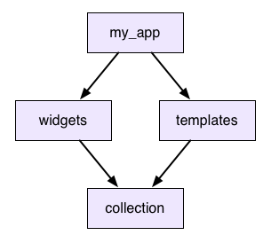

# 오픈소스 패키지 배포 시 고려해야할 것들

## 소개

Flutter 환경에서 커스터마이징 가능한 움직이는 아이콘 개발과 배포를 진행하면서 찾아본 내용들을 정리하였다. 어떻게 하면 좀 더 많은 사람들이 편하게 활용할 수 있도록 작성할 수 있을 지, 어떻게 코드를 작성해야 다른 사람들이 코드를 확인하고 수정하기 더 편할지를 생각하며 성공한 여러 오픈소스 패키지들을 참고하고 관련 글을 찾아본 내용들을 정리하였다.

:::info 목차

1. [Flutter의 패키지 배포 환경](#flutter의-패키지-배포-환경)
2. [Flutter 패키지 개발하기](#flutter-패키지-개발하기)
3. [패키지 버전 관리 가이드](#패키지-버전-관리-가이드)

:::

<!--truncate-->

## Flutter의 패키지 배포 환경

Flutter는 다른 개발자가 Flutter 및 Dart 생태계에 기여한 공유 패키지를 사용하도록 지원한다. 이를 통해 모든 것을 처음부터 개발하지 않고도 앱을 빠르게 빌드할 수 있다.

:::info 패키지와 플러그인의 차이점

플러그인은 패키지의 한 유형으로 전체 명칭은 *플러그인 패키지*이며 일반적으로 플러그인이라고 줄여 부른다.

**패키지**

Dart 패키지는 최소한 `pubspec.yaml` 파일을 포함하는 디렉토리이다. 또한 패키지에는 종속성(pubspec에 나열됨), Dart 라이브러리, 앱, 리소스, 테스트, 이미지, 글꼴 및 예시가 포함될 수 있다. [pub.dev](https://pub.dev/) 사이트에는 Google 엔지니어와 Flutter 및 Dart 커뮤니티의 구성원들이 개발한 패키지들이 소개되어 있으며, 앱에서 활용할 수 있다.

**플러그인**

플러그인 패키지는 플랫폼 기능을 앱에서 사용할 수 있게 해주는 특별한 종류의 패키지이다. 플러그인 패키지는 Android(Kotlin 또는 Java 사용), iOS(Swift 또는 Objective-C 사용), 웹, macOS, Windows, Linux 또는 이들의 조합으로 작성될 수 있다. 예를 들어, 플러그인은 Flutter 앱에 기기의 카메라를 사용할 수 있는 기능을 제공할 수 있다.

[Packages versus plugins | Decoding Flutter](https://www.youtube.com/watch/Y9WifT8aN6o)

:::

### 패키지 사용

패키지는 [pub.dev](https://pub.dev/)에 게시된다. `pub.dev`의 [Flutter 랜딩 페이지](https://pub.dev/flutter)는 Flutter와 호환되는 상위 패키지(일반적으로 Flutter와 호환되는 종속성을 선언한 패키지)를 표시하고 게시된 모든 패키지를 검색하는 기능을 지원한다.

pub.dev의 [Flutter Favorites](https://pub.dev/flutter/favorites) 페이지에는 앱을 작성할 때 크게 도움이 되는 패키지들이 나열되어있어 이를 활용하면 보다 빠르게 애플리케이션을 개발할 수 있다.

또한 `Android`, `iOS`, `web`, `Linux`, `Windows`, `macOS`를 필터링하여 현재 환경에서 활용할 수 있는 패키지 목록도 찾아볼 수 있다.

#### 앱에 패키지 종속성 추가하기

예시로 `css_colors`를 추가해보자

1. `dependencies` 추가

   - 프로젝트 폴더에 있는 `pubspec.yaml` 파일을 열고 `dependencies` 항목에 `css_colors`를 추가한다.

2. Install

   - 터미널:
     `flutter pub get`을 실행한다
   - VS Code:
     다운로드 아이콘으로 표시된 상단 작업 목록의 **패키지 가져오기**를 클릭한다.
   - Android Studio/IntelliJ:
     `pubspec.yaml` 상단의 작업 목록에서 **Pub get**을 클릭한다.

3. Import

   - Dart code에 `import`를 사용하여 패키지를 추가한다.

4. 앱 재실행하기
   - `hot reload/restart`의 경우 Dart 코드만 업데이트 하므로 패키지가 플랫폼별 코드 (Android의 경우 Kotlin/Java, iOS의 경우 Swift/Objective-C)를 가져오는 경우 앱을 재실행하여 빌드해야한다.

#### 터미널 명령어를 통한 추가

`flutter pub add "some-package"`를 통해서도 패키지 종속성을 추가할 수 있다. 마찬가지로 `css_colors`를 예시로 확인해보자.

1. 프로젝트 디렉토리 내부 터미널에서 명령어 실행

   - `flutter pub add css_colors`

2. Import

   - Dart code에 `import`를 사용하여 패키지를 추가한다.

3. 앱 재실행하기
   - `hot reload/restart`의 경우 Dart 코드만 업데이트 하므로 패키지가 플랫폼별 코드 (Android의 경우 Kotlin/Java, iOS의 경우 Swift/Objective-C)를 가져오는 경우 앱을 재실행하여 빌드해야한다.

#### 패키지 종속성 제거

`flutter pub remove`를 통해 패키지를 제거할 수 있다.

1. 프로젝트 디렉토리 내부 터미널에서 명령어 실행
   - `flutter pub add css_colors`

#### 문제 해결

앱에서 `some_package`와 `another_package`를 사용하려 한다. 두 패키지는 모두 `url_launcher`를 종속성으로 가지고 있는데 `url_launcher`의 버전이 다르다고 가정해보자. 그러면 두 패키지를 가져올 때 충돌이 발생하게 될 것이다.

이를 피하는 가장 좋은 방법은 패키지 작성자가 종속성을 지정할 때 특정 버전 대신 **범위** 버전을 설정하는 것 이다.

:::info Caret syntax & Traditional syntax

버전 범위를 설정해주는 방법은 `caret syntax`와 `traditional syntax` 방식이 있다.

**caret syntax**

`caret syntax`의 경우 다음과 같이 사용한다. ex. `^1.2.3`

이는 `>=1.2.3 <2.0.0`의 의미를 가지며 메이저 버전이 바뀌지 않는 모든 버전을 포함하는 의미를 가진다.

**traditional syntax**

`traditional syntax`의 경우 단어 그대로 이전부터 사용되던 범위 설정 방식이며 아래와 같이 설정한다.

| **Value** | **허용 범위**    | **사용가능 여부** | **메모**                                                              |
| --------- | ---------------- | ----------------- | --------------------------------------------------------------------- |
| `any`     | 모든 버전        | No                | 비어있는 버전 제약 조건을 명시적으로 보여주는 역할이다.               |
| `1.2.3`   | 해당 버전만      | No                | 패키지를 사용하는 앱에 제약이 걸리기 때문에 패키지가 채택되지 않는다. |
| `>=1.2.3` | 주어진 버전 이상 | Yes               |                                                                       |
| `>1.2.3`  | 주어진 버전 이후 | No                |                                                                       |
| `<=1.2.3` | 주어진 버전 이하 | No                |                                                                       |
| `<1.2.3`  | 주어진 버전 이전 | No                |                                                                       |

패키지의 경우 여러 사용자들이 제약없이 활용할 수 있어야하므로 `>=` 만 허용되는 것에 유의하자.

:::

종속성을 범위 버전으로 설정해주면 pub은 자동으로 문제를 해결해준다.

만약 해당 패키지를 직접 수정할 수 없는 경우에는 어떻게 할까? `pubspec.yaml`파일에서 `dependency_overrides`를 설정하여 종속성을 재정의 할 수 있다.

```yaml title="pubspec.yaml"
dependencies:
  some_package:
  another_package:
dependency_overrides:
  url_launcher: "5.4.0"
```

충돌하는 종속성이 패키지 자체가 아니라 Android나 iOS 전용 라이브러리일 경우에는 어떻게 할까? **Android**의 경우 종속성 재정의 선언을 `Gradle` 빌드 로직에 추가하여 강제할 수 있다. `guava` 패키지를 예시로 보자.

```groovy
configuration.all {
    resolutionStrategy {
        force 'com.google.guava:guava:28.0-android'
    }
}
```

**CocoaPods**의 경우 현재(2024-11-19) 종속성 재정의 기능을 제공하지 않고 있다.

## Flutter 패키지 개발하기

원하는 패키지가 없는 경우 새로운 패키지를 작성하는 방법은 어떻게 될까?

### 패키지 종속성 및 버전 관리

우선 버전 충돌 위험을 최소화하기 위해 `pubspec.yaml` 파일에서 버전 범위를 설정해줘야한다.

#### 패키지 버전

모든 패키지에는 `pubspec.yaml` 파일에 지정된 패키지 버전 번호가 있다. 패키지의 현재 버전은 이름 옆에 표시된다.(예시 `url_launcher`: [url_launcher 6.3.1](https://pub.dev/packages/url_launcher)) 또한 모든 이전 버전 목록을 확인할 수 있다.(예시 [url_launcher 버전](https://pub.dev/packages/url_launcher/versions))

패키지를 업데이트할 때 마이그레이션 작업 없이 앱이 동작하도록 하기 위해 종속성들을 버전 범위로 설정해준다.

- **범위 제약 조건**: 최소 및 최대 버전 지정

  ```yaml
  dependencies:
    url_launcher: ">=5.4.0 <6.0.0"
  ```

- **[캐럿 구문](https://dart.dev/tools/pub/dependencies#caret-syntax)을 이용한 범위 제약**: 최소 버전을 설정한다. 이는 해당 버전부터 다음 메이저 버전 이전까지의 모든 버전을 포함한다.

  ```yaml
  dependencies:
    collection: "^5.4.0"
  ```

  이 구문은 위 **범위 제약 조건** 과 같은 의미를 가진다.

상세 내용은 다음에 살펴볼 [패키지 버전 관리 가이드](#패키지-버전-관리-가이드)에서 확인하자.

#### 공개되지 않은 패키지에 대한 종속성

패키지는 pub.dev에 게시되지 않은 경우에도 활용할 수 있다. 비공개 패키지 또는 로컬 패키지와 같은 게시할 준비가 되지 않은 패키지의 경우 추가 종속성 옵션을 사용할 수 있다.

##### 경로 종속성

Flutter 앱은 파일 시스템 `path:` 종속성을 사용하여 패키지에 종속될 수 있다. 경로는 상대 경로 또는 절대 경로일 수 있다. 상대 경로는 `pubspec.yaml`을 포함하는 디렉토리를 기준으로 평가된다. 예를 들어, 옆 디렉토리에 있는 패키지에 종속되려면 다음과 같이 설정한다.

```yaml title="상대 경로 종속성"
dependencies:
packageA:
  path: ../pacakgeA/
```

##### Git 종속성

Git 저장소에 저장된 패키지에 의존할 수도 있다. 패키지가 저장소 루트에 있는 경우 다음과 같이 설정한다.

```yaml title="Git 종속성"
dependencies:
  packageA:
    git:
      url: https://github.com/flutter/packageA.git
```

##### SSH를 사용한 Git 종속성

저장소가 비공개이고 SSH를 사용하여 연결할 수 있는 저장소의 SSH URL을 사용하여 설정한다.

```yaml title="SSH를 사용한 Git 비공개 저장소"
dependencies:
  packageA:
    git:
      url: git@github.com:flutter/packageA.git
```

##### 폴더 내 패키지에 대한 Git 종속성

Pub은 패키지가 Git 저장소의 루트에 있다고 가정한다. 그렇지 않은 경우 `path`로 위치를 지정한다.

```yaml title="폴더 내 패키지에 대한 Git 종속성"
dependencies:
  packageA:
    git:
      url: https://github.com/flutter/packages.git
      path: packages/packageA
```

##### 특정 커밋, 브랜치 고정 Git 종속성

마지막으로 `ref`인수를 사용하여 종속성을 특정 git 커밋, 브랜치 또는 태그에 고정한다.

```yaml
dependencies:
  kittens:
    git:
      url: git@github.com:munificent/kittens.git
      ref: some-branch
```

추가적인 내용은 [패키지 종속성](https://dart.dev/tools/pub/dependencies)을 확인하자.

## 패키지 버전 관리 가이드

pub 패키지 관리자는 버전 관리를 하는데 도움을 준다. 이번에는 버전 관리의 역사와 pub의 버전 관리 접근 방식에 대해 간략히 알아보자.

### 버전 관리의 역사

현대 소프트웨어 개발, 특히 웹 개발은 많은 기존 코드를 재사용하는 데 크게 의존한다. 여기에는 과거 작성한 코드뿐만 아니라 타사의 코드, 큰 프레임 워크에서 작은 유틸리티 라이브러리에 이르기까지 많은 것이 포함된다. 애플리케이션이 수십 개의 서로 다른 패키지와 라이브러리에 의존하는 것은 이처럼 드문 일이 아니다.

이는 생각보다도 매우 강력한 효력을 발휘한다. 몇 주 만에 수백만 명의 사용자를 확보한 사이트를 구추하는 소규모 웹 스타트업의 이야기를 볼 때, 그들이 이를 달성할 수 있는 이유는 오픈 소스 커뮤니티 덕분이라 할 수 있다.

하지만 이는 무료로 제공되지는 않는다. 코드 재사용, 특히 유지 관리하지 않는 코드 재사용에는 어려움이 있다. 앱에서 다른 사람이 개발한 코드를 사용하는 경우, 그들이 코드를 변경하면 어떻게 될까? 그들은 앱을 망가뜨리고 싶어하지 않으며, 이는 다들 마찬가지일 것이다. 따라서 이를 *버전관리*를 통해 해결하고자 한다.

### Name과 Number

외부 코드에 의존할 때, "내 앱은 `widgets`를 사용합니다." 라고만 말하지는 않는다. "내 앱은 `widgets 2.0.5`를 사용합니다." 라고 말한다. 이름과 버전 번호의 조합은 _변경 불가능한_ 코드 덩어리를 고유하게 식별한다. 업데이트하는 사람들은 원하는 모든 변경을 할 수 있지만 이미 릴리스된 버전은 건드리지 않겠다고 약속한다. 그들은 또 다른 `widgets 3.0.0`를 내놓을 수 있고 `2.0.5`에서는 사용하는 버전이 변경되지 않았기 때문에 전혀 영향을 미치지 않는다.

*변경 사항*을 적용하고 싶을 때는 항상 앱을 최신 버전으로 지정할 수 있으며 이를 위해 해당 개발자와 협력할 필요가 없다. 그러나 그렇다고 해서 문제가 완전히 해결되지는 않는다.

아래 내용에서 논의하는 버전 번호는 패키지 파일 이름에 설정된 버전 번호와 다를 수 있다. 여기에는 `-0`또는 `-beta`가 포함될 수 있다. 이러한 표기법은 종속성 해결에 영향을 미치지 않는다.

### 공유 종속성 해결

*종속성 그래프*가 실제로 *종속성 트리*일 때 특정 버전에 따라 잘 변경된다. 앱이 여러 패키지에 종속되고 해당 패키지가 자체 종속성을 갖는 경우와 같이 종속성이 겹치지 않는 한 모두 잘 동작한다.

다음 예시를 참고해보자



그래서 `my_app`은 `widgets`와 `templates`를 사용하고 이 둘은 모두 `collection`을 사용한다. 이 것을 **공유 종속성** 이라 한다. 하지만 `widgets`에서 `collection 2.3.5` 종속성을 사용하고 싶지 않고 `templates`에서 `collection 2.3.7`을 사용하고 싶다면 어떻게 할까? 버전에 동의하지 않으면 어떻게 될까?

#### Unshared libraries (npm 접근 방식)

한 가지 옵션은 앱이 `collection`의 두 버전을 모두 사용하도록 하는 것이다. `widgets`와 `templates`는 다른 버전의 복사본을 각각 따로 가지게 된다.

이것이 `npm`이 `node.js`를 위해 하는 일이다. 다트에서는 어떨까? 다음 시나리오를 따라가며 보자.

1. `collection`이 일부 `Dictionary` 클래스를 정의한다.
2. `widgets`는 `collection 2.3.5`의 복사본에서 인스턴스를 얻는다. 이 후 `my_app`으로 전달한다.
3. `my_app`은 `templates`로 `Dictionary`를 넘긴다.
4. 이 후 순차적으로 `collection 2.3.7`에 전달된다.
5. 이를 사용하는 메서드에는 해당 `Dictionary` 형식 주석이 있다.

Dart에서는 `collection 2.3.5`와 `collection 2.3.7`은 완전히 관련없는 라이브러리이다. 한 쪽에서 클래스 인스턴스를 가져와 다른쪽의 `Dictionary` 메서드에 전달하면 두 `Dictionary`는 완전히 다른 유형이므로 일치하지 않는다.

이러한 이유로 Dart에서는 npm 모델이 적합하지 않다고 판단하고 다른 접근 방식을 가진다.

#### Version lock (사용되지 않음)

대신, 패키지에 의존할 때 앱은 해당 패키지의 단일 사본만 사용한다. 공유 종속성이 있는 경우 이에 의존하는 모든 것이 사용할 버전에 대해 동의해야 한다. 만약 그렇지 않으면 오류가 발생한다.

하지만 이러한 접근 방법으로는 문제가 해결되지 않는다. 우리는 오류가 발생하면 이를 해결할 수 있어야 한다. 이전 npm의 예에서와 같은 상황에 처했다고 가정해보자. `widgets`와 `templates`를 사용하고 싶지만 서로 다른 `collection` 버전을 사용하고 있다. 어떻게 해결해야 할까?

이 접근 방식에서 제시할 수 있는 답은 둘 중 하나를 업그레이드 하는 것이다. `templates`에 맞추기 위해 `collection 2.3.7` 버전이 적용된 `widgets` 버전을 찾을 수 있을까?

대부분의 경우 답은 "No"일 것이다. 개발하는 입장에서 생각해보자 우리는 `widgets` 코드에 새로운 변경사항을 적용한 새 버전을 출시하려 한다. 어떻게 하면 보다 많은 사람들이 문제 없이 업그레이드 하도록 할 수 있을까? `collection`의 버전을 유지한다면 모든 사람이 문제 없이 새 버전으로 업그레이드할 수 있을 것이다.

우리가 종속성을 업그레이드 한다면 `widgets`를 업그레이드 하는 모든 사람은 좋든 싫든 `collection`을 업그레이드 해야한다. 이는 때에 따라 매우 힘든일이므로 종속성 버전을 올리고자 하는 동기가 저하된다. 이를 **버전 잠금** 이라고 한다.

#### 버전 제약 (Dart의 접근 방식)

버전 잠금을 해결하기 위해 패키지가 종속성에 두는 제약을 느슨하게 한다. `widgets`및 `templates`가 모두 작업하는 버전의 *범위*를 나타낼 수 있다면 종속성을 새 버전으로 옮길 수 있는 충분한 여유가 생긴다. 범위에 겹치는 부분이 있는 한 둘다 만족하는 버전을 찾을 수 있다.

이는 [bundler](https://bundler.io/)가 따르는 모델이며 **pub**의 모델이기도 하다. `pubspec.yaml`에 종속성을 추가 할 때 허용할 수 있는 버전 범위를 지정할 수 있다. `widgets`의 `pubspec.yaml`이 다음과 같다면

```yaml
dependencies:
  collection: '>=2.3.5 <2.4.0'
```

`collection 2.3.7`에 대한 버전을 선택할 수 있을 것이다. 해당 버전은 `widgets`와 `templates` 모두의 제약 조건을 충족한다.

#### 의미론적 버전

패키지에 종속성을 추가할 때 허용할 버전 범위를 지정하고 싶을 때가 있다. 어떤 범위를 선택해야 할지 어떻게 알 수 있을까? 전방 호환이 되어야 하므로 이상적으로는 범위가 아직 출시되지 않은 미래 버전을 포함한다. 하지만 아직 존재하지도 않는 새로운 버전에서 패키지가 작동할 것이라고 어떻게 확신할 수 있을까?

이를 해결하려면 버전 번호가 무엇을 의미하는지 **합의**해야 한다. 의존하는 패키지 개발자가 "이전 버전과 호환되지 않는 변경 사항을 만들면 주요 버전 번호를 올리겠다고 약속합니다."라고 선언했다고 가정해보자. 그들을 신뢰하고 `2.3.5` 패키지가 그들의 버전과 호환된다는 것을 알고 있다면 최대 `3.0.0`까지 작동할 것이라고 믿을 수 있다. 이를 `pubspec.yaml`에서 보면 다음과 같다.

```yaml
dependencies:
  collection: ^2.3.5
```

:::memo

이 예에서는 캐럿 구문을 사용하여 다양한 버전을 표현한다. `^2.3.5` 문자열은 "`3.0.0`을 제외한 `2.3.5`에서 `3.0.0`까지의 모든 버전 범위"를 의미한다. 자세한 내용은 [캐럿 구문](https://dart.dev/tools/pub/dependencies#caret-syntax)을 참고하자.

:::

이 작업을 하려면 우리는 약속들을 정리해 규칙을 만들어야 한다. 다행히도 이미 이전의 똑똑한 사람들이 모든 작업을 끝냈고, 이를 [의미론적 버전 관리](https://semver.org/spec/v2.0.0-rc.1.html)라 명명했다.

이는 버전 번호의 형식과 이후 버전 번호로 증가할 때의 정확한 API 동작 차이를 설명한다. Pub에서는 버전이 이런 방식으로 포맷되어야 하며, Pub 커뮤니티와 잘 어울리려면 패키지가 지정한 의미 체계를 따라야 한다. 또한 의존하는 패키지도 이를 따른다고 가정해야 한다.

의미론적 버전 관리가 `1.0.0` 이전 버전들 사이의 호환성을 약속하지는 않지만 Dart 커뮤니티 규칙에서는 이러한 버전들도 의미론적으로 처리한다. 각 숫자별로 해석해보면 `0.1.2`에서 `0.2.0`은 중대한 변경사항이 추가되었음을 나타내고 `0.1.3`은 새로운 기능이 추가되었음을 나타낸다. `0.1.2+1`과 같이 표시할 수도 있는데 이는 공개 API에 영향을 미치지 않는 변경을 나타낸다. 하지만 보다 단순하고 명확하게 관리하기 위해 `0.1.2+1`과 같은 명명 방식은 `1.0.0` 이후부터는 사용하지 않도록 하자.

#### 제약 조건 해결

패키지를 정의할 때 

## 성공적으로 활용중인 오픈소스 패키지들
