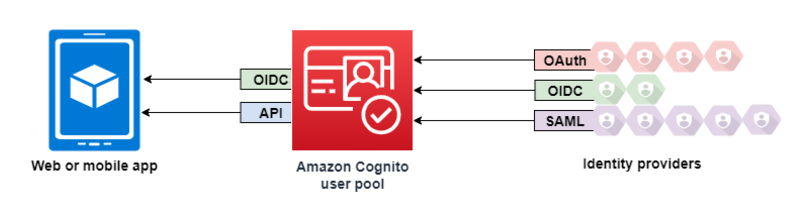

# Amazon Cognito로 사용자 관리하기

## 소개

Amazon Cognito는 웹 및 모바일 앱에 대한 사용자 인증 및 승인을 처리한다. 사용자 풀을 사용하면 앱에 가입 및 로그인 기능을 쉽고 안전하게 추가할 수 있다. Identity pools를 사용하면 앱은 사용자가 익명이든 인증되었든 특정 AWS 리소스에 대한 액세스 권한을 부여하는 임시 자격 증명을 얻을 수 있다.

미국, 수술실이라는 특수한 환경에서 사용하는 애플리케이션을 개발하면서 사용자 요청을 최소화하기 위해 ML model 적용, 제스쳐 동작 등 다양한 시도를 하였다. 이번에는 사용자 인증과 관련하여 어떻게 하면 불필요한 과정을 줄이고 보다 안전하게 적용할 수 있을지 고민하며 Amazon Coginto를 적용한 내용이다.

:::info 목차

1. [User pool](#user-pool)
2. [Identity pool](#identity-pool)
3. [Cognito Sync](#cognito-sync)
4. [Flutter에 적용하기](#flutter에-적용하기)

:::

<!--truncate-->

## User pool

Amazon Cognito 사용자 풀은 웹 및 모바일 앱 인증과 권한 부여를 위한 사용자 디렉토리이다. 앱 관점에서 Amazon Cognito 사용자 풀은 OpenID Connect(OIDC) 자격 증명 공급자(IdP)이다. 사용자 풀은 보안, 아이덴티티, 페더레이션, 앱 통합, 사용자 경험 사용자 지정을 위한 기능 계층을 추가한다.

예를 들어 사용자의 세션이 신뢰할 수 있는 출처에서 온 것인지 확인할 수 있다. Amazon Cognito 디렉터리를 외부 ID 제공업체와 결합할 수 있다. 원하는 AWS SDK를 사용하여 앱에 가장 적합한 권한 부여 모델 API를 선택할 수 있다. 그리고 Amazon Cognito의 기본 동작을 수정하거나 정비하는 AWS Lambda 함수를 추가할 수 있다.



### 특징

Amazon Cognito user pool은 다음과 같은 특징을 가지고 있다.

#### 가입하기

Amazon Cognito 사용자 풀에는 사용자 프로필을 사용자 풀에 추가하는 사용자 중심, 관리자 중심 및 프로그래밍 방식이 있다. Amazon Cognito 사용자 풀은 다음 가입 모델을 지원한다. 앱에서 아래 모델의 모든 조합을 사용할 수 있다.

:::warning 중요

사용자 풀에서 사용자 가입을 활성화 하면 인터넷에 있는 모든 사람이 계정에 가입하고 앱에 로그인할 수 있다. 앱을 공개적으로 개방하려는 경우가 아니면 사용자 풀에서 셀프 등록을 비활성화 해야한다. 이 설정을 변경하려면 사용자 풀 콘솔의 **Authentication** 아래 **Sign-up** 메뉴에서 **Self-service sign-up** 설정을 변경하거나 `CreateUserPool` 또는 `UpdateUserPool` API 요청에서 `AllowAdmiCreateUserOnly` 값을 수정해야 한다.

사용자 풀에 설정할 수 있는 보안 기능에 대한 자세한 내용은 [Amazon Cognito 사용자 풀 보안 기능 사용](https://docs.aws.amazon.com/cognito/latest/developerguide/managing-security.html)을 참고하자.

:::

1. 사용자는 앱에 정보를 입력하고 사용자 풀에 고유한 사용자 프로필을 만들 수 있다. API 가입 작업을 호출하여 사용자 풀에 사용자를 등록할 수 있다. 이러한 가입 작업을 누구에게나 공개하거나 **Client secret** 또는 **AWS credentials**로 권한을 부여할 수 있다.

2. 사용자가 Amazon Cognito에 정보를 전달하도록 허가할 수 있는 타사 IdP로 리디렉션할 수 있다. Amazon Cognito는 OIDC ID 토큰, OAuth 2.0 `userInfo` 데이터 및 SAML 2.0 어설션을 사용자 풀의 사용자 프로필로 처리한다. 속성 매핑 규칙에 따라 Amazon Cognito가 수신하도록 하려는 속성을 제어한다.

3. 공개 또는 연합 가입을 건너뛰고, 자체 데이터 소스 및 스키마를 기반으로 사용자를 만들 수 있다. Amazon Cognito 콘솔 또는 API에서 직접 사용자를 추가한다. CSV 파일에서 사용자를 가져온다. 기존 디렉토리에서 새 사용자를 조회하고 기존 데이터에서 사용자 프로필을 채우는 AWS Lambda 함수를 실행한다.

사용자가 가입한 후 Amazon Cognito가 액세스 및 ID 토큰에 나열한 그룹에 추가할 수 있다. ID 토큰을 ID 풀에 전달할 때 사용자 풀 그룹을 IAM 역할에 연결할 수도 있다.

#### 로그인

Amazon Cognito는 앱에 대한 독립형 사용자 디렉터리 및 ID 공급자(IdP)가 될 수 있다. 사용자는 Amazon Cognito에서 호스팅하는 관리형 로그인 페이지 또는 Amazon Cognito 사용자 풀 API를 통한 사용자 정의 사용자 인증 서비스로 로그인할 수 있다. 사용자 정의 프론트엔드 뒤에 있는 애플리케이션 계층은 여러가지 방법 중 하나를 사용하여 백엔드에서 요청을 승인하여 요청을 확인할 수 있다.

사용자는 사용자 이름과 비밀번호, 패스키, 이메일 및 SMS 메시지 일회용 비밀번호로 설정하고 로그인할 수 있다. 외부 사용자 디렉토리, 로그인 후 다중 요소 인증(MFA), 신뢰 기억 장치, 설계한 사용자 지정 인증 흐름과 통합 로그인을 제공할 수 있다.

Amazon Cognito에 내장된 사용자 디렉토리와 선택적으로 결합된 외부 디렉토리를 통해 사용자를 로그인시키려면 다음 통합을 추가할 수 있다.

1. OAuth 2.0 소셜 로그인으로 로그인하고 고객 사용자 데이터를 가져온다. Amazon Cognito는 OAuth 2.0을 통해 Google, Facebook, Amazon 및 Apple 로그인을 지원한다.

2. SAML 및 OIDC 로그인으로 로그인하고 직장 및 학교 사용자 데이터를 가져온다. 또한 Amanon Cognito를 구성하여 모든 SAML 또는 OpenID Connect(OIDC) ID 공급자(IdP)의 클레임을 수락할 수도 있다.

3. 외부 사용자 프로필을 기본 사용자 프로필에 연결한다. 연결된 사용자는 타사 사용자 ID로 로그인하여 기본 제공 디렉토리에서 사용자에게 할당한 액세스 권한을 받을 수 있다.

#### 관리자 로그인

사용자 인터페이스를 구축하고 싶지 않은 경우, 사용자에게 사용자 지정 관리형 로그인 페이지를 제공할 수 있다. 관리형 로그인은 가입, 로그인, 다중 요소 인증(MFA) 및 비밀번호 재설정을 위한 웹 페이지 세트이다. 기존 도메인에 관리형 로그인을 추가하거나 AWS 하위 도메인에서 접두사 식별자를 사용할 수 있다.

#### 보안

로컬 사용자는 SMS 또는 이메일 메시지읠 코드 또는 다중 요소 인증(MFA) 코드를 생성하는 앱으로 추가 인증 요소를 제공할 수 있다. 애플리케이션에서 MFA를 설정하고 처리하는 메커니즘을 구축하거나 관리되는 로그인이 이를 관리하도록 할 수 있다. Amazon Cognito 사용자 풀은 사용자가 신뢰할 수 있는 기기에서 로그인할 때 MFA를 우회할 수 있다.

사용자에게 처음에 MFA를 요구하지 않으려면 조건부로 요구할 수 있다. Amazon Cognito는 고급 보안 기능을 통해 잠재적인 악의적 활동을 감지하고 사용자에게 MFA를 설정하거나 로그인을 차단하도록 요구할 수 있다.

사용자 풀에 대한 네트워크 트래픽이 악의적일 수 있는 경우 AWS WAF 웹 ACL을 사용하여 이를 모니터링하고 조치를 취할 수 있다.

#### 사용자 정의형 사용자 경험

사용자의 가입, 로그인 또는 프로필 업데이트의 대부분 단계에서 Amazon Cognito가 요청을 처리하는 방식을 사용자 정의할 수 있다. Lambda 트리거를 사용하면 사용자 정의 조건에 따라 ID 토큰을 수정하거나 가입 요청을 거부할 수 있다. 사용자 정의 인증 흐름을 직접 만들 수 있다.

사용자 정의 CSS와 로고를 업로드하여 관리되는 로그인에 친숙한 모양과 느낌을 부여할 수 있다.

#### 모니터링 및 분석

Amazon Cognito 사용자 풀을 관리형 로그인 요청을 포함한 API 요청을 AWS CloudTrail에 기록한다. Amazon CloudWatch Logs에서 성능 지표를 검토하고, Lambda 트리거를 사용하여 CloudWatch에 사용자 지정 로그를 푸시하고, 이메일 및 SMS 메시지 전달을 모니터링하고, Service Quotas 콘솔에서 API 요청 볼륨을 모니터링할 수 있다.

Plus 기능 플랜을 사용하면 자동 학습 기술로 사용자 인증 시도를 모니터링하여 침해 지표를 파악하고 위험을 즉시 해결할 수 있다. 이러한 고급 보안 기능은 사용자 활동을 사용자 풀에 기록하고, 선택적으로 Amazon S3, CloudWatch Logs 또는 Amazon Data Firehouse에 기록한다.

API 요청에서 Amazon Pinopoint 캠페인으로 디바이스 및 세션 데이터를 로깅할 수도 있다. Amazon Pinpoint를 사용하면 사용자 활동 분석에 따라 앱에서 푸시 알림을 보낼 수 있다.

#### Amazon Cognito ID 풀 통합

Amazon Cognito의 다른 절반은 ID 풀이다. ID 풀은 사용자로부터 Amazon DynamoDB 또는 Amazon S3와 같은 AWS 서비스에 대한 API 요청을 승인하고 모니터링하는 자격 증명을 제공한다. 사용자 풀에서 사용자를 분류하는 방법에 따라 데이터를 보호하는 ID 기반 액세스 정책을 빌드할 수 있다. ID 풀은 사용자 풀 인증과 무관하게 다양한 ID 공급자로부터 토큰 및 SAML 2.0 어설션을 허용할 수 있다.

## Identity pool

Amazon Cognito ID 풀은 AWS 자격 증명으로 교환할 수 있는 페더레이션 ID 디렉토리이다. ID 풀은 앱 사용자에 대한 임시 AWS 자격 증명을 생성한다. 사용자가 로그인했든 아직 식별하지 않았든 상관없다. AWS Identity and Access Management(IAM) 역할 및 정책을 사용하면 사용자에게 부여하려는 권한 수준을 선택할 수 있다. 사용자는 게스트로 시작하여 AWS 서비스에 보관된 자산을 검색할 수 있다. 그런 다음 타사 ID 공급자를 사용하여 로그인하여 등록된 멤버에게 제공하는 자산에 대한 액세스를 잠금 해제 할 수 있다. 타사 ID 공급자는 Apple이나 Google과 같은 소비자(소셜) OAuth 2.0 공급자, 사용자 지정 SAML 또는 OIDC ID 공급자 또는 사용자가 직접 디자인한 사용자 지정 인증 체계(개발 공급자라고도 함)가 될 수 있다.

### 특징

#### AWS 서비스에 대한 요청 인증

Amazon Simple Storage Service(Amazon S3) 및 Amazon DynamoDB와 같은 AWS 서비스에 API 요청을 인증한다. Amazon Pinpoint 및 Amazon CloudWatch와 같은 서비스로 사용자 활동을 분석한다.

#### 리소스 기반 정책으로 요청 필터링

리소스에 대한 사용자 액세스를 세부적으로 제어한다. 사용자 클레임을 IAM 세션 태그로 변환하고 사용자의 개별 하위 집합에 리소스 액세스를 부여하는 IAM 정책을 구축한다.

#### 게스트 액세스 할당

아직 로그인하지 않은 사용자의 경우, 좁은 액세스 범위로 AWS 자격 증명을 생성하도록 ID 풀을 구성한다. 단일 로그인 공급자를 통해 사용자를 인증하여 액세스 권한을 높일 수 있다.

#### 사용자 특성에 따라 IAM 역할 할당

인증된 모든 사용자에게 단일 IAM 역할을 할당하거나 각 사용자의 클레임에 따라 역할을 선택한다.

#### 다양한 ID 공급자 허용

AWS 자격 증명을 위해 ID 또는 액세스 토큰, 사용자 풀 토큰, SAML 어설션 또는 소셜 공급자 OAuth 토큰을 교환한다.

#### 직접 자격 증명

사용자 검증을 직접 수행하고 개발자 AWS 자격 증명을 사용하여 사용자에게 자격 증명을 발급한다.

앱에 인증 및 권한 부여 서비스를 제공하는 Amazon Cognito 사용자 풀이 이미 있을 수 있다. 사용자 풀을 ID 풀에 대한 ID 공급자(IdP)로 설정할 수 있다. 그렇게 하면 사용자는 사용자 풀 IdP를 통해 인증하고, 클레임을 공통 OIDC ID 토큰으로 통합하고, 해당 토큰을 AWS 자격 증명으로 교환할 수 있다. 그런 다음 사용자는 서명된 요청에서 자격 증명을 AWS 서비스에 제시할 수 있다.

또한 모든 ID 공급자의 인증된 클레임을 ID 풀에 직접 제출할 수 있다. Amazon Cognito는 SAML, OAuth 및 OIDC 공급자의 사용자 클레임을 단기 자격 증명에 대한 AssumeRoleWithWebIdentity API 요청으로 사용자 정의한다.

Amazon Cognito 사용자 풀은 SSO 지원 앱에 대한 OIDC ID 공급자와 같다. ID 풀은 IAM 권한 부여에 가장 잘 작동하는 리소스 종속성이 있는 모든 앱에 대한 AWS ID 공급자 역할을 한다.

Amazon Cognito ID 풀은 다음과 같은 ID 공급자를 지원한다.

- 공공 공급자: Amazon을 ID 풀 IdP로 로그인 설정, Facebook을 ID 풀 IDP로 설정, Google을 ID 풀 IdP로 설정, Apple을 ID 풀 IdP로 로그인 설정
- Amazon Cognito 사용자 풀
- OIDC 공급자를 ID 풀 IdP로 설정
- SAML 공급자를 ID 풀 IdP로 설정
- 개발자 인증 ID

Amazon Cognito ID 풀 지역 가용성에 대한 자세한 내용은 [AWS 서비스 지역 가용성](https://aws.amazon.com/about-aws/global-infrastructure/regional-product-services/)을 통해 확인할 수 있다.

## Cognito Sync

Amazon Cognito Sync는 AWS AppSync와 데이터를 동기화 하므로 AWS AppSync를 사용해도 된다.

Amazon Cognito Sync는 애플리케이션 관련 사용자 데이터를 여러기기에서 동기화할 수 있는 AWS 서비스 및 클라이언트 라이브러리이다. Amazon Cognito Sync는 자체 백엔드를 사용하지 않고도 모바일 기기와 웹에서 사용자 프로필 데이터를 동기화할 수 있다. 클라이언트 라이브러리는 데이터를 로컬에 캐시하여 앱이 기기 연결 상태에 관계없이 데이터를 읽고 쓸 수 있도록 한다. 기기가 온라인 상태이면 데이터를 동기화할 수 있다. 푸시 동기화를 설정하면 다른 기기에 업데이트가 있음을 즉시 알릴 수 있다.

## Flutter에 적용하기

Cognito의 경우 아직 Flutter 환경설정에 대한 안내가 없다. 아래는 직접 Flutter 애플리케이션에 구현해보며 정리한 내용이다. 따라서 더 나은 구현 방법이 있을 수도 있으니 참고만 하자.

### 패키지 설치

주로 많이 활용되는 방식과 Cognito에서 추천하는 방식은 Carthage 을 사용한 설치법이다. 하지만 플러터의 경우 반드시 **CocoaPods**을 사용하도록 되어있어 해당 방식을 사용하지 못하였다. 해당 방법은 [링크](https://github.com/openid/AppAuth-iOS)를 참고하자.

먼저 `Podfile`에 `pod 'AppAuth'` 를 추가하여 **AppAuth** 를 설치한다.

#### CocoaPods

```Podfile title="ios/Podfile"
target 'Runner' do
  use_frameworks!
  use_modular_headers!

  // highlight-next-line
  pod 'AppAuth'

  flutter_install_all_ios_pods File.dirname(File.realpath(__FILE__))
  ...
end
```

### AppDelegate 설정

**Cognito** 를 활용하여 사용자 추가 로직을 구현할 경우 반드시 AWS에서 제공하는 로그인 페이지를 통해야 한다. 해당 화면은 웹에서 실행되므로 `Safari` 실행이 필요하다. 따라서 로그인이 완료된 후 접근할 앱링크를 설정해준다.

```swift title="AppDelegate.swift"
@UIApplicationMain
class AppDelegate: UIResponder, UIApplicationDelegate {
    // ...
    func application(_ application: UIApplication, didFinishLaunchingWithOptions launchOptions: [UIApplicationLaunchOptionsKey: Any]?) -> Bool {
        // Override point for customization after application launch.
        return true
    }

    // highlight-start
    func application(_ app: UIApplication, open url: URL, options: [UIApplicationOpenURLOptionsKey : Any] = [:]) -> Bool {

        if let authorizationFlow = self.currentAuthorizationFlow, authorizationFlow.resumeExternalUserAgentFlow(with: url) {
            self.currentAuthorizationFlow = nil
            return true
        }

        return false
    }
    // highlight-end
}
```

Swift로만 화면을 구성해줄 경우 ViewController를 통해 비동기 처리를 한다. 하지만 Flutter의 경우 methodCall을 통해 ViewController를 실행해주므로 해당 함수의 실행이 끝날때 ViewController가 사라져 결과값을 받아올 수 없다. 따라서 아래와 같이 `AppDelegate`에서 `Session`과 `AuthState` 값을 선언해준다.

```swift title="AppDelegate.swift"
// highlight-next-line
import AppAuth
import UIKit

@UIApplicationMain
class AppDelegate: UIResponder, UIApplicationDelegate {
    // ...
    // highlight-next-line
    var currentAuthorizationFlow: OIDExternalUserAgentSession?
    // highlight-next-line
    var appState: OIDAuthState?

    // ...
    // ...
}
```

### ViewController 설정

먼저 사용자 풀의 OIDC 속성에 대한 값을 추가한다. 클라이언트 보안키가 있으므로 따로 잘 관리해주자.

```swift title="secrets.swift"
/**
  The OIDC issuer from which the configuration will be discovered.
*/
let kIssuer: String = "http://cognito-idp.<your_region>.amazonaws.com/<your_resion>_<hash_key>";

/**
  The OAuth client ID.
*/
let kClientID: String = "<your_clientID>";

/**
  The OAuth redirect URI for the client
*/
let kRedirectURI: String = "<redirectURL: Applink>";

/**
  The OAuth logout URI for the client.
*/
let kLogoutURL: String = "<logout uri>";

/**
  Client secret key
*/
let kClientSecret: String = "<client_secret>"
```

`AppAuth`를 사용할 경우 `viewDidLoad()` 를 통해 화면이 로드된 후 코드가 동작하도록 해야한다.

```swift title="AppAuthExampleViewController.swift"
class AppAuthExampleViewController: UIViewController {
    override func viewDidLoad() {
        super.viewDidLoad()
        // ...
    }
}
```

제공한 발급자 문자열에서 OIDC 검색을 구성한다. 권한 부여 코드를 구현하려면 애플리케이션이 사용자 풀 발급자에 대한 `.well-known/openid-configuration` 엔드포인트에서 발급자 엔드포인트를 검색할 수 있어야 한다.

```swift title="AppAuthExampleViewController.swift"
extension AppAuthExampleViewController {
    func authWithAutoCodeExchange() {
        guard let issuer = URL(string: kIssuer) else {
            self.logMessage("Error creating URL for : \(kIssuer)")
            return
        }

        // discovers endpoints
        OIDAuthorizationService.discoverConfiguration(forIssuer: issuer) { configuration, error in

            guard let config = configuration else {
                self.logMessage("Error retrieving discovery document: \(error?.localizedDescription ?? "DEFAULT_ERROR")")
                self.setAuthState(nil)
                return
            }
            // ...

            if let clientId = kClientID {
                self.doAuthWithAutoCodeExchange(configuration: config, clientID: clientId, clientSecret: nil)
            } // ...
        }
    }
}
```

검색된 구성에서 사용자 풀 authorize 엔드포인트에 대한 Amazon Cognito 관리 로그인을 위한 로그인 URL을 구성한다. 이 코드는 앱 클라이언트 ID, openid 및 profile 범위, redirectURI를 요청에 추가한다. clientID에서 참조하는 앱 클라이언트는 이러한 범위를 요청할 수 있는 권한이 있어야 한다. 인증 후 Amazon Cognito는 앱 클라이언트에 대한 승인된 콜백 URL인 요청의 redirectURI로 리디렉션한다. OIDC 라이브러리는 권한 부여 코드를 액세스 토큰으로 교환한다.

```swift title="AppAuthExampleViewController.swift"
extension AppAuthExampleViewController {
    func doAuthWithAutoCodeExchange(configuration: OIDServiceConfiguration, clientID: String, clientSecret: String?) {
        guard let redirectURI = URL(string: kRedirectURI) else {
            self.logMessage("Error creating URL for : \(kRedirectURI)")
            return
        }

        guard let appDelegate = UIApplication.shared.delegate as? AppDelegate else {
            self.logMessage("Error accessing AppDelegate")
            return
        }
        // builds authentication request
        let request = OIDAuthorizationRequest(configuration: configuration,
                                              clientId: clientID,
                                              clientSecret: clientSecret,
                                              scopes: [OIDScopeOpenID, OIDScopeProfile],
                                              redirectURL: redirectURI,
                                              responseType: OIDResponseTypeCode,
                                              additionalParameters: nil)

        // performs authentication request
        logMessage("Initiating authorization request with scope: \(request.scope ?? "DEFAULT_SCOPE")")

        appDelegate.currentAuthorizationFlow = OIDAuthState.authState(byPresenting: request, presenting: self) { authState, error in

            if let authState = authState {
                self.setAuthState(authState)
                self.logMessage("Got authorization tokens. Access token: \(authState.lastTokenResponse?.accessToken ?? "DEFAULT_TOKEN")")
            } else {
                self.logMessage("Authorization error: \(error?.localizedDescription ?? "DEFAULT_ERROR")")
                self.setAuthState(nil)
            }
        }
    }
}
```

`OIDAuthState.authState()`의 경우 비동기로 동작하는 API 요청 메서드이다. 하지만 Swift에서 해당 메서드를 따로 비동기 처리를 해줄 수 업어, 결과값을 받아올 수 없었다. 따라서 API 요청 세션을 `AppDelegate`에 저장해두어 앱이 실행되고 있는 동안 해당 세션이 끊기지 않도록 설정해주었다.
