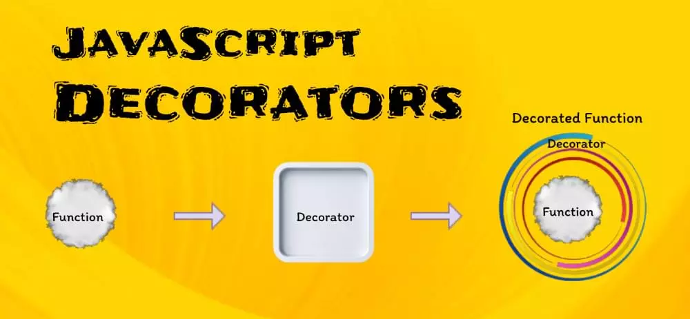

# 프론트앤드에서의 데코레이터 패턴 살펴보기

## 소개

백엔드 개발자들이라면 **Decorator**나 **Annotation**에 대해 익숙할 것이다. 하지만 프론트엔드 생태계에서는 지금껏 여러 이유로 인해 사용되지 않다가 최근에 들어서 도입을 하려는 시도가 이루어지고 있다. 프론트엔드에서는 왜 이러한 메타프로그래밍 방식을 적용하지 못하였는지, 또 적용하기 위해서 앞으로 넘어야할 산들은 어떤 것들이 있는지 알아보자.

:::info 목차

1. [메타 프로그래밍이란?](#메타-프로그래밍이란)
2. [자바스크립트와 데코레이터](#자바스크립트와-데코레이터)

:::

<!--truncate-->

## 메타 프로그래밍이란?

Java annotation과 관련해서 공부하다 보면 메타 프로그래밍이라는 키워드를 심심찮게 발견할 수 있다. **메타**라는 용어만 봐서는 일반적인 프로그래밍보다 좀 더 상위에 있는 무언가를 말하는 듯 하다. 그렇다면 메타 프로그래밍이란 무엇일까?

위키피디아의 정의를 살펴보자

> 메타프로그래밍(Metaprogramming)이란 자기 자신 혹은 다른 *컴퓨터 프로그램*을 데이터로 취급하며 프로그램을 작성, 수정하는 것을 말한다. 넓은 의미에서 *런타임*에 수행해야 할 작업의 일부를 _컴파일 타임_ 동안 수행하는 프로그램을 말하기도 한다.

런타임에서 실행되는 무언가를 컴파일 단계에서 처리하도록 도와주는 듯하다. 하지만 이 것만으로는 설명이 좀 부족하다 다음 내용을 보자.

### 메타 프로그래밍 살펴보기

아래 내용은 [메타프로그래밍 살펴보기 (Medium blog - SeongHo Hong)](https://medium.com/@hongseongho/%EB%A9%94%ED%83%80%ED%94%84%EB%A1%9C%EA%B7%B8%EB%9E%98%EB%B0%8D-%EC%82%B4%ED%8E%B4%EB%B3%B4%EA%B8%B0-8c30dbe4d566) 글을 참조하여 정리한 내용이다.

메타 프로그래밍에 이용되는 언어를 *메타 언어*라고 하고, 메타 프로그래밍의 대상이 되는 언어를 대상 언어라고 한다.

- 대상 언어: **눈은 하얗다**
- 메타 언어: 눈이 하얗다**는 것은 참이다.**

한 프로그래밍 언어가 자기 자신의 메타 언어가 되는 것을 **반영(reflection)**이라고 한다.

> 메타 프로그래밍을 통해 개발자는 Generic 프로그래밍 패러다임에 해당하는 프로그램을 작성하고 코드를 개발할 수 있다. (...) Generic 프로그래밍은 언어 내에서 메타 프로그래밍 기능을 호출한다. Generic을 쓰면 데이터 타입 지정에 대한 걱정 없이 코드를 작성할 수 있게 해준다. Generic이 사용될 때 파라미터로 제공되기 때문이다.

메타 프로그래밍을 설명하면서 동시에 제너릭 프로그래밍이라는 용어가 등장한다. 제너릭은 자바 컴파일 단계에서 타입 체크를 해주는 기능으로만 알고 있는데 이와 어떻게 연관이 되어있는걸까? 아래 내용을 더 살펴보도록 하자.

리플렉션은 제너릭 소프트웨어 라이브러리를 만들 수 있게 도와준다. 데이터를 표시 하고, 다양한 형식의 데이터를 처리하고, 통신을 위한 직렬화 또는 역직렬화를 수행하거나, 컨테이너를 위한 번들링과 unbundling, 간헐적 소통을 가능하게 한다.

즉, 같은 언어로 메타 프로그래밍을 하는 것을 리플렉션이라고 한다. 제너릭이라는 기능을 만들 때 리플렉션을 활용한다. 제너릭 자체가 메타 프로그래밍은 아니지만, 우리가 제너릭을 사용한다면 메타 프로그래밍의 도움을 받은 것이라고 볼 수 있다.

#### 동작방식

메타 프로그래밍이 동작하는 방식은 세 가지 종류가 있다.

1. run-time 엔진 내부를 프로그래밍 코드로 노출
2. 프로그래밍 명령(command)이 포함된 표현식(expressions)을 동적으로 실행
3. 해당 언어의 범주를 완전히 벗어나는 방식 (컴파일러는 메타 프로그래밍을 직접 구현하는 것이다. 타겟 언어가 메타프로그래밍을 지원하지 않아도 구현할 수 있다.)

#### 종류

1. Type Introspection: 수행중인 프로그램에서 변수나 함수들의 타입이나 속성을 나타내는 능력
2. Reflection: 실행중인 프로그램 자신의 구조와 행동을 조사하고 변경할 수 있는 능력
3. Self-Modifying Code: 코드를 스스로 고칠 수 있는 능력

#### 예제

[Reflective programming - Wikipedia](https://en.wikipedia.org/wiki/Reflective_programming?source=post_page-----8c30dbe4d566--------------------------------#Examples)

여기에 있는 예시 중에 Java, Objective-C 를 살펴보자. 메타 프로그래밍 중에서 리플렉션 관련 예제이다.

```objectivec Objective-C 예시
// Foo class.
@interface Foo : NSObject
- (void)hello;
@end

// Sending "hello" to a Foo instance without reflection.
Foo *obj = [[Foo alloc] init];
[obj hello];

// Sending "hello" to a Foo instance with reflection.
id obj = [[NSClassFromString(@"Foo") alloc] init];
[obj performSelector: @selector(hello)];
```

objc 는 객체에 메시지를 던지는 message dispatch를 사용한다. 클래스를 특정하지 않고 `performSelector`로 직접 메시지를 호출할 수 있다. 해당 클래스와 메소드의 내부 구조를 파악하고 매칭되는 메소드를 호출하는 방식이므로 reflection을 사용했다고 볼 수 있다.

```java Java 예시
import java.lang.reflect.Method;

// Without reflection
Foo foo = new Foo();
foo.hello();

// With reflection
try {
  Object foo = Foo.class.getDeclaredConstructor().newInstance();

  Method m = foo.getClass().getDeclaredMethod("hello", new Class<?>[0]);
  m.invoke(foo);
} catch (ReflectiveOperationException ignored) {}
```

Java에서도 클래스를 직접 생성하는게 아니라 reflection을 통해서 생성하는 방법을 지원한다. 그리고 method를 호출하는 것도 reflection을 통해서 호출할 수 있다. 같은 맥락에서 `getAnnotation()`를 호출해서 annotation이 존재하는지 확인할 수도 있다. 한번 커스텀 어노테이션을 만들어서 확인해보자. 런타임에서도 어노테이션을 확인하려면 `@Retention(RetentionPolicy.RUNTIME)`를 추가해줘야 한다.

```java Annotation Examples
@Retention(RetentionPolicy.RUNTIME)
public @inteface MyAnnotation {
  String greeting() default "hello";
}
// ...
class AppTest {
  @Test
  void testMyAnnotation() {
    App classUnderTest = new App();
    MyAnnotation myAnnotation = classUnderTest.getClass().getAnnotation(MyAnnotation.class);
    assertNotNull(myAnnotation);
    assertEquals("hello", myAnnotation.greeting());
  }
}
```

메타 프로그래밍은 제네릭, 어노테이션등 다양한 형태로 사용되고 있다. 이번 글에서는 제네릭에 관련한 내용을 주로 다루었다.

## 자바스크립트와 데코레이터

데코레이터는 기존 메서드에 몇가지 기능을 추가하는 함수이다. 원래 코드를 변경하지 않고도 객체의 동작을 수정하여 기능을 확장할 수 있다.



데코레이터는 코드의 가독성, 유지보수, 재사용성을 향상시키는데 좋다. JavaScript에서 데코레이터는 클래스, 메서드, 속성 또는 매개변수를 수정할 수 있는 함수이다. 소스 코드를 변경하지 않고도 코드의 다양한 부분에 동작이나 메타데이터를 추가하는 방법을 제공한다.

데코레이터는 일반적으로 클래스와 함께 사용되며 다음과 같은 `@`기호로 시작한다.

```js Decorator on JS
// A simple decorator
function log(target, key, descriptor) {
  console.log(`Logging ${key} function`);
  return descriptor;
}

class Example {
  @log
  greet() {
    console.log("Hello, world");
  }
}

const example = new Example();
example.greet(); // Logs "Logging greet function" and "Hello, world!"
```

위의 코드는 데코레이터를 사용하여 메서드가 실행되기 전에 메시지를 로깅하여 클래스 메서드의 동작을 수정할 수 있는 방법을 보여준다.

### 데코레이터 구성

데코레이터는 구성되고 중첩되는 강력한 기능을 가지고 있다. 여러 데코레이터를 동일한 코드에 적용할 수 있으며 특정 순서로 실행된다. 복잡한 모듈식 애플리케이션을 구축하는데 도움이 된다.

#### 데코레이터 구성 예시

여러 데코레이터가 동일한 코드에 적용되는 사례를 살펴보자. 사용자 인증 및 권한 부여 수준에 따라 특정 경로에 대한 액세스를 제한하려는 웹 애플리케이션을 고려한다. 다음과 같이 데코레이터를 구성하여 이를 달성할 수 있다.

```js
@requireAuth
@requireAdmin
class AdminDashboard {
  // ...
}
```

여기에는 `requireAuth` 사용자 인증, `AdminDashboard`에 진입하기 전에 관리자 권한이 있는지 확인하는 `requireAdmin` 데코레이터가 있다.

### 매개변수 데코레이터

매개변수 데코레이터를 사용하면 메서드 매개변수를 수정할 수 있다. 다른 데코레이터 유형보다 덜 일반적이지만 함수 인수를 검증하거나 변환하는 것과 같은 특정 상황에서는 가치있다.

#### 매개변수 데코레이터 예시

다음은 함수 매개변수가 지정된 범위 내에 있는지 확인하는 매개변수 데코레이터의 예시이다.

```js
function validateParam(min, max) {
  return function (target, key, index) {
    const originalMethod = target[key];
    target[key] = function (...args) {
      const arg = args[index];
      if (arg < min || arg > max) {
        throw new Error(`Argument at index ${index} is out of range.`);
      }
      return originalMethod.apply(this, args);
    };
  };
}

class MathOperations {
  @validateParam(0, 10)
  multiply(a, b) {
    return a * b;
  }
}

const math = new MathOperations();
math.multiply(5, 12); // Throws an error
```

이 코드는 `MathOperations` 클래스에서 호출되는 `multiply` 메서드에 적용된 `validateParam` 데코레이터를 정의한다. `validateParam` 데코레이터는 곱셈 메서드의 매개변수가 지정된 범위(0~10) 내에 있는지 확인한다. 곱셈 메서드가 인수 `5`, `12`를 사용하여 호출하면 데코레이터는 `12`가 범위를 벗어났음을 감지하고 에러를 `throw` 한다.

### 비동기 데코레이터

비동기 데코레이터는 최신 JavaScript 애플리케이션에서 비동기 작업을 처리한다. `async/await` 및 `promise`를 처리할 때 유용하다.

#### 비동기 데코레이터 예시

특정 메서드의 호출 속도를 제한하려는 시나리오를 생각해보자. `@throttle` 데코레이터를 적용한다.

```js
function throttle(delay) {
  let lastExecution = 0;
  return function (target, key, descriptor) {
    const originalMethod = descriptor.value;
    descriptor.value = async function (...args) {
      const now = Date.now();
      if (now - lastExecution >= delay) {
        lastExecution = now;
        return originalMethod.apply(this, args);
      } else {
        console.log(`Method ${key} throttled`);
      }
    };
  };
}

class DataService {
  @throttle(1000)
  async fetchData() {
    // Fetch data from the server
  }
}

const dataService = new DataService();
dataService.fetchData(); // Executes only once per second
```

여기서 정의된 `throttle` 데코레이터는 `DataService` 클래스의 `fetchData` 메서드에 적용된다. `throttle` 데코레이터는 메서드가 1초에 한번만 실행되도록 한다. 더 자주 호출되는 경우 데코레이터는 메서드가 throttle 되었음을 나타내는 로그를 남긴다.

이 코드는 데코레이터로 메서드가 호출되는 속도를 제어하는 방법을 보여준다. 이는 API 요청 속도 제한과 같은 시나리오에서 유용하다.

### 사용자 정의 데코레이터 만들기

JavaScript에서는 `@deprecated`나 `@readonly` 같은 빌트인 데코레이터를 제공하지만, 특정 프로젝트 요구 사항에 맞게 사용자 정의 데코레이터를 만들어야할 경우도 있다.

사용자 정의 데코레이터는 JavaScript 코드에서 클래스, 메서드, 속성 또는 매개변수의 동작이나 속성을 수정하는 사용자 정의 함수이다. 이러한 데코레이터는 특정 기능을 캡슐화하고 재사용하거나 코드베이스 전체에서 특정 규칙을 일관되게 적용한다.

#### 사용자 정의 데코레이터 예시

데코레이터는 `@` 심볼과 함께 제공된다. 메서드 실행 전후에 메시지를 기록하는 사용자 지정 데코레이터를 만들어보자. 이 데코레이터는 사용자 지정 데코레이터의 기본 구조를 이해하는데 도움 될 것이다.

```js
function logMethod(target, key, descriptor) {
  const originalMethod = descriptor.value; // Save the original method

  // Redefine the method with custom behavior
  descriptor.value = function (...args) {
    console.log(`Before ${key} is called`);
    const result = originalMethod.apply(this, args);
    console.log(`After ${key} is called`);
    return result;
  };

  return descriptor;
}

class Example {
  @logMethod
  greet() {
    console.log("Hello, world!");
  }
}

const example = new Example();
example.greet();
```

이 예에서 우리는 `Example` 클래스의 `greet` 메서드를 래핑하는 `logMethod` 데코레이터를 정의하였다. 데코레이터는 메서드 실행 전후에 메시지를 기록하여 소스 코드를 수정하지 않고도 greet 메서드의 동작을 향상시킨다.

또 다른 예시를 보자. 메서드의 실행 시간을 기록하는 `@measureTime` 사용자 정의 데코레이터이다.

```js
function measureTime(target, key, descriptor) {
  const originalMethod = descriptor.value;
  descriptor.value = function (...args) {
    const start = performance.now();
    const result = originalMethod.apply(this, args);
    const end = performance.now();
    console.log(`Execution time for ${key}: ${end - start} milliseconds`);
    return result;
  };
  return descriptor;
}

class Timer {
  @measureTime
  heavyComputation() {
    // Simulate a heavy computation
    for (let i = 0; i < 1000000000; i++) {}
  }
}

const timer = new Timer();
timer.heavyComputation(); // Logs execution time
```

위의 코드는 명명된 `measureTime` 사용자 지정 데코레이터를 정의하고 `Timer` 메서드에 적용한다. 이 데코레이터는 데코레이팅된 메서드의 실행 시간을 측정한다. `heavyComputation` 메서드를 호출하면 데코레이터는 시작 시간을 기록하고, 계산을 실행하고, 종료 시간을 기록하고, 경과 시간을 계산하고, 콘솔에 기록한다.

이 코드는 데코레이터가 메서드에 성능 모니터링 및 타이밍 기능을 추가하는 방법을 보여준다. 이러한 기능은 코드를 최적화 하고 병목 현상을 식별하는 데 유용하다.

#### 사용자 정의 데코레이터의 사용 사례

사용자 지정 데코레이터는 검증, 인증, 로깅 또는 성능 측정과 같은 다양한 기능을 제공할 수 있다. 다음은 몇가지 사용 사례이다.

- **검증**: 이전 예제에서 매개변수 검증과 함께 보여준 것처럼, 메서드 인수를 검증하여 특정 기준을 충족하는지 확인하기 위해 데코레이터를 만들 수 있다.
- **인증 및 권한 부여**: 데코레이터는 액세스 제어 및 권한 부여 규칙을 시행하는 데 사용할 수 있으며, 이를 통해 경로나 방법을 보호할 수 있다.
- **캐싱**: 데코레이터는 캐싱 메커니즘을 구현하여 데이터를 효율적으로 저장하고 검색하고 불필요한 계산을 줄일 수 있다.
- **로깅**: 데코레이터는 메서드의 호출, 성능 메트릭 또는 오류를 기록하여 디버깅 및 모니터링을 도울 수 있다.
- **메모이제이션**: 메모이제이션 데코레이터는 특정 입력에 대한 함수 결과를 캐시하여 반복적인 계산의 성능을 개선할 수 있다.
- **재시도 메커니즘**: 실패 시 자동으로 특정 횟수만큼 메서드를 재시도하는 데코레이터를 만들 수 있다.
- **이벤트 처리**: 데코레이터는 메서드 실행 전후에 이벤트를 트리거하여 이벤트 기반 아키텍처를 구현할 수 있다.

### 다양한 프레임워크의 데코레이터

Angular, React, Vue.js와 같은 JavaScript 프레임워크와 라이브러리는 데코레이터를 사용하기 위한 자체 규칙이 있다. 이러한 프레임워크에서 데코레이터가 어떻게 작동하는지 이해하면 더 나은 애플리케이션을 구축하는 데 도움이 된다.

#### Angular: 데코레이터의 광범위한 사용

포괄적인 프론트엔드 프레임워크인 Angular는 데코레이터에 크게 의존하여 구성 요소, 서비스 등의 다양한 영역을 정의한다. 다음은 Angular의 일부 데코레이터이다.

- `@Component`: 구성 요소를 정의하고 구성 요소의 선택기, 템플릿 및 스타일과 같은 메타데이터를 지정하는 데 사용된다.

  ```js
  @Component({
    selector: "app-example",
    template: "<p>Example component</p>",
  })
  class ExampleComponent {}
  ```

- `@Injectable`: 클래스를 다른 구성 요소 및 서비스에 주입될 수 있는 서비스로 표시한다.

  ```js
  @Injectable()
  class ExampleService {}
  ```

- `@Input`, `@Output`: 이러한 데코레이터를 사용하면 구성 요소에 대한 입력 및 출력 속성을 정의하여 부모 및 자식 구성 요소간의 통신을 용이하게 할 수 있다.

  ```js
  @Input() title: string;
  @Output() notify: EventEmitter<string> = new EventEmitter();
  ```

Angular 데코레이터는 코드 구성을 강화하여, 명확하고 체계적인 아키텍처로 복잡한 애플리케이션을 더 쉽게 만들 수 있도록 한다.

### React: 고차 구성 요소

React는 인기있는 JavaScript 라이브러리이다. Angular와 같은 방식으로 네이티브 데코레이터가 없다. 하지만 React는 데코레이터의 한 형태로 작동하는 고차 구성 요소(HOC)라는 개념을 도입했다. HOC는 구성 요소를 가져와 새로운 향상된 구성 요소를 반환하는 함수이다. 코드 재사용, 상태 추상화 및 props 조작을 위해 작동한다.

다음은 구성 요소가 렌더링되는 시점을 기록하는 HOC의 예시이다.

```js
function withLogger(WrappedComponent) {
  return class extends React.Component {
    render() {
      console.log("Rendering", WrappedComponent.name);
      return <WrappedComponent {...this.props} />;
    }
  };
}

const EnhancedComponent = withLogger(MyComponent);
```

이 예에서 `withLogger` 는 래핑하는 모든 구성 요소의 렌더링을 기록하는 상위 구성 요소이다. 소스 코드를 변경하지 않고 추가 동작으로 구성 요소를 향상시키는 방법이다.

### Vue.js: 데코레이터를 사용한 컴포넌트 옵션

Vue.js 는 사용자 인터페이스를 구축하기 위한 또 다른 인기 있는 JavaScript 프레임워크이다. Vue.js 는 기본적으로 데코레이터를 지원하지 않지만, 일부 프로젝트와 라이브러리에서는 데코레이터를 사용하여 구성 요소 옵션을 정의할 수 있다.

다음은 `vue-class-component`와 함께 데코레이터를 사용하여 Vue 구성 요소를 정의하는 예시이다.

```js
javascriptCopy code
import { Component, Prop, Vue } from 'vue-class-component';

@Component
class MyComponent extends Vue {
  @Prop() title: string;
  data() {
    return { message: 'Hello, world!' };
  }
}
```

이 예제에서 `@Component` 데코레이터는 Vue 컴포넌트를 정의하는 데 사용되고, `@Prop` 데코레이터는 컴포넌트에 prop을 만드는데 사용된다.

### 데코레이터 팩토리

**데코레이터 팩토리**는 데코레이터 함수를 반환하는 함수이다. 데코레이터를 직접 정의하는 대신, 전달한 인수에 따라 데코레이터를 생성하는 함수를 만든다. 이를 통해 데코레이터의 동작을 사용자 정의하에 다양하게 활용하고 재사용 가능하게 만들 수 있다.

데코레이터 팩토리의 일반적인 구조는 다음과 같다.

```js
function decoratorFactory(config) {
  return function decorator(target, key, descriptor) {
    // Customize the behavior of the decorator based on the 'config' argument.
    // Modify the 'descriptor' or take other actions as needed.
  };
}
```

여기, `config` 인수를 받아들이는 `decoratorFactory` 데코레이터 팩토리 함수가 있다. 제공된 구성에 따라 대상, 키 또는 설명자를 수정할 수 있는 데코레이터 함수를 반환한다.

중요도 메시지를 기록하는 데코레이터 팩토리인 아래 예시를 보자.

```js
function logWithSeverity(severity) {
  return function (target, key, descriptor) {
    const originalMethod = descriptor.value;
    descriptor.value = function (...args) {
      console.log(`[${severity}] ${key} called`);
      return originalMethod.apply(this, args);
    };
  };
}

class Logger {
  @logWithSeverity("INFO")
  info() {
    // Log informational message
  }

  @logWithSeverity("ERROR")
  error() {
    // Log error message
  }
}

const logger = new Logger();
logger.info(); // Logs "[INFO] info called"
logger.error(); // Logs "[ERROR] error called"
```

위의 코드에서 사용자 정의 데코레이터는 `Logger` 클래스 내의 메서드를 강화하는 데 사용된다. 이러한 데코레이터는 `logWithSeverity`라는 데코레이터 팩토리에 의해 제공된다. 메서드에 적용되면 원래 메서드를 실행하기 전에 특정 중요도 수준의 메시지를 기록한다. 이 경우 `Logger` 클래스의 `info`, `error` 메서드는 각각 중요도 수준의 `INFO`, `ERROR` 메시지를 기록하도록 데코레이팅한다. 이러한 메서드를 호출하면 데코레이터는 메서드 호출과 심각도 수준을 나타내는 메시지를 기록한다.

이 코드는 데코레이터 팩토리가 소스 코드를 변경하지 않고 로깅과 같은 메서드에 동작을 추가하는 사용자 정의 데코레이터를 생성하는 방법을 보여줍니다.

#### 데코레이터 팩토리의 실제 사용 사례

데코레이터 팩토리는 특히 다양한 설정, 조건 또는 동작을 가진 데코레이터를 만드는 데 유용하다. 데코레이터 팩토리의 몇 가지 실용적인 사례는 아래와 같다.

- **검증 데코레이터**: 검증 데코레이터 팩토리를 만들어 메서드 매개변수에 대한 특정 조건을 검증하는 데코레이터를 생성할 수 있다. 예를 들어, `@validateParam` 데코레이터 팩토리는 최소값과 최대값 같이 다른 매개변수에 대해 규칙을 적용할 수 있다.

  ```js
  function validateParam(min, max) {
    return function (target, key, descriptor) {
      // Validate the parameter usion 'min' and 'max' values
    };
  }

  class MathOperations {
    @validateParam(0, 10)
    multiply(a, b) {
      return a * b;
    }
  }
  ```

- **로깅 데코레이터**: 데코레이터 팩토리는 다양한 로그 레벨 또는 목적지를 가진 로깅 데코레이터를 생성할 수 있다. 예를 들어 다양한 심각도 레벨로 메시지를 로깅하는 `@logWithSeverity` 데코레이터 팩토리를 만들 수 있다.

  ```js
  function logWithSeverity(severity) {
    return function (target, key, descriptor) {
      // Log messages with the specified 'severity'.
    };
  }

  class Logger {
    @logWithSeverity("INFO")
    info() {
      // Log informational messages.
    }

    @logWithSeverity("ERROR")
    error() {
      // Log error message.
    }
  }
  ```

- **조건부 데코레이터**: 데코레이터 팩토리를 사용하면 특정 상황에서만 데코레이팅 된 동작을 적용하는 조건부 데코레이터 속성을 만들 수 있다. 예를 들어 메서드를 실행하기 전에 조건을 확인하는 `@conditionallyExecute` 데코레이터 팩토리를 만들 수 있다.

  ```js
  function conditionallyExecute(shouldExecute) {
    return function (target, key, descriptor) {
      if (shouldExecute) {
        // Execute the method.
      } else {
        // Skip execution.
      }
    };
  }

  class Example {
    @conditionallyExecute(false)
    someMethod() {
      // Conditionally execute this method.
    }
  }
  ```

#### 데코레이터 팩토리의 장점

- **구성 가능성**: 데코레이터 팩토리를 사용하면 다양한 구성으로 데코레이터를 정의하여 다양한 사례에 맞게 조정할 수 있다.
- **재사용성**: 데코레이터 팩토리를 만든 후에는 코드베이스 전체에서 재사용하여 일관된 동작을 생성할 수 있다.
- **깔끔한 코드**: 데코레이터 팩토리는 특정 동작을 캡슐화하고 더 모듈화된 구조를 촉진함으로써 코드베이스를 깔끔하게 유지하는데 도움된다.
- **역동성**: 데코레이터 팩토리의 역동적인 특성은 다양한 요구 사항이 있는 복잡한 애플리케이션에 적응할 수 있게 한다.

### JavaScript 데코레이터의 장단점

자바스크립트 데코레이터는 강력하지만 개발자가 알아야 할 최적화 장단점이 있다.

#### JavaScript 데코레이터 최적화 장점

- **코드 재사용성**: 데코레이터는 공통적인 횡단적 관심사에 대한 코드 재사용을 촉진한다. 여러 곳에 동일한 로직을 작성하는 대신, 데코레이터에 캡슐화하여 필요한 곳에 적용할 수 있다. 코드 중복을 줄여 유지 관리와 업데이트를 더 쉽게 한다.
- **가독성**: 데코레이터는 관심사를 분리하여 코드의 가독성을 높인다. 데코레이터를 사용하여 로깅, 검증 또는 기타 핵심이 아닌 기능을 관리하면 클래스 또는 메서드의 핵심 로직에 집중하기가 더 쉬워진다.
- **모듈성**: 데코레이터는 코드베이스에서 모듈성을 촉진한다. 우리는 데코레이터를 쉽게 만들고 독립적으로 유지 관리하며 핵심 구현에 영향을 미치지 않고 기능을 더 잘 추가하거나 제거한다.
- **성능 최적화**: 데코레이터는 메모이제이션 데코레이터에서 볼 수 있듯 비싼 함수 호출을 캐시할 수 있도록 하여 성능을 최적화 할 수 있다. 동일한 입력이 동일한 출력을 가져오는 경우 실행 시간을 크게 줄일 수 있다.
- **테스트 및 디버깅**: 데코레이터는 테스트 및 디버깅에 도움이 될 수 있다. 메서드 호출과 인수를 기록하는 데코레이터를 만들어 개발 중에 문제를 식별하고 수정하고 프로덕션에서 문제를 해결하는 데 도움을 준다.

#### JavaScript 데코레이터의 단점

- **오버헤드**: 데코레이터를 사용하여 동일한 함수나 클래스에 여러 데코레이터를 적용하면 코드베이스에 오버헤드가 발생할 수 있다. 각 데코레이터는 원래 함수 실행 전이나 후에 실행되는 추가 코드를 가져올 수 있다. 이는 특히 시간이 중요한 애플리케이션에서 성능에 영향을 미칠 수 있다.
- **복잡성**: 코드베이스가 커짐에 따라 데코레이터를 사용하면 복잡성이 더해질 수 있다. 데코레이터는 종종 여러 함수를 함께 연결하는 것을 포함하며, 실행 순서를 이해하는 것이 어려울 수 있다. 이러한 코드를 디버깅하는 것도 더 복잡해질 수 있다.
- **유지 관리**: 데코레이터는 코드 재사용성을 촉진할 수 있지만 과도하게 사용하면 코드베이스를 유지 관리하기 어렵게 만들 수 있다. 개발자는 과도하 데코레이터를 만들지 않도록 주의해야 하며, 이는 혼란과 동작 수정 추적의 어려움으로 이어진다.
- **제한된 브라우저 지원**: JavaScript 데코레이터는 여전히 제안 단계일 뿐이며 모든 브라우저에서 완전히 지원하지는 않는다. 프로덕션에서 데코레이터를 사용하려면 Babel과 같은 트랜스파일러에 의존해야 하며, 이는 빌드 프로세스에 복잡성을 더한다.

### JavaScript 데코레이터에 대한 FAQ

#### JavaScript의 데코레이터란 무엇인가요?

데코레이터는 JavaScript에서 제안된 기능으로 클래스, 메서드, 속성에 메타데이터나 동작을 추가할 수 있습니다. 이 기능은 `@decorator` 구문을 사용하여 적용됩니다.

#### JavaScript에서 데코레이터가 유용한 이유는 무엇인가요?

데코레이터는 관심사를 분리하고 코드 가독성을 개선하는 데 도움이 됩니다. 데코레이터를 사용하면 클래스의 핵심 로직을 어지럽히지 않고도 코드에 기능을 추가할 수 있습니다.

#### JavaScript에서 데코레이터의 일반적인 사용 사례는 무엇인가요?

데코레이터는 로깅, 검증, 권한 부여, 캐싱, 종속성 주입을 포함한 다양한 용도로 사용될 수 있습니다. 특히 Angular 및 TypeScript와 같은 프레임워크에서 유용합니다.

#### 데코레이터를 사용하는 인기 있는 라이브러리나 프레임워크는 무엇이 있나요?

Angular는 컴포넌트, 서비스 등을 정의하기 위해 데코레이터를 광범위하게 사용하는 잘 알려진 프레임워크입니다. 상태 관리 라이브러리인 Mobx도 관찰 가능한 데이터를 정의하기 위해 데코레이터를 사용합니다.

#### JavaScript에서 비슷한 기능을 달성하기 위해 데코레이터를 대체할 수 있는 방법이 있나요?

데코레이터는 메타데이터와 동작을 추가하는 편리한 방법이지만 JavaScript에 고차 함수, 믹스인 및 기타 디자인 패턴을 사용하여 비슷한 결과를 얻을 수 있습니다.

## 참고 자료

- [메타프로그래밍 살펴보기 (Medium blog - SeongHo Hong)](https://medium.com/@hongseongho/%EB%A9%94%ED%83%80%ED%94%84%EB%A1%9C%EA%B7%B8%EB%9E%98%EB%B0%8D-%EC%82%B4%ED%8E%B4%EB%B3%B4%EA%B8%B0-8c30dbe4d566)
- [JavaScript Decorators: An In-depth Guide - Blessing Ene Anyebe](https://www.sitepoint.com/javascript-decorators-what-they-are/#whataredecoratorsinjavascript)
