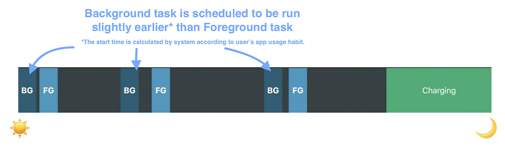
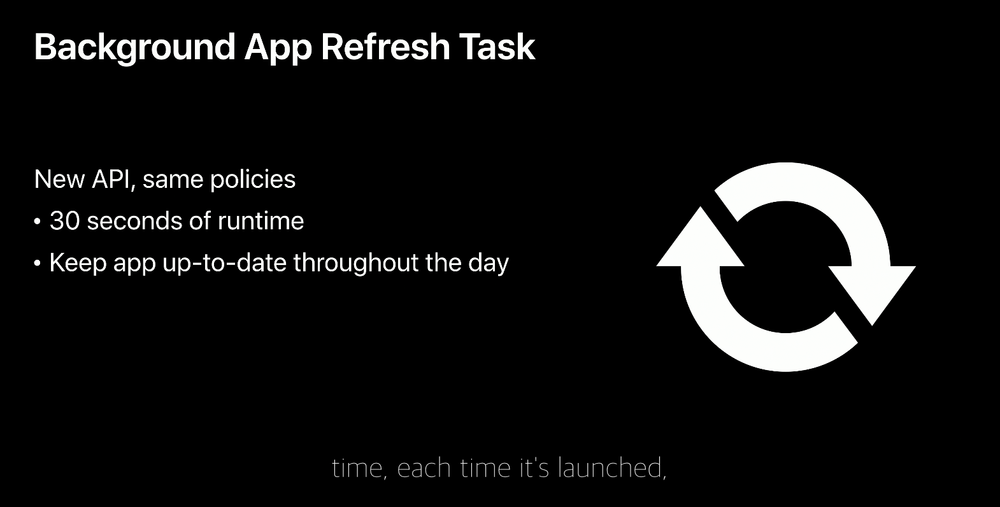

# 애플리케이션을 백그라운드에서 동작시키기 위한 방법

## 소개

애플리케이션을 개발하다보면 대용량 파일 업로드/다운로드 주기적인 데이터 fetch 작업 등 애플리케이션에서 백그라운드로 동작을 해줘야하는 상황들이 있다. 이러한 백그라운드 프로세스 작업들의 경우 어떤 식으로 실행할 수 있으며 어떻게 유지할 수 있는지 iOS/Android 각각의 환경에서 알아본 내용이다.

:::info 목차

1. [안드로이드에서의 백그라운드 작업](#안드로이드에서의-백그라운드-작업)
2. [iOS에서의 백그라운드 작업](#ios에서의-백그라운드-작업)
3. [플러터에 연결하기](#플러터에-연결하기)

:::

<!--truncate-->

## 안드로이드에서의 백그라운드 작업

## iOS에서의 백그라운드 작업

안드로이드와 비교했을때, iOS에서는 백그라운드 작업에 많은 제한을 두고 있다. iOS 13 이전 버전에서는 백그라운드 프로세스로 동작하는 경우를 고려하지 않아, 많은 개발자들이 여러 방법으로 앱이 현재 "실행 중"인 것 처럼 속여서 프로그램을 동작시켜주는 방식을 많이 활용해왔다. iOS 13 이후 버전에서는 *앱이 현재 "실행 중"인 것 처럼 속여*서 실행하는 개념자체는 동일하지만 이러한 기능들을 더 쉽게 활용할 수 있도록 Bacground Tasks Framework를 제공해주고 있다.

### Background Tasks

iOS 13부터 추가된 프레임워크로 시스템과 앱 간의 Background Task 요청을 담당하는 역할을 한다. 해당 프레임워크에서는 `BGAppRefreshTask`, `BGProcessingTask` 두 가지 타입을 제공해주는데 `BGAppRefreshTask`는 30초 정도가 소요되는 작업에 사용되고 그 이상의(몇분, 보통 5분 내외) 시간이 소요되는 작업들은 `BGProcessingTask`를 사용하게 한다.

[WWDC 2019년 발표자료](https://developer.apple.com/videos/play/wwdc2019/707/?time=1149)를 참고해보면 사용자가 Foreground로 진입하는 시점을 시스템이 분석하여 Background Task를 먼저 실행해준다. 그 외에도 백그라운드 앱 새로고침 설정, 베터리 충전 상태, 네트워크 연결등의 속성을 추가해주어 호출하는 시점을 정해주며 이 부분은 시스템에서 자체적으로 적용하여 정확한 시점을 파악하기 힘들다.

### BGAppRefreshTask

[WWDC 2019년 발표자료](https://developer.apple.com/videos/play/wwdc2019/707/?time=1131)를 확인해보면 `BGAppRefreshTask`에 대해 아래와 같이 설명한다.

`BGAppRefreshTask`의 경우 30초 이내의 간단한 작업들에 사용되기 위해 만들어졌다. 또한 스케쥴러 속성을 설정하여 주기적으로 새로고침 작업을 실행해줄 수 있다.

### BGProcessingTask

`BGProcessingTask`의 경우 반대로 대용량 파일 다운로드나 데이터 동기화와 같이 시간이 많이 걸리는 작업을 수행하기 위해 만들어졌다.

## 플러터에 연결하기
