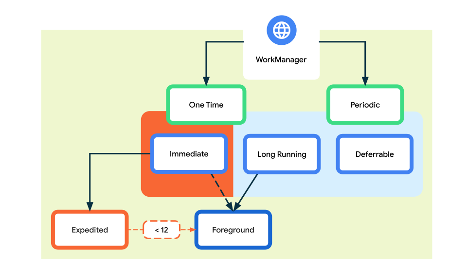

import Tabs from '@theme/Tabs';
import TabItem from '@theme/TabItem';

# 애플리케이션을 백그라운드에서 동작시키기 위한 방법

## 소개

애플리케이션을 개발하다보면 대용량 파일 업로드/다운로드 주기적인 데이터 fetch 작업 등 애플리케이션에서 백그라운드로 동작을 해줘야하는 상황들이 있다. 이러한 백그라운드 프로세스 작업들의 경우 어떤 식으로 실행할 수 있으며 어떻게 유지할 수 있는지 iOS/Android 각각의 환경에서 알아본 내용이다.

:::info 목차

1. [안드로이드에서의 백그라운드 작업](#안드로이드에서의-백그라운드-작업)
2. [iOS에서의 백그라운드 작업](#ios에서의-백그라운드-작업)
3. [플러터에 연결하기](#플러터에-연결하기)

:::

<!--truncate-->

## 안드로이드에서의 백그라운드 작업

안드로이드에서의 지속적인 작업은 WorkManager를 통해 처리가능하다. 대부분의 백그라운드 처리가 지속적 작업을 통해 수행되기 때문에 WorkManager는 일반적으로 백그라운드 처리를 위한 주요 권장 API로 사용된다.

### 지속적인 작업의 유형

WorkManager는 세 가지 유형의 지속적인 작업을 처리한다.

- **즉시(Immediate)**: 즉시 시작해서 곧 완료해야 하는 작업
- **오래 걸리는 작업(Long Running)**: 10분 이상 소요되는 작업
- **예약 작업(Deferrable)**: 나중에 시작되거나 주기적으로 실행되는 예약된 작업

아래 그림은 다양한 유형의 지속적 작업이 서로 어떻게 연관되어 있는지 간략히 설명한다.


지속적인 작업 유형(https://developer.android.com/develop/background-work/background-tasks/persistent)

마찬가지로, 다음 표에서는 다양한 유형의 작업을 간략히 설명한다.

| 유형             | 주기                 | 접근방법                                                                                                 |
| ---------------- | -------------------- | -------------------------------------------------------------------------------------------------------- |
| 즉각적인         | 일회성               | `OneTimeWorkRequest`, `Worker` 사용, 즉시 처리해야할 경우 `OneTimeWorkRequest`에서 `setExpedited()` 호출 |
| 오래 걸리는 작업 | 한번 또는 주기적으로 | `WorkRequest`, `Worker` 사용, 알림 처리를 위해서는 `setForeground()` 호출                                |
| 예약 작업        | 한번 또는 주기적으로 | `PeriodicWorkRequest`, `Worker` 사용                                                                     |

WorkManager를 설정하는 방법에 대한 자세한 내용은 [WorkRequest 정의](https://developer.android.com/topic/libraries/architecture/workmanager/how-to/define-work?_gl=1*12i8vjd*_up*MQ..*_ga*Nzg3NTIxNDM3LjE3MzQzMTkyNTc.*_ga_6HH9YJMN9M*MTczNDMxOTI1Ni4xLjAuMTczNDMxOTI1Ni4wLjAuMTExNTE5NzcxNQ..#work-constraints) 가이드에서 확인할 수 있다.

### WorkManager 기능

WorkManager는 더 간단하고 일관된 API를 제공하는 것 외에도 여러 가지 주요 이점을 제공한다.

#### 작업 제약

[작업 제약 조건](https://developer.android.com/topic/libraries/architecture/workmanager/how-to/define-work?_gl=1*16egi7j*_up*MQ..*_ga*Nzg3NTIxNDM3LjE3MzQzMTkyNTc.*_ga_6HH9YJMN9M*MTczNDMxOTI1Ni4xLjAuMTczNDMxOTI1Ni4wLjAuMTExNTE5NzcxNQ..#work-constraints)을 사용하여 작업을 실행하기 위한 최적의 조건을 선언적으로 정의한다. 예를 들어, 장치가 무제한 네트워크에 있을 때, 장치가 유휴 상태일 때 또는 베터리가 충분할 때만 실행한다.

#### 강력한 스케줄링

WorkManager를 사용하면 [유연한 스케줄링](https://developer.android.com/topic/libraries/architecture/workmanager/how-to/define-work?_gl=1*13c2q6w*_up*MQ..*_ga*Nzg3NTIxNDM3LjE3MzQzMTkyNTc.*_ga_6HH9YJMN9M*MTczNDMxOTI1Ni4xLjAuMTczNDMxOTI1Ni4wLjAuMTExNTE5NzcxNQ..)창을 사용하여 작업을 [한 번](https://developer.android.com/reference/androidx/work/OneTimeWorkRequest?_gl=1*5iktiz*_up*MQ..*_ga*MTQ1MDI1MDM4NC4xNzM0MzkxNDMz*_ga_6HH9YJMN9M*MTczNDM5MTQzMy4xLjAuMTczNDM5MTQzMy4wLjAuMjEzODYzMDMwMA..) 또는 [반복적](https://developer.android.com/reference/androidx/work/PeriodicWorkRequest?_gl=1*5iktiz*_up*MQ..*_ga*MTQ1MDI1MDM4NC4xNzM0MzkxNDMz*_ga_6HH9YJMN9M*MTczNDM5MTQzMy4xLjAuMTczNDM5MTQzMy4wLjAuMjEzODYzMDMwMA..)으로 실행하도록 스케줄링 할 수 있다. 작업에는 태그를 지정하고 이름을 지정할 수도 있으므로 고유하고 대체 가능한 작업을 스케줄링하고 작업 그룹을 함께 모니터링하거나 취소할 수 있다.

예약된 작업은 내부적으로 관리되는 SQLite 데이터베이스에 저장되고 WorkManager는 장치가 재부팅되어도 이 작업을 지속하고 다시 예약되도록 보장한다.

또한 WorkManager는 [Doze 모드](https://developer.android.com/training/monitoring-device-state/doze-standby?_gl=1*15kdla1*_up*MQ..*_ga*MTQ1MDI1MDM4NC4xNzM0MzkxNDMz*_ga_6HH9YJMN9M*MTczNDM5MTQzMy4xLjAuMTczNDM5MTQzMy4wLjAuMjEzODYzMDMwMA..)와 같은 절전 기능과 모범 사례를 준수하므로 이에 대해 걱정할 필요가 없다.

#### 신속한 작업

WorkManager를 사용하면 백그라운드에서 실행하기 위해 즉각적인 작업을 예약할 수 있다. 사용자에게 중요하고 몇 분 안에 완료되는 작업에는 [Expedited 작업](https://developer.android.com/topic/libraries/architecture/workmanager/how-to/define-work?_gl=1*1dcvv91*_up*MQ..*_ga*MTQ1MDI1MDM4NC4xNzM0MzkxNDMz*_ga_6HH9YJMN9M*MTczNDM5MTQzMy4xLjAuMTczNDM5MTQzMy4wLjAuMjEzODYzMDMwMA..#expedited)을 사용해야한다.

#### 유연한 재시도 정책

작업이 실패하는 경우도 있을 것이다. WorkManager는 구성 가능한 [지수 백오프 정책](https://developer.android.com/reference/androidx/work/BackoffPolicy?_gl=1*1vet3n8*_up*MQ..*_ga*MTQ1MDI1MDM4NC4xNzM0MzkxNDMz*_ga_6HH9YJMN9M*MTczNDM5MTQzMy4xLjAuMTczNDM5MTQzMy4wLjAuMjEzODYzMDMwMA..)을 포함하여 [유연한 재시도 정책](https://developer.android.com/topic/libraries/architecture/workmanager/how-to/define-work?_gl=1*1ir6xg6*_up*MQ..*_ga*MTQ1MDI1MDM4NC4xNzM0MzkxNDMz*_ga_6HH9YJMN9M*MTczNDM5MTQzMy4xLjAuMTczNDM5MTQzMy4wLjAuMjEzODYzMDMwMA..#retries_backoff)을 제공한다.

#### 작업 체이닝

복잡한 작업의 경우 직관적인 인터페이스를 사용하여 [개별 작업을 연결](https://developer.android.com/topic/libraries/architecture/workmanager/how-to/chain-work?_gl=1*ipxv84*_up*MQ..*_ga*MTQ1MDI1MDM4NC4xNzM0MzkxNDMz*_ga_6HH9YJMN9M*MTczNDM5MTQzMy4xLjAuMTczNDM5MTQzMy4wLjAuMjEzODYzMDMwMA..)하여 어떤 작업이 순차적으로 실행되고 어떤 작업이 병렬로 실행될지 제어할 수 있다.

<Tabs>
  <TabItem value="Kotlin" label="Kotlin" default>
    ```kt
    val continuation = WorkManager.getInstance(context)
    .beginUniqueWork(
        Constants.IMAGE_MANIPULATION_WORK_NAME,
        ExistingWorkPolicy.REPLACE,
        OneTimeWorkRequest.from(CleanupWorker::class.java)
    ).then(OneTimeWorkRequest.from(WaterColorFilterWorker::class.java))
    .then(OneTimeWorkRequest.from(GrayScaleFilterWorker::class.java))
    .then(OneTimeWorkRequest.from(BlurEffectFilterWorker::class.java))
    .then(
        if (save) {
            workRequest<SaveImageToGalleryWorker>(tag = Constants.TAG_OUTPUT)
        } else /* upload */ {
            workRequest<UploadWorker>(tag = Constants.TAG_OUTPUT)
        }
    )
    ```
  </TabItem>
  <TabItem value="Java" label="Java">
    ```java
    WorkManager.getInstance(...)
      .beginWith(Arrays.asList(workA, workB))
      .then(workC)
      .enqueue();
    ```
  </TabItem>
</Tabs>

각 작업 태스크에 대해 해당 작업에 대한 [입력 및 출력 데이터를 정의](https://developer.android.com/topic/libraries/architecture/workmanager/how-to/define-work?_gl=1*mlerpu*_up*MQ..*_ga*MTQ1MDI1MDM4NC4xNzM0MzkxNDMz*_ga_6HH9YJMN9M*MTczNDM5MTQzMy4xLjAuMTczNDM5MTQzMy4wLjAuMjEzODYzMDMwMA..#input_output) 할 수 있다. 작업을 함께 연결할때 WorkManager는 자동으로 한 작업 목록에서 다음 작업 목록으로 출력 데이터를 전달한다.

#### 내장된 상호 스레딩 운용

WorkManager는 [Coroutines](https://developer.android.com/topic/libraries/architecture/workmanager/advanced/coroutineworker?_gl=1*155py4x*_up*MQ..*_ga*MTQ1MDI1MDM4NC4xNzM0MzkxNDMz*_ga_6HH9YJMN9M*MTczNDM5MTQzMy4xLjAuMTczNDM5MTQzMy4wLjAuMjEzODYzMDMwMA..)과 [RxJava](https://developer.android.com/topic/libraries/architecture/workmanager/advanced/rxworker?_gl=1*1nq42mo*_up*MQ..*_ga*MTQ1MDI1MDM4NC4xNzM0MzkxNDMz*_ga_6HH9YJMN9M*MTczNDM5MTQzMy4xLjAuMTczNDM5MTQzMy4wLjAuMjEzODYzMDMwMA..)와 [완벽하게 통합](https://developer.android.com/topic/libraries/architecture/workmanager/advanced/threading?_gl=1*1nq42mo*_up*MQ..*_ga*MTQ1MDI1MDM4NC4xNzM0MzkxNDMz*_ga_6HH9YJMN9M*MTczNDM5MTQzMy4xLjAuMTczNDM5MTQzMy4wLjAuMjEzODYzMDMwMA..)되며, [사용자의 비동기 API를 플러그인](https://developer.android.com/topic/libraries/architecture/workmanager/advanced/listenableworker?_gl=1*1cyuof1*_up*MQ..*_ga*MTQ1MDI1MDM4NC4xNzM0MzkxNDMz*_ga_6HH9YJMN9M*MTczNDM5MTQzMy4xLjAuMTczNDM5MTQzMy4wLjAuMjEzODYzMDMwMA..)할 수 있는 유연성을 제공한다.

:::tip 참고

코루틴과 WorkManager는 서로 다른 사용 사례에 권장되지만 상호 배타적이지는 않다. WorkManager를 통해 예약된 작업 내에서 코루틴을 사용할 수 있다.

:::

### WorkManager 시작하기

WorkManager를 사용하려면 먼저 라이브러리를 Android 프로젝트로 가져와야한다.

앱 `build.gradle` 파일에 다음 종속성을 추가하자.

<Tabs>
  <TabItem value="Groovy" label="Groovy" default>
    ```gradle
    dependencies {
      def work_version = "2.9.1"

      // (Java only)
      implementation "androidx.work:work-runtime:$work_version"

      // Kotlin + coroutines
      implementation "androidx.work:work-runtime-ktx:$work_version"

      // optional - RxJava2 support
      implementation "androidx.work:work-rxjava2:$work_version"

      // optional - GCMNetworkManager support
      implementation "androidx.work:work-gcm:$work_version"

      // optional - Test helpers
      androidTestImplementation "androidx.work:work-testing:$work_version"

      // optional - Multiprocess support
      implementation "androidx.work:work-multiprocess:$work_version"
    }
    ```

  </TabItem>
  <TabItem value="Kotlin" label="Kotlin">
    ```kt
    dependencies {
      val work_version = "2.9.1"

      // (Java only)
      implementation("androidx.work:work-runtime:$work_version")

      // Kotlin + coroutines
      implementation("androidx.work:work-runtime-ktx:$work_version")

      // optional - RxJava2 support
      implementation("androidx.work:work-rxjava2:$work_version")

      // optional - GCMNetworkManager support
      implementation("androidx.work:work-gcm:$work_version")

      // optional - Test helpers
      androidTestImplementation("androidx.work:work-testing:$work_version")

      // optional - Multiprocess support
      implementation("androidx.work:work-multiprocess:$work_version")
    }
    ```

  </TabItem>
</Tabs>

종속성을 추가하고 Gradle 프로젝트를 동기화한 후 실행할 작업을 정의한다.

:::tip 참고

베타, 알파, 릴리스 후보 버전을 포함한 최신 버전의 WorkManager는 항상 [WorkManager 릴리스 페이지](https://developer.android.com/jetpack/androidx/releases/work?_gl=1*1wpnp38*_up*MQ..*_ga*MTQ1MDI1MDM4NC4xNzM0MzkxNDMz*_ga_6HH9YJMN9M*MTczNDM5MTQzMy4xLjAuMTczNDM5MTQzMy4wLjAuMjEzODYzMDMwMA..) 에서 찾을 수 있다.

:::

#### 작업 정의하기

작업은 `Worker`클래스를 사용하여 정의된다. `doWork()` 메서드는 WorkManager가 제공하는 백그라운드 스레드에서 비동기적으로 실행된다.

WorkManager가 실행할 작업을 만들려면 `Worker` 클래스를 확장하고 `doWork()`메서드를 재정의한다. 예를 들어 이미지를 업로드하는 `Worker`를 만들려면 다음과 같이 적용할 수 있다.

<Tabs>
  <TabItem value="Kotlin" label="Kotlin" default>
    ```kt
    class UploadWorker(appContext: Context, workerParams: WorkerParameters):
       Worker(appContext, workerParams) {
      override fun doWork(): Result {

          // Do the work here--in this case, upload the images.
          uploadImages()

          // Indicate whether the work finished successfully with the Result
          return Result.success()
      }
    }
    ```

  </TabItem>
  <TabItem value="Java" label="Java">
    ```java
    public class UploadWorker extends Worker {
      public UploadWorker(
          @NonNull Context context,
          @NonNull WorkerParameters params) {
          super(context, params);
      }

      @Override
      public Result doWork() {

        // Do the work here--in this case, upload the images.
        uploadImages();

        // Indicate whether the work finished successfully with the Result
        return Result.success();
      }
    }
    ```

  </TabItem>
</Tabs>

`doWork()`를 통해 반환된 `Result` 내용은 WorkManager 서비스에 작업이 성공했는지 여부를 알려주고, 실패한 경우 작업을 다시 시도할지 여부를 알려준다.

- `Result.success()`: 작업이 성공적으로 완료됨
- `Result.failure()`: 작업이 실패함
- `Result.retry()`: 작업이 실패하였으며, **재시도 정책**에 따라 다른 시간에 다시시도해야 함을 알림

#### 작업 요청 생성

작업이 정의되면 WorkManager 서비스로 예약해야 실행할 수 있다. WorkManager는 작업 예약 방법에 많은 유연성을 제공한다. 일정 시간 간격동안 [주기적으로 실행](https://developer.android.com/topic/libraries/architecture/workmanager/how-to/define-work?_gl=1*1wbm5nw*_up*MQ..*_ga*MTQ1MDI1MDM4NC4xNzM0MzkxNDMz*_ga_6HH9YJMN9M*MTczNDM5MTQzMy4xLjAuMTczNDM5MTQzMy4wLjAuMjEzODYzMDMwMA..#schedule_periodic_work)되도록 예약하거나 [한 번만](https://developer.android.com/topic/libraries/architecture/workmanager/how-to/define-work?_gl=1*1wbm5nw*_up*MQ..*_ga*MTQ1MDI1MDM4NC4xNzM0MzkxNDMz*_ga_6HH9YJMN9M*MTczNDM5MTQzMy4xLjAuMTczNDM5MTQzMy4wLjAuMjEzODYzMDMwMA..#constraints) 실행되도록 예약할 수 있다.

작업을 어떻게 예약하든 항상 `WorkRequest`를 사용한다. `Worker`가 작업 단위를 정의한다면, `WorkRequest`(및 하위 클래스)는 실행 방법과 시기를 정의한다. 간단한 경우에는 아래와 같이 `OneTimeWorkRequest`를 사용할 수 있다.

<Tabs>
  <TabItem value="Kotlin" label="Kotlin" default>
    ```kt
    val uploadWorkRequest: WorkRequest =
      OneTimeWorkRequestBuilder<UploadWorker>()
          .build()
    ```

  </TabItem>
  <TabItem value="Java" label="Java">
    ```java
    WorkRequest uploadWorkRequest =
      new OneTimeWorkRequest.Builder(UploadWorker.class)
          .build();
    ```

  </TabItem>
</Tabs>

#### 시스템에 WorkRequest 전달

마지막으로, `WorkRequest`를 `WorkManager`로 `enqueue()`를 사용하여 제출해야 한다.

<Tabs>
  <TabItem value="Kotlin" label="Kotlin" default>
    ```kt
    WorkManager
      .getInstance(myContext)
      .enqueue(uploadWorkRequest)
    ```

  </TabItem>
  <TabItem value="Java" label="Java">
    ```java
    WorkManager
      .getInstance(myContext)
      .enqueue(uploadWorkRequest);
    ```

  </TabItem>
</Tabs>

워커가 실행되는 정확한 시간은 사용자가 정의한 `WorkRequest` 및 시스템 최적화에 사용되는 제약 조건에 따라 달라진다. WorkManager는 이러한 제약 조건하에서 최상의 동작을 제공하도록 설계되었다.

## iOS에서의 백그라운드 작업

안드로이드와 비교했을때, iOS에서는 백그라운드 작업에 많은 제한을 두고 있다. iOS 13 이전 버전에서는 백그라운드 프로세스로 동작하는 경우를 고려하지 않아, 많은 개발자들이 여러 방법으로 앱이 현재 "실행 중"인 것 처럼 속여서 프로그램을 동작시켜주는 방식을 많이 활용해왔다. iOS 13 이후 버전에서는 *앱이 현재 "실행 중"인 것 처럼 속여*서 실행하는 개념자체는 동일하지만 이러한 기능들을 더 쉽게 활용할 수 있도록 Bacground Tasks Framework를 제공해주고 있다.

### Background Tasks

iOS 13부터 추가된 프레임워크로 시스템과 앱 간의 Background Task 요청을 담당하는 역할을 한다. 해당 프레임워크에서는 `BGAppRefreshTask`, `BGProcessingTask` 두 가지 타입을 제공해주는데 `BGAppRefreshTask`는 30초 정도가 소요되는 작업에 사용되고 그 이상의 시간이 소요되는 작업들은 `BGProcessingTask`를 사용하게 한다.


[WWDC 2019년 발표자료](https://developer.apple.com/videos/play/wwdc2019/707/?time=1149)를 참고해보면 사용자가 Foreground로 진입하는 시점을 시스템이 분석하여 Background Task를 먼저 실행해준다. 그 외에도 백그라운드 앱 새로고침 설정, 베터리 충전 상태, 네트워크 연결등의 속성을 추가해주어 호출하는 시점을 정해주며 이 부분은 시스템에서 자체적으로 적용하여 정확한 시점을 파악하기 힘들다.

### BGAppRefreshTask

[WWDC 2019년 발표자료](https://developer.apple.com/videos/play/wwdc2019/707/?time=1131)를 확인해보면 `BGAppRefreshTask`에 대해 아래와 같이 설명한다.


`BGAppRefreshTask`의 경우 30초 이내의 간단한 작업들에 사용되기 위해 만들어졌다. 또한 스케쥴러 속성을 설정하여 주기적으로 새로고침 작업을 실행해줄 수 있다.

### BGProcessingTask

`BGProcessingTask`의 경우 반대로 대용량 파일 다운로드나 데이터 동기화와 같이 시간이 많이 걸리는 작업을 수행하기 위해 만들어졌다.

## 플러터에 연결하기

하지만 위와 같은 방법으로 프로그램을 동작하기 위해서는 결국 Kotlin, Swift 코드 모두 작성해야 한다. 단순히 백그라운드 작업을 추가해주기 위해 네이티브 언어로 작성하려고 보니 다트 코드보다 Kotlin, Swift 코드가 더 많아질 것 같다. 어떻게 좀 더 쉽게 적용할 수 있을까?

Flutter에서는 멀티 프로세스 환경에서도 코드를 실행해줄 수 있도록 Android/iOS 환경에서 각각 [FlutterEngine](https://github.com/flutter/engine) 패키지를 제공해준다. 플러터 엔진은 플러터 애플리케이션을 호스팅하기 위한 휴대용 런타임 환경이다. 애니메이션 및 그래픽, 파일 및 네트워크 I/O, 접근성 지원, 플러그인 아키텍쳐, Dart 런타임 및 컴파일 툴체인 등 플러터의 핵심이 되는 기능들을 모두 구현할 수 있으며 이를 오픈소스로 제공해주고 있다.

따라서 FlutterEngine을 활용하여 Dart 코드를 받아와 백그라운드 프로세스에서 바로 실행될 수 있도록 적용한다면 보다 쉽게 백그라운드 작업을 적용할 수 있다.

아래에는 이러한 플러터엔진을 잘 활용한 [flutter_workmanager](https://pub.dev/packages/workmanager) 패키지를 참고하여 개발한 내용을 정리하였다.

### 코드로 작성하기

플러터 코드에서 시작해 거꾸로 타고 들어가면서 코드를 확인해보자.

먼저 네이티브 코드에서 플러터 코드를 그대로 사용하기 위해 `@pragma('vm:entry-point')` 주석을 추가해준다. 이는 컴파일러에 해당 함수(또는 클래스와 같은 다른 엔티티)가 **네이티브 코드에서 사용될 것**임을 나타낸다. 이 주석이 없으면 Dart 컴파일러는 최적화를 위해 사용하지 않는 함수를 제거하고, 인라인으로 만들거나, 이름을 축소하는 등 작업을 할 수 있으며 이 경우 네이티브 코드에서는 이를 호출하지 못할 수 있다.

#### Main

```dart
@pragma(
    'vm:entry-point') // Mandatory if the App is obfuscated or using Flutter 3.1+
void callbackDispatcher() {
  BackgroundTask().executeTask((task, inputData) async {
    switch (task) {
    // ...
```

위 코드와 같이 백그라운드 프로세싱을 위한 `BackgroundTask` 클래스를 선언해주고 Callback을 위한 `executeTask()` 함수에 비동기 함수를 전달한다.

#### BackgroundTask

`executeTask()`에서는 전달받은 함수를 `FlutterMethodCallHandler()`를 통해 네이티브 코드로 전달해준다.

```dart
/// A helper function so you only need to implement a [BackgroundTaskHandler]
void executeTask(final BackgroundTaskHandler backgroundTask) {
  WidgetsFlutterBinding.ensureInitialized();
  DartPluginRegistrant.ensureInitialized();

  _backgroundChannel.setMethodCallHandler((call) async {
    final inputData = call.arguments["be.pinokiolab.workmanager.INPUT_DATA"];
    return backgroundTask(
      call.arguments["be.pinokiolab.workmanager.DART_TASK"],
      inputData == null ? null : jsonDecode(inputData),
    );
  });
  _backgroundChannel.invokeMethod("backgroundChannelInitialized");
}
```

#### Native Code

MethodCall을 통해 Kotlin, Swift 코드를 실행해주면 각각의 클래스에 설정되어있던 FlutterEngine을 통해 Dart 코드를 실행해준다.

