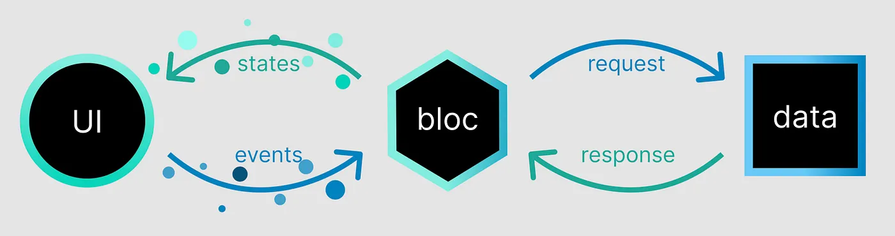
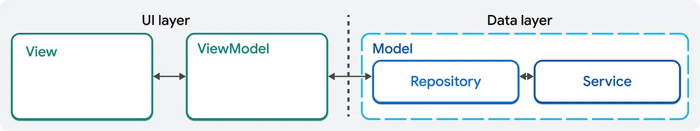

# Flutter 권장 아키텍쳐, BLoC은 왜 안될까?

## 소개

최근(2024년 12월) Flutter 팀은 아키텍쳐 가이드를 게시하고 네이티브 Kotlin, Swift와 같은 다른 모바일 프레임워크에서 채택한 확립된 패턴을 따라 Flutter 앱의 레이어를 구성하는데 MVVM 접근 방식을 사용할 것을 제안했다. 이때 MVVM 접근 방식으로 사용한다면 기존에 많은 개발자들이 사용 중이던 BLoC의 접근 방식이 떠올릴 수 있다. 그렇다면 왜 Flutter에서는 BLoC의 사용을 권장하지 않고 다시 제안을 하였을까?

이 글은 [Flutter’s recommended architecture: why not BLoC? - Eduardo Pires, Medium Blog](https://empires.medium.com/flutters-recommended-architecture-why-not-bloc-6cccc1d078d3)의 글을 의역하며 내가 이해한 내용을 정리한 글이다.

:::info 목차

1. [기본 사항 이해](#기본-사항-이해)

:::

<!--truncate-->

## 기본 사항 이해

**BLoC(Business Logic Component)** 은 **상태**와 **이밴트**를 관리하기 위해 **Streams**을 사용하는 반응형 프로그래밍 패러다임을 따른다. BLoC의 주요 목표는 비즈니스 로직을 UI와 완전히 분리하는 단방향 데이터 흐름을 적용하는 것이다.

### BLoC의 주요 구성요소

1. **Events**: 사용자 작업이나 외부 트리거.
2. **States**: UI의 현재 상태
3. **Blocs**: 스트림을 사용하여 이벤트를 상태에 매핑

MVVM 계층 아키텍처( https://docs.flutter.dev/app-architecture/concepts)

반면, MVVM(Model-View-ViewModel) 패턴은 상태를 관리하는 더 간단한 방법을 제공한다. 여기서 ViewModel은 UI(View)와 데이터(Model) 사이의 중개자 역할을 한다. 이때, `notifyListeners()` 메서드를 사용하여 UI에 변경사항을 알린다.

MVVM 계층 아키텍처( https://docs.flutter.dev/app-architecture/concepts)

두 구조를 확인했을 때 유사한 점을 확인할 수 있다. 둘 모두 상태를 효율적으로 관리하고 UI를 반응적으로 업데이트하는 것을 목표로 하며, 둘 다 Flutter 위젯과 완벽하게 통합되고 비동기 작업을 지원한다. 하지만 BLoC의 Streams는 보다 복잡한 워크플로우에 더 적합하다.

### MVVM의 주요 구성요소

1. **Model**: 앱의 데이터를 나타낸다.
2. **ViewModel**: 상태와 비즈니스 로직을 관리한다.
3. **View**: UI를 표시하고 변경 사항을 관찰한다.

MVVM 접근 방식의 구성 요소( https://docs.flutter.dev/app-architecture/guide)

이 둘은 주로 관심사를 잘 정의된 계층적 아키텍처로 분리한다는 동일한 아이디어에 기반을 두고 있으므로, 아래의 내용에서 둘 사이의 차이점에 초점을 맞춰보자.

### 주요 차이점

#### 1. 데이터 흐름

- **BLoC**: 단방향 데이터 흐름을 적용한다. 이벤트는 상태 변경을 트리거하고 상태는 UI로 전달된다.

- **MVVM**: 양방향 데이터 흐름을 사용하며, 이를 통해 상태 업데이트와 UI 상호작용이 보다 자유롭게 발생할 수 있다.

#### 2. Boilerplate

- **BLoC**: 이벤트, 상태, Bloc 클래스 정의를 포함한 더 많은 보일러플레이트가 필요하다.

- **MVVM**: `notifyListeners()` 혹은 `ValueNotifier.value`를 통해 직접 업데이트하도록 하여 최소한의 보일러플레이트만 사용한다.

#### 3. 성능

- **BLoC**: 스트림은 복잡한 비동기 작업을 처리하는데 매우 효율적이다.

- **MVVM**: 가볍고 빠르지만 더 크고 복잡한 애플리케이션에서는 어려움을 겪을 수 있다.

  > 이 부분은 아마도 원 작자가 양방향 데이터 흐름 때문에 위와 같이 설명한 것 같다. FrontEnd에서 이미 `Angular`나 `MobX`를 통해 양방향 데이터 흐름이 크고 복잡한 애플리케이션에서 얼마나 까다로운지 많은 개발자들이 경험해봤다.

#### 4. Learning Curve

- **BLoC**: Streams 및 StreamControllers와 같은 반응형 프로그래밍 개념을 활용하여 배우기 어렵다.

- **MVVM**: 메서드 혹은 변수에 직접 접근할 수 있어 보다 배우기 쉽다.

#### 5. 테스트

- **BLoC**: 뛰어난 테스트 기본 기능을 제공하므로 상태 전환을 독립적으로 테스트 할 수 있다.

- **MVVM**: BLoC에 비해서는 테스트하기 까다롭고 UI에서 비즈니스로직을 분리하기 위해 추가 작업이 필요하다.

#### 6. 확장성

- **BLoC**: 공유 상태를 가지는 크고 복잡한 앱에 이상적이다.

- **MVVM**: 대규모 앱에서는 커플링이 발생할 수 있으므로 중소규모의 앱에 적합하다.

## 정리

BLoC과 MVVM은 모두 더 클린하게 관리하기 위해 `ChangeNotifier` 또는 `ValueNotifier`를 제공한다. 올바른 선택은 프로젝트의 크기, 복잡성, 선호하는 구조에 따라 달라진다.

### BLoC을 선택해야하는 경우

크고 복잡한 애플리케이션을 구축하고 엄격한 아키텍쳐 규칙과 함께 제공되는 이점을 원한다면, BLoC을 선택하라. 커플링이나 상태 관리를 더 완벽하게 다루고 싶다면 BLoC을 사용하는 것이 좋을 듯 하다. BLoC의 Events-States 패턴과 불변성은 데이터 흐름을 테스트, 디버깅하고 추적하는 것을 더 쉽게 만들어준다. 팀이 예측 가능성과 확장성을 고려한 접근 방식을 중요하게 여긴다면 BLoC이 확실한 선택이다.

### Notifier 기능이 있는 MVVM을 원할 경우

빠르게 구현하고 이해하기 쉬운 것을 찾고 있다면 MVVM이 맞을 수 있다. 소규모 프로젝트나 막 시작해서 BLoC의 모든 복잡성이 필요하지 않을 때 좋다. 설정하는 데 시간을 덜 쓰고 빠르게 반복하는 데 시간을 더 많이 할애할 수 있지만 시간이 지나면서 혼란이 생기지 않도록 규칙이 필요하다.

각 패턴이 추구하는 방향을 이해하면 팀의 요구 사항과 앱의 복잡성에 가장 적합한 패턴을 선택할 수 있다. 어떤 것을 선택하든 더 깨끗하고 효율적인 Flutter 코드를 작성하는데 큰 진전을 이룰 수 있다.
