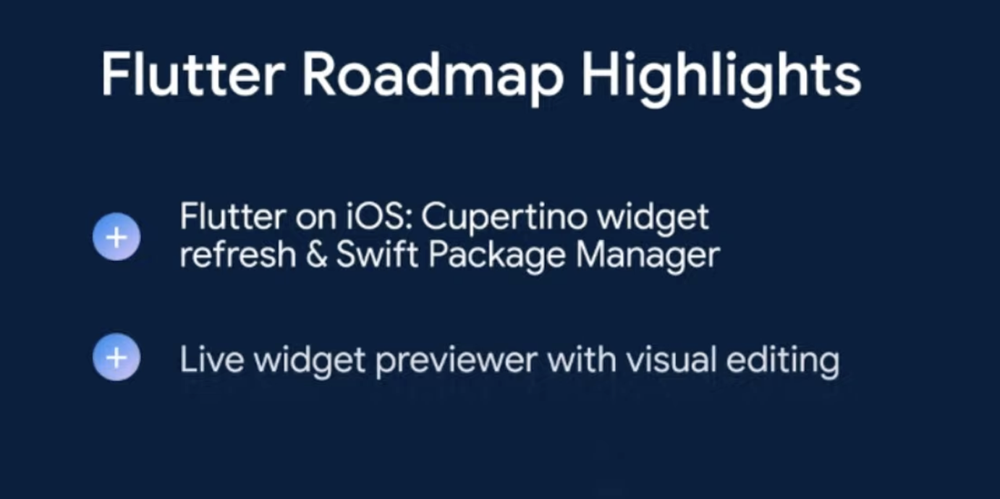
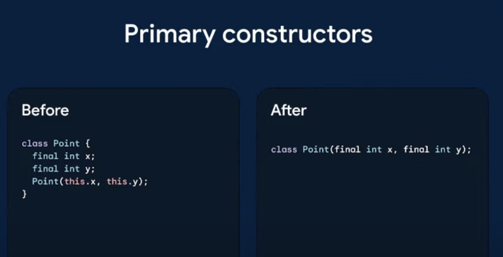
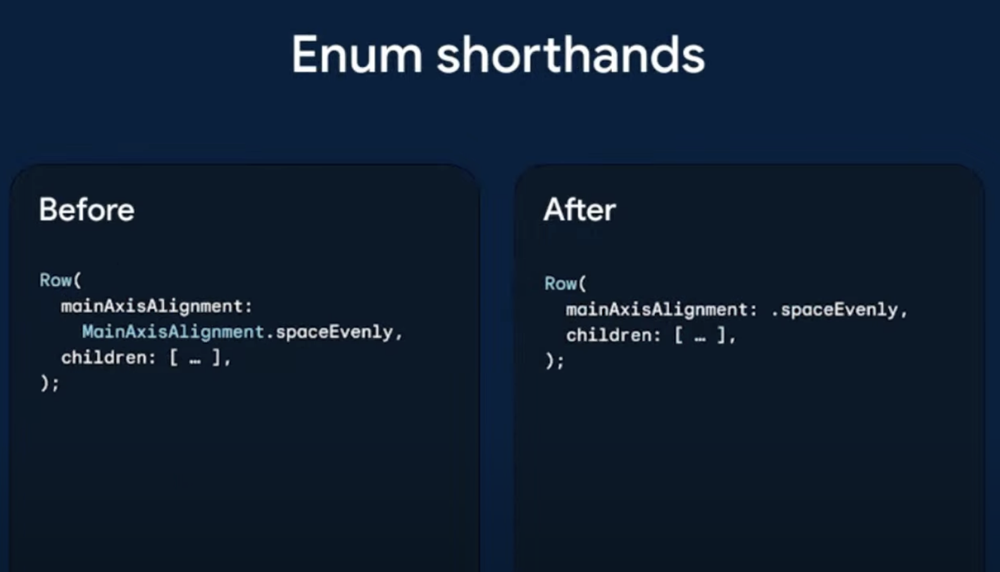
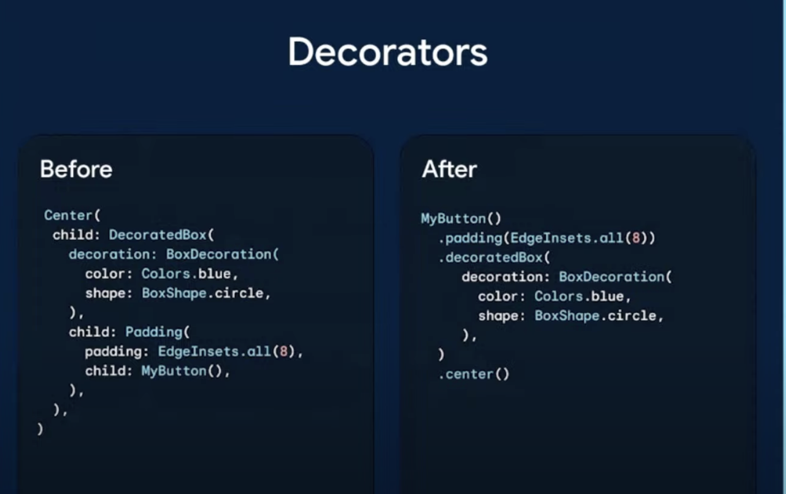
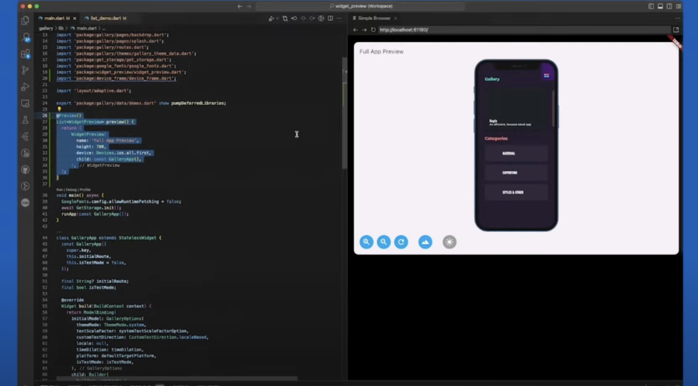
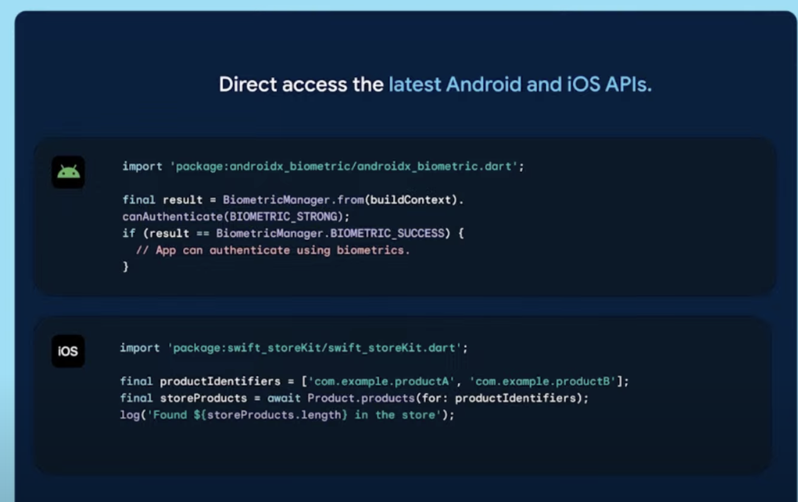

# FlutterInProduction 내용 정리

## 소개

2024년 12월 18일 유튜브 라이브로 진행된 [#FlutterInProduction](https://www.youtube.com/watch?v=AEXIrThTgb0) 내용을 정리하며 플러터 프레임워크의 현재 상황과 2025년 목표, 이 후 진행될 로드맵에 대해 정리한 내용이다.

> [Flutter](https://flutter.dev)의 **과거, 현재, 그리고 미래** 에 대한 통찰력을 제공하는 이 영상에서는 앱 개발 에 있어 **효율성과 안정성** 을 대폭 향상한 Flutter 프로젝트의 발전 과정을 볼 수 있습니다. Flutter 는 다양한 플랫폼에서의 디자인 과 개발을 손쉽게 하여, 많은 기업들이 최상의 사용자 경험 을 제공할 수 있도록 돕고 있습니다. 또한, 대중적으로 사용되는 Flutter SDK의 **위젯 수** 와 이를 통한 앱 생태계의 증가를 소개하여, Flutter 가 비즈니스에 미치는 긍정적인 영향을 드러냅니다. Flutter 의 **성공적인 성과** 는 개발자들에게 흥미롭고 창의적인 앱을 제작할 수 있게 해주며, 이는 사용자의 경험 향상으로 이어집니다.

:::info 목차

1. [Flutter의 발전과 현재 위치](#1--flutter의-발전과-현재-위치)
2. [Flutter의 위젯 수와 종류](#2--flutter의-위젯-수와-종류)
3. [Flutter 기여자 및 모임 현황](#3--flutter-기여자-및-모임-현황)
4. [Flutter 현황 및 발전 단계](#4--flutter-현황-및-발전-단계)
5. [Flutter의 미래 계획 및 개발자 지원](#5--flutter의-미래-계획-및-개발자-지원)

:::

<!--truncate-->

## 1. 🌟 Flutter의 발전과 현재 위치

- Flutter 는 실험적인 **렌더링 프로젝트** 에서 전 세계적으로 사용되는 도구로 발전하여 디자이너의 창의성을 발휘하고 비즈니스 애플리케이션 을 최적화하며 개발자들이 우수한 사용자 경험 을 제공할 수 있게 한다.
- Flutter 는 **백만 개 이상의 앱** 이 공개되었으며, 수백만의 사용자와 수십억 달러가 이들 앱을 통해 거래되는 등 **크로스 플랫폼 지원** 이 뛰어난 안전한 선택으로 알려져 있다.
- 웹 앱을 먼저 제작한 후 Android 및 iOS로 배포하여 보다 쉽게 개발을 진행할 수 있고, **hot reload** 기능이 특히 인상적이다.
- Flutter 프로젝트는 시작된 지 **10년** 이 되었고, 초기에는 'Sky'라는 이름으로 알려졌었다.

## 2. 🧩 Flutter의 위젯 수와 종류

- Flutter SDK에는 **528개**의 **위젯** 이 공개되어 있다.
- 이 위젯들은 다양한 형태로 제공되며, **SizeBox** 와 **MultiChildRenderObjectWidget** 등이 포함된다.
- 처음에는 100개에서 200개 사이일 것이라고 추정했으나, 실제로는 **528개**로 확인되었다.
- 이는 Flutter 의 다양한 기능을 나타내며, 개발자들이 이런 위젯들을 잘 활용하면 더욱 효율적인 개발을 할 수 있을 것이다.

## 3. 🌍 Flutter 기여자 및 모임 현황

- 연초부터 **Flutter** 에 기여한 코드 작성자는 총 **475명** 이다.
- 그 중에서 **Google** 직원인 기여자는 **119명** 이다.
- **Flutter** **Meetup Network** 은 전 세계에서 다양한 언어로 진행되는 지역 모임을 운영하고 있다.
- 이 네트워크는 **64개국** 에서 활동하고 있으며, 약 **92,000명** 이 참여하고 있다.

## 4. 📊 Flutter 현황 및 발전 단계

- **매월 100만 명 이상의 개발자**가 **Flutter**툴을 사용하고 있으며, 최근 **iOS 앱 스토어에 등록된 앱의 28%**가 **Flutter**로 개발되었다. 이를 통해 Flutter 의 성장 추세를 확인할 수 있다.
- **Flutter**는 초기 실험적 시기를 지나 안정적인 SDK인 1.0 버전을 2018년에 출시한 이후 성장 단계에 진입하였다. 이 시기에는 모바일 플랫폼뿐 아니라 웹과 데스크톱에 대한 지원도 확장되었다.
- 현재 **Flutter**가 안정화 되면서, 대기업들이 **Flutter**를 사용하여 비즈니스 핵심 기능을 구현하고 있다. 예를 들어, **Scandinavian Airlines**는 디자인 어워드를 수상하였고, **Flutter**를 통해 연간 2400만 명의 승객을 수송하고 있다.
- **Flutter**의 최신 버전은 플랫폼에 따라 네이티브와 유사한 성능을 제공하는 데 초점을 맞추고 있다. 이를 통해 Material 3 및 iOS 디자인 시스템을 지원하고 있으며, 각 플랫폼에 맞춘 민첩한 업데이트가 이루어지고 있다.
- **Flutter**는 전체 에코시스템을 통해 50,000개 이상의 패키지를 호스팅하며, 개발자들은 이를 통해 빠르게 생산성 높은 솔루션을 구축할 수 있다. 이 오픈 생태계는 품질과 지속 가능성을 높이는 데 기여하고 있다.

### 4.1. Flutter 사용 통계

- **플러터 도구** 를 사용하는 개발자는 매달 **백만 명** 이상으로 추정된다. 이 수치는 여러 가지 방법으로 측정되지만, **정확한 수치는 알려져 있지 않다** .
- 구글 애널리틱스 를 통해 수집된 **데이터** 를 기반 **iOS 앱 스토어** 에 업로드되는 신규 앱 중 **28%** 가 **플러터** 로 개발된 것으로 나타났다, 이는 **new iOS app의 4분의 1** 이상을 차지한다.
- 데이터는 **플러터 도구** 를 사용할 때 발생하며, 이는 "flutter run" 또는 "flutter create" 명령어 실행 시 수집된다.
- 도구를 사용하는 개발자 수와 신규 앱의 비율이 증가하고 있다는 점은 **플러터의 인기** 를 암시한다.

### 4.2. Flutter의 발전 단계

- **플러터** 는 2018년 1.0 출시를 통해 안정적인 SDK로 자리잡았다. 초기에는 몇몇 엔지니어들이 웹 성능 향상을 실험하는 단계였다.
- 성장 단계에서는 더 많은 지원 플랫폼이 추가되었고, 새로운 엔지니어들이 참여하여 **플러터** 의 발전을 이끌었다.
- 커뮤니티가 새로운 개발자들을 환영하며, 매주 새로운 패키지가 발표되고 **생태계** 가 빠르게 확장되고 있다.

### 4.3. Flutter의 발전과 개발자 경험

- Flutter 는 **수천 명의 기여자** 와 **수백만 명의 개발자** 덕분에 타인의 의존을 받는 플랫폼으로 성장했다.
- SDK와 도구는 Flutter 의 기존 약속을 이행하고 **개발자 경험**을 지속적으로 개선 하는 데 중점을 두고 있다.
- 이번 이벤트에서는 Flutter 의 최근 릴리스 정보와 미래 방향에 대해 논의하며, **실시간 Q&A** 세션이 포함된다.
- 기술 리드인 Kate는 Flutter 가 개발자들이 놀라운 **사용자 경험** 을 창출할 수 있도록 돕는 방법에 대해 이야기할 예정이다.
- 이벤트 중 Kate는 Flutter 의 **위젯** **렌더링** 과 Dart 파일에서의 기타 다양한 임포트 관련 내용도 다룰 것이다.

### 4.4. Flutter의 발전과 비즈니스 성공

- **플러터는 많은 기업들이 여러 플랫폼에서 사용자 지원을 위해 선택하는 이유로, 수백만 개의 앱을 배포한 경험이 있다.** 이러한 성과는 개발자들이 더 높은 품질의 앱 경험을 제공하면서 자원을 절약할 수 있음을 보여준다.
- **앱을 사용하는 팀들은 플러터를 채택한 후 앱 스토어 평가 및 주요 비즈니스 지표가 향상된다고 보고했다.** 여기에는 광고 노출 및 인앱 구매 등이 포함된다.
- 플러터의 초기 실험 시기는 1.0 버전 출시로 이어졌고, 이는 **Cupertino 및 Material** 위젯 라이브러리를 포함하여 iOS와 Android에서의 적합한 앱 디자인을 가능하게 했다. 기존 네이티브 앱에 플러터를 통합할 수 있는 옵션도 제공되었다.
- 플러터는 Android, iOS를 비롯해 각종 플랫폼에 대한 생산 지원을 확대하면서 그 성장기에 들어섰고, 새로운 디자인 라이브러리와 사용자 입력 방식이 도입되었다. 이는 다양한 사용자 경험 을 담은 고품질 UI를 지원하도록 했다.
- 최근 몇 년 동안, 플러터는 플랫폼 신뢰성을 높이기 위해 Material 3 지원, 최신 iOS 디자인 시스템에 맞춰 새로운 위젯을 추가하고, 코드 생성 도구를 구축하여 네이티브 API와의 통합을 원활히 했다. 이로 인해 대규모 기업들이 비즈니스 기능을 제공하기 위해 플러터를 사용하는 상황에 이르렀다.

### 4.5. Flutter의 성능 개선 사례

- Headspace는 Flutter 를 도입한 후, AI 정신 건강 도우미와 치료 서비스 같은 기능을 개발하여 여러 플랫폼에 통합하고 있으며, 이를 통해 **효율적인 앱 성능** 을 제공하고 있다.
- Flutter 의 성능 개선 은 Universal Studios 를 포함한 여러 기업에서 앱의 **크래시 비율을 0.1% 이하로 감소** 시키는 등 긍정적인 결과를 가져왔다.
- Flutter 의 **Impeller** 는 iOS에서 기본 렌더러로 사용되며, Vulkan이 지원되는 안드로이드 기기에서도 기본 렌더러로 전환되었다. 이를 통해 **97%의 렌더링 시간 감소** 와 **100MB의 메모리 사용량 절감** 을 달성했다.
- Flutter 3.7에서는 **Display P3 색 공간** 지원이 추가되어 iOS 고해상도 디스플레이에서 **향상된 시각적 충실도** 를 제공한다.
- Flutter 는 최신 기술을 통해 **CPU와 메모리 효율성** 을 높이고 있으며, 이는 여러 산업에서의 thriving ecosystem의 발전에 기여하고 있다.

### 4.6. Flutter의 개발 생태계와 혁신

- Flutter 는 **상태 저장 핫 리로드** 기능을 통해 즉각적인 코드 변경 사항 반영이 가능하여, 개발 속도를 **분 초 단위** 의 반복으로 단축시킨다.
- Flutter DevTools는 WebAssembly 의 힘으로 **강력한 디버깅, 프로파일링** , 그리고 UI 감사 기능을 제공하여 복잡한 앱 개발 을 용이하게 만든다.
- Dart 언어와 Flutter 프레임워크의 관계는 **안전한 널 처리** 와 **고급 동시성** 과 같은 기능을 제공하면서, 더 읽기 쉽고 신뢰할 수 있는 코드 품질을 높인다.
- Flutter 의 패키지 저장소인 **Pub.dev** 는 50,000개 이상의 패키지를 호스팅하며, 이에 따라 개발자들은 데이터 시각화 및 다양한 **상용 솔루션** 을 쉽게 이용할 수 있다.
- Flutter 는 글로벌 컨설턴트 네트워크와 통합 서비스를 통해 사용자가 **모든 프로젝트 규모** 에 걸쳐 다양한 지원을 받을 수 있도록 보장한다.

### 4.7. Flutter의 엔터프라이즈 수준 개발 지원

- **Flutter** 는 2020년 8월 출시 이후 **자체 기능 통합** 이 용이하여, 복잡한 기능을 개발하는 데 제한이 없다.
- 현재 40명의 Flutter 개발자가 있는 **7개 프론트엔드 팀** 이 연간 24회의 **릴리스** 일정을 유지하고 있다.
- Flutter 문서가 크게 개선되어 신규 개발자가 **빠르게 적응하고 효과적으로 기여** 할 수 있는 환경이 마련되었다.
- Flutter 는 **모바일 앱** 뿐만 아니라 웹 기반 도구와 태블릿용 키오스크 앱에서도 사용될 수 있는 **코드 재사용** 을 가능하게 한다.
- **MG Rewards 앱** 의 구축 및 확장에서 Flutter 는 일관되고 효율적인 사용자 경험 을 제공하는 데 강력한 도구 역할을 하고 있다.

## 5. 🚀 Flutter의 미래 계획 및 개발자 지원

- Flutter 팀은 **애플리케이션의 iOS 지원** 을 강화하기 위해 Cupertino 위젯 을 대대적으로 개편하고 있으며, 이를 통해 사용자 경험 을 개선할 계획이다.
- 새로운 **Direct Native Interop** 접근법을 통해 Dart 코드에서 C, Swift, Kotlin의 플랫폼 API에 직접 접근할 수 있도록 하여 생산성을 향상시킬 예정이다.
- Flutter 개발자들이 코드를 더 쉽게 작성하고 읽을 수 있도록 **데코레이터** 와 같은 새로운 API 요약 기능을 프로토타입 중이며, 이를 통해 스타일링이 간편화될 것이다.
- Flutter 커뮤니티 는 성장하고 있으며, 최근 데이터를 통해 **Apple App Store** 의 25% 이상의 앱에 Flutter 가 사용되고 있다는 사실이 강조되었다.
- Flutter 는 **3D 렌더링** 을 위한 저수준 API인 Flutter GPU 및 Flutter Scene 클립을 개발 중이며, 향후 어떤 플랫폼에서도 사용할 수 있도록 개선해 나갈 계획이다.

### 5.1. Flutter의 미래에 대한 기대 사항

| Primary constructors                                                                        | Enum shorthands                                                                   | Decorator                                                              |
| ------------------------------------------------------------------------------------------- | --------------------------------------------------------------------------------- | ---------------------------------------------------------------------- |
|  |  |  |

- Flutter 팀은 새로운 아이디어를 발전시키기 위해 **아이디어 회의** 를 자주 진행하며, 이는 창의적인 과정의 일부이다.
- 일부 아이디어는 실패할 수 있지만, **실험적인 아이디어** 는 전체 프로세스에 필수적이다.
- Flutter 에서 공개될 내용들은 개발 과정에서 변경될 수 있으며, **안정된 채널** 에서 출시될 때 다른 모습일 수 있다.
- Kate는 다양한 **디바이스 생태계** 에서 혁신적인 앱을 개발할 수 있도록 팀을 도와줄 것이라고 언급했다.
- Apple의 App Store에 등록된 앱 중 **4분의 1 이상이** **Flutter** 를 사용하고 있다는 점이 강조되었다.

### 5.2. Flutter의 개발자 지원 계획

- **Cupertino** 위젯 을 대대적으로 개편하여, iOS 사용자들이 더욱 친숙하게 느낄 수 있도록 새로운 기능과 기능성을 추가하고 있다.
- 프레임워크를 최근 Apple **Ecosystem 표준** 으로 업그레이드하며, Cocoapods를 Swift Package Manager로 대체하고, Flutter가 SwiftUI에서 할 수 있는 모든 작업을 가능하게 하는 비전을 반영하고 있다.
- 툴 개선에 투자하여 팀들이 더 빠르게 반복 작업할 수 있도록 지원하고 있으며, IDE 내부에서 개별 위젯 을 실행하지 않고도 렌더링할 수 있는 **실시간 위젯 미리보기 도구** 를 설계하고 있다.
- 미리보기 도구에서 위젯 속성의 **비주얼 편집 지원** 을 조사하고 있으며, 이는 생산성을 향상시키고 UI 개발을 더욱 접근 가능하게 만든다고 믿고 있다.
- 흥미로운 앱은 단순히 화면을 그리는 것뿐만 아니라 호스트 플랫폼에서 제공하는 API와 서비스를 활용해야 하며, 현재 이 작업은 준비된 패키지를 찾거나 플랫폼 채널을 사용하여 번거로운 코드 작성으로 이어진다.

### 5.3. Flutter의 새로운 접근법: Direct Native Interop

- Flutter 는 **Direct Native Interop** 이라는 새로운 접근법에 많은 투자를 하고 있다.
- 이 접근법의 목표는 Dart 에서 **C** , **Swift** , **Kotlin** API를 직접 호출할 수 있는 간단하고 매끄러운 메커니즘을 제공하는 것이다.
- 예를 들어, 안드로이드에서 생체 인식을 활용한 사용자 인증을 위한 API를 직접 호출하는 Dart 코드를 작성할 수 있다.
- 이 기능을 통해 새로운 API가 도입되더라도, Dart 클래스에서 해당 API를 자동으로 매핑하고 처리할 수 있다.
- 현재 이 접근법이 완전히 작동할 수 있을지 검증 중이며, 자체 플러그인을 포팅하여 테스트하고 있다.

### 5.4. Flutter 생태계와 커뮤니티의 중요성

- Flutter 는 **여섯 개 공식 플랫폼** 에서 지원되며, 커뮤니티 는 실험적으로 다양한 기기에서 Flutter 를 실행하기 위해 노력하는 사람들이 있다고 언급된다.
- Flutter 커뮤니티 의 **지원은 개발 과정에서 가장 큰 장점** 중 하나로, 많은 사람들이 이 커뮤니티 와 연결되어 도움을 받는 경험을 하고 있다.
- 개인적인 경험으로는, **Stack Overflow와 같은 온라인 커뮤니티** 가 대단히 도움이 되었고, 개발자들 간의 긍정적인 상호작용이 있었음을 공유한다.
- Flutter 를 사용한 다양한 프로젝트 중, **Wefi** 라는 웹 애플리케이션 과 **명상 앱** 의 개발 참여로 많은 사람들에게 사용되고 있는 점을 강조한다.

### 5.5. Flutter 생태계의 발전

- **Flutter 커뮤니티**는 시간이 지나면서 점차 더 전문적이고 흥미로운 방향으로 변화하고 있다.
- **Flutter의 원래 비전**은 여섯 개의 플랫폼에 대응하는 것이었으며, 이를 통해 웹, iOS, Android, Linux, macOS, Windows 등 다양한 기기에 활용될 수 있도록 하는 것이다.
- 현재의 작업은 **모든 것이 원활하게 작동하도록** 하는 데 집중되고 있으며, 사용자들이 설정없이 바로 사용할 수 있는 환경을 조성하는 데 중점을 두고 있다.

### 5.7. Flutter의 향후 로드맵

- Flutter 는 다음 2~5년 동안 **iOS 플랫폼에 최적화** 를 위해 많은 투자와 Cupertino 위젯 추가를 계획하고 있다.
- **상호 운영성(interoperability)** 을 향상시키기 위해 다양한 프로그래밍 언어(Kotlin, Swift, C 등)와의 직접 호출 기능을 개발 중이다.
- Flutter UI 코드를 개선하여 읽고 쓰기 쉽게 만들어, 새로운 **언어 기능** 과 API 검토 작업이 진행되고 있다.
- Flutter 는 **네이티브 API 호출** 을 직접 가능하게 하여 개발자들이 새로운 네이티브 기능에 더 쉽게 접근할 수 있도록 만들 예정이다.
- Impeller를 사용하는 **3D 렌더링** 에 대한 작업이 진행 중이며, Flutter GPU와 Flutter Scene을 통해 다양한 3D 장면을 앱에 통합할 수 있는 가능성이 열리고 있다.
