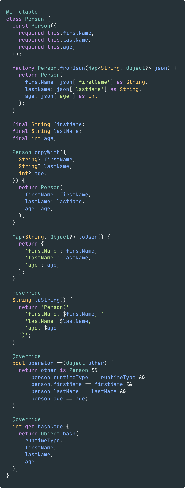
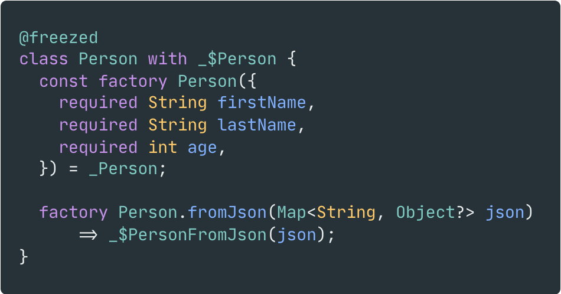

# Flutter 상태관리 with freezed

## 소개

Flutter에서 State를 생성할 때, 방법으로 Bloc에서 추천하는 Equatable을 사용해왔다. 하지만 개발 편의성과 copy, toString override, json 변환 등 여러 기본 기능을 활용하여 개발 속도를 단축하고자 Freezed를 도입하게 되었다. 이번 내용은 Flutter freezed의 기본 활용법을 정리한 내용이다.

:::info 목차

1. [Freezed란?](#freezed란)
2. [사용 방법](#사용-방법)

:::

<!--truncate-->

## Freezed란?

Dart는 잘 만들어진 언어로 활용하기 좋지만, **Model**을 정의할 때는 조금 귀찮아질 수 있다. 간단하게만 생각해보아도 모델을 생성하기 위해서는 아래의 과정을 수행해야 한다.

- 생성자(constructor) 와 속성(properties) 정의
- `toString`, `operator ==`, `hashCode` 재작성(override)
- `copyWith` 함수를 통해 객체를 복제하는 방법 구현
- 직렬화(serialization), 역직렬화(deserialization) 처리

이를 매번 생성하기 위해서는 불필요한 반복 작업이 발생하며, 이는 실수로 인한 오류를 낳고 코드를 한눈에 알아보기도 힘들다. 따라서 Freezed는 최소한의 코드만 작성하여 이에 대한 상세 구현은 분리해두어 선언형 프로그래밍을 통해 사용자가 모델 정의에만 집중할 수 있도록 해준다.

| Before                                                                              | After                                                                             |
| ----------------------------------------------------------------------------------- | --------------------------------------------------------------------------------- |
|  |  |

## 사용 방법

### 설치

Freezed를 사용하려면 `build_runner/code-generator` 설정이 필요하다. 먼저 `pubspec.yaml` 파일에 아래와 같이 dependency를 추가해준다.

```yaml
dependencies:
  freezed_annotation: (*required)
  json_annotation: (optional)

dev_dependencies:
  build_runner: (*required)
  freezed: (*required)
  json_serializable: (optional)
```

> `json_annotaion`과 `json_serializable`의 경우 `fromJson/toJson`을 사용한다면 추가해주어야 한다.

- [build_runner](https://pub.dev/packages/build_runner): Code generator를 실행하기 위한 툴
- [freezed](https://pub.dartlang.org/packages/freezed): Code generator
- [freezed_annotaion](https://pub.dev/packages/freezed_annotation): `freezed`에 대한 **annotation**을 포함하는 패키지

:::note invalid_annotation_target 경고 및 생성 파일에서 경고 비활성화

Freezed와 함께 `json_serializable`을 사용할 때, `json_serializable`과 `meta`의 최신버전을 사용한다면 `invalid_annotaion_target` 경고를 비활성해줘야할 수도 있다.

아래와 같이 `analysis_options.yaml` 파일에 추가하여 비활성화 한다.

```yaml
analyzer:
  errors:
    invalid_annotaion_target: ignore
```

:::

### Generator 실행

Code generator를 실행하기 위해, 터미널(프로젝트 루트 위치)에 아래의 명령어를 입력한다.

```bash
dart run build_runner build
```
