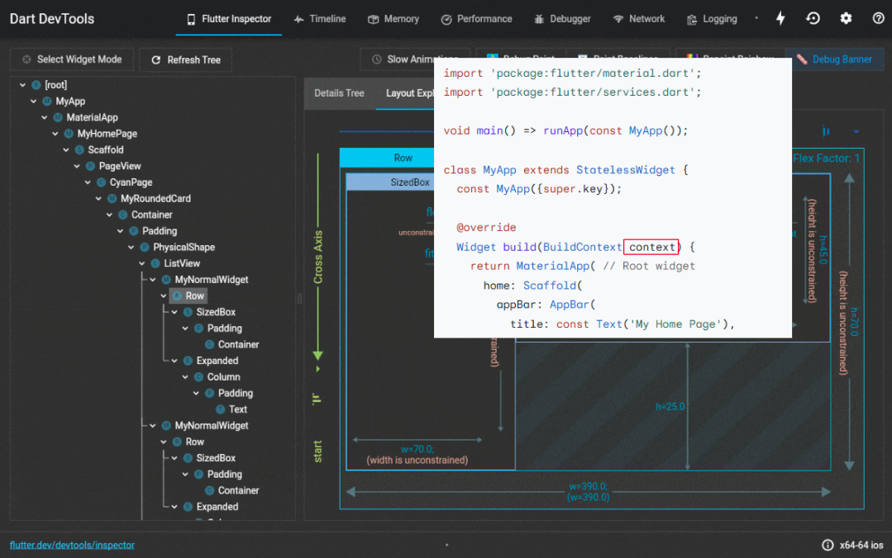

# 프론트앤드 애플리케이션 설계하기


## 소개

회사에서 진행한 세미나에서 발표한 내용으로 프론트앤드 개발과 관련하여 어떤 부분에 신경쓰고 어떤 방식으로 설계를 하는지 팀원들과 공유한 내용을 정리하였다.

:::info 목차

1. [프론트앤드 개발 이해하기](#프론트앤드-개발-이해하기)

   1. [State와 Context](#state와-context)

2.

:::

<!--truncate-->

## 프론트앤드 개발 이해하기

먼저 프론트앤드 개발에 있어 기본적인 내용을 살펴보려 한다.

### State와 Context

프론트앤드 개발에 있어 가장 중요한 것을 꼽으라고하면 많은 개발자들이 상태관리를 말할 것이다. 그렇다면 상태란 무엇일까?

#### State

> _특정시점에만 존재하는 정보나 값들 혹은 시간에 따라서 변하는 값_

상태란 특정시점에만 존재하는 정보나 값들 혹은 시간에 따라서 변하는 값을 말한다. 일상 생활에서 예를 들면 _화분을 사다_ *슬프다*와 같이 단순한 정보, 감정과 같은 것들이 이에 해당할 것이다.

백앤드에서는 어떤 것들이 있을까 간단하게 생각해서 DB에 저장되는 데이터들이 있겠고, 캐시 메모리에 저장되는 데이터들도 포함될 것 같다.

그렇다면 프론트엔드에서는 어떤 것들이 있을까, 프론트엔드에서 상태는 조금 더 사용자와 밀접하다. 기본적인 Backend API에서 받아온 데이터, 로컬에 저장되는 데이터 외에도 사용자의 화면 터치, 카메라, GPS 위치정보 등 사용자의 동작에 의해 발생하는 상태들이 포함된다.


#### Context

> 단어의 ‘진정한 본래의 의미'란 존재하지 않는다. ‘상황과 맥락에 의해서 결정된다' - 루트비히 비트겐슈타인

하지만 이런 상태만으로는 의미를 가지기는 어렵다.

누군가가 *벽돌!*이라고 소리치는 상황을 생각해보자. 단순히 *벽돌!*하고 소리친 상황만으로는 무슨 의미를 나타내는지 알기 힘들다.

벽돌을 피하라는 것인지, 벽돌을 보라는 것인지, 벽돌이라는 별명을 가진 친구를 부르는 것인지 조차 파악할 수 없다.

따라서 상태에는 **문맥(Context)** 정보를 같이 전달해주어야만 진정한 의미를 가지게 된다.

공사장에서 쌓아둔 벽돌이 무너지고 있는 상황을 생각해보자. 누군가 _벽돌!_ 이라 소리치면 모두가 당연히 *벽돌을 피해*라는 뜻으로 알아들을 것이다.

이를 Flutter 코드를 통해 어떤식으로 전달되고 있는지 확인해보자.



위 이미지의 왼쪽은 화면 **Widget**의 트리 구조를 보여준다. 해당 위젯들에서 내부 코드를 확인해보면

```dart
class MyApp extends StatelessWidget {
   const MyApp({super.key});

   @override
   Widget build(BuildContext context) {
      /// ...
   }
}
```

위 코드와 같이 `context`를 전달해주는 것을 확인할 수 있다. 플러터 위젯을 작성할 때는 부모 위젯의 문맥을 전달받아 사용하고 있는 것이다.

하지만 이렇게 상태와 문맥정보를 계속 상속해서 사용하면 위젯 트리의 깊이는 계속해서 깊어질 수 밖에 없다.

따라서 Flutter에서는 상태를 분리하여 관리할 수 있도록 **MVVM 패턴**을 활용할 것을 권장하고 있다.
