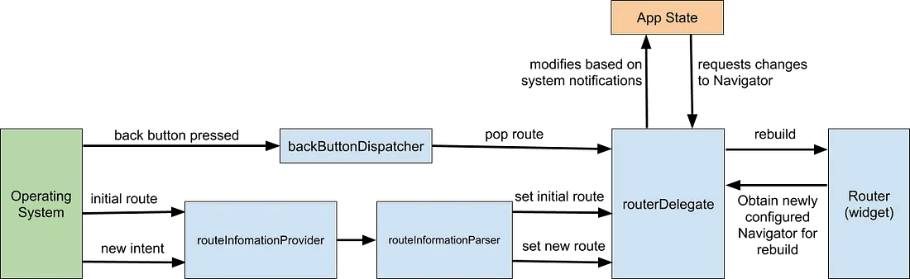

# Navigator

:::info

이 문서는 Flutter 화면 API가 동작하는 방식 인 `Navigator Router`에 대해 정리한 내용이다.
Navigator 2.0 이 새롭게 Release 될 때 작성된 [Medium Blog - Learning flutters new navigation and routing system](https://medium.com/flutter/learning-flutters-new-navigation-and-routing-system-7c9068155ade) 글과 `Codemagic` 기술 블로그에 작성 된 [Understanding Flutter Navigator 2.0](https://blog.codemagic.io/flutter-navigator2/#:~:text=Flutter%20offers%20an%20imperative%20API%20%28Navigator%201.0%29%20and,allows%20you%20to%20control%20the%20navigation%20stack%20completely.) 를 번역 및 정리한 내용이다.

:::

## 소개

**Navigation** 은 모바일 앱 개발에 있어 핵심이 되는 개념이다. 사용자가 어떤 화면에서 다른 화면으로 이동하도록 하며, 잘 관리된 **Navigator**는 앱 구조를 체계적으로 유지하도록 해주고 기능성을 높여준다.

초기 **Flutter** 개발 시에는 **명령형 API(`Navigator 1.0`)** 으로만 개발 되었지만 이후 **선언형 API(`Navigator 2.0`)** 라우팅 메커니즘이 추가되었다.

> Navigator 2.0 이 출시된건 2020년으로 Flutter 가 본격적으로 사용되기 시작한 시기와 유사하다. 대부분의 개발자가 21년 이후 플러터를 사용하기 시작했으므로 `Navigator 1.0`만을 사용한 개발자는 거의 없을 것으로 생각된다.

**Flutter**로 앱을 개발해보면 _꼭_ 선언형 `Navigator`를 사용해서 개발하지는 않는다. 딥 링크 기능을 사용하지 않거나 페이지를 스택(Stack) 형태로 구성하려고 하면 `Navigator 1.0` 의 기능만으로도 충분한 경우도 있다. 따라서 아래 내용은 `Navigator 1.0` 과 `Navigator 2.0` 에 대해 알아보며 각 기능을 어떻게 사용하는지 알아보려한다.

## 학습할 내용

- `Navigator 1.0`(명령형) 특징
- `Navigator 2.0`(선언형) 특징

## Navigator 1.0

Flutter로 App 개발을 해보았다면 `Navigator` 라는 개념에 대해 익숙할 것이라 생각한다.

- `Navigator` - Route 객체의 스택(Stack)을 관리하는 위젯
- `Route` - `Navigator`를통해 관리되는 객체, 일반적으로 `MaterialPageRoute` 와 같은 클래스에서 구현된다.

Navigator 1.0 에서 `Routes`는 `Navigator` 스택(Stack)에 push/pop 되는 방식이며, 해당 과정에서 기명 라우트(named routes) 와 익명 라우트(anonymous routes) 두가지 방식으로 접근 가능하다. 이러한 두 가지 접근 방식에 대해 간단히 알아보자

### 익명 라우트(anonymous routes)

대부분의 모바일 앱은 스택과 같이 화면을 하나하나 덮어씌우는 방식으로 보여준다. 플러터에서는 이를 `Navigator`를 통해서 쉽게 구현할 수 있다.

`MaterialApp` 과 `CupertinoApp` 은 이미 `Navigator`를 포함하고 있다. 따라서 `Navigator.of()`나 `Navigator.push()`, `Navigator.pop()`을 통해 해당 기능을 사용할 수 있다.

```dart
import 'package:flutter/material.dart';

void main() {
  runApp(Nav2App());
}

class Nav2App extends StatelessWidget {
  @override
  Widget build(BuildContext context) {
    return MaterialApp(
      home: HomeScreen(),
    );
  }
}

class HomeScreen extends StatelessWidget {
  @override
  Widget build(BuildContext context) {
    return Scaffold(
      appBar: AppBar(),
      body: Center(
        child: FlatButton(
          child: Text('View Details'),
          onPressed: () {
            Navigator.push(
              context,
              MaterialPageRoute(builder: (context) {
                return DetailScreen();
              }),
            );
          },
        ),
      ),
    );
  }
}

class DetailScreen extends StatelessWidget {
  @override
  Widget build(BuildContext context) {
    return Scaffold(
      appBar: AppBar(),
      body: Center(
        child: FlatButton(
          child: Text('Pop!'),
          onPressed: () {
            Navigator.pop(context);
          },
        ),
      ),
    );
  }
}
```

`push()` 함수를 호출하면, `DetailScreen` 위젯이 `HomeScreen` 위젯 위에 덮어 씌워진다.


이전 화면인 `HomeScreen`은 여전히 위젯 트리에 표시되며 `DetailScreen` 이 보여지는 동안에도 여전히 남아있다.

### 기명 라우트(Named routes)

Navigator 1.0에서는 또한 기명 라우트(Named routes)도 제공한다. 각 `routes` 파라미터는 `MaterialApp` 또는 `CupertinoApp`에 정의한다.

```dart
import 'package:flutter/material.dart';

void main() {
  runApp(Nav2App());
}

class Nav2App extends StatelessWidget {
  @override
  Widget build(BuildContext context) {
    return MaterialApp(
      routes: {
        '/': (context) => HomeScreen(),
        '/details': (context) => DetailScreen(),
      },
    );
  }
}

class HomeScreen extends StatelessWidget {
  @override
  Widget build(BuildContext context) {
    return Scaffold(
      appBar: AppBar(),
      body: Center(
        child: FlatButton(
          child: Text('View Details'),
          onPressed: () {
            Navigator.pushNamed(
              context,
              '/details',
            );
          },
        ),
      ),
    );
  }
}

class DetailScreen extends StatelessWidget {
  @override
  Widget build(BuildContext context) {
    return Scaffold(
      appBar: AppBar(),
      body: Center(
        child: FlatButton(
          child: Text('Pop!'),
          onPressed: () {
            Navigator.pop(context);
          },
        ),
      ),
    );
  }
}
```

이 방식은 항상 `routes`가 정의 되어있어야한다. 또한 `arguments`를 `named route`로 전달해줄 수는 있지만, `route`에서 해당 `arguments`를 해석할 수는 없으므로 이를위한 전처리과정을 추가해주어야 한다. 다음 예시를 보며 자세히 알아보자. 아래는 Web에서 동작하는 Flutter app으로 `URL`을 통해 `ID` 값을 전달하려한다. `route` 는 `/details/:id` 로 설정한다.

#### `onGenerateRoute`를 사용한 활용법

`Named routes`를 보다 유연하게 활용하기 위해 `onGenerateRoute`를 활용할 수 있다. 이 API는 path가 변경되었을 때 이를 조작할 수 있도록 해준다.

```dart
onGenerateRoute: (settings) {
  // Handle '/'
  if (settings.name == '/') {
    return MaterialPageRoute(builder: (context) => HomeScreen());
  }

  // Handle '/details/:id'
  var uri = Uri.parse(settings.name);
  if (uri.pathSegments.length == 2 &&
      uri.pathSegments.first == 'details') {
    var id = uri.pathSegments[1];
    return MaterialPageRoute(builder: (context) => DetailScreen(id: id));
  }

  return MaterialPageRoute(builder: (context) => UnknownScreen());
},
```

전체 코드는 아래와 같다

```dart
import 'package:flutter/material.dart';

void main() {
  runApp(Nav2App());
}

class Nav2App extends StatelessWidget {
  @override
  Widget build(BuildContext context) {
    return MaterialApp(
      onGenerateRoute: (settings) {
        // Handle '/'
        if (settings.name == '/') {
          return MaterialPageRoute(builder: (context) => HomeScreen());
        }

        // Handle '/details/:id'
        var uri = Uri.parse(settings.name);
        if (uri.pathSegments.length == 2 &&
            uri.pathSegments.first == 'details') {
          var id = uri.pathSegments[1];
          return MaterialPageRoute(builder: (context) => DetailScreen(id: id));
        }

        return MaterialPageRoute(builder: (context) => UnknownScreen());
      },
    );
  }
}

class HomeScreen extends StatelessWidget {
  @override
  Widget build(BuildContext context) {
    return Scaffold(
      appBar: AppBar(),
      body: Center(
        child: FlatButton(
          child: Text('View Details'),
          onPressed: () {
            Navigator.pushNamed(
              context,
              '/details/1',
            );
          },
        ),
      ),
    );
  }
}

class DetailScreen extends StatelessWidget {
  String id;

  DetailScreen({
    this.id,
  });

  @override
  Widget build(BuildContext context) {
    return Scaffold(
      appBar: AppBar(),
      body: Center(
        child: Column(
          mainAxisAlignment: MainAxisAlignment.center,
          children: [
            Text('Viewing details for item $id'),
            FlatButton(
              child: Text('Pop!'),
              onPressed: () {
                Navigator.pop(context);
              },
            ),
          ],
        ),
      ),
    );
  }
}

class UnknownScreen extends StatelessWidget {
  @override
  Widget build(BuildContext context) {
    return Scaffold(
      appBar: AppBar(),
      body: Center(
        child: Text('404!'),
      ),
    );
  }
}
```

`onGenerateRoute: (settings) {`의 `setting`은 `RouteSettings`의 인스턴스로 `name` 과 `arguments`는 `Navigator.pushnamed` 가 호출될 때 입력된 값이거나 `initialRoute`에서 설정해준 값이다.

## Navigator 2.0

`Navigator 2.0`은 선언적 탐색에 대한 표준 참조이며 `Navigator 1.0`을 대체하지 하는 것이 아니므로 함께 사용될 수 있다. `Navigator 2.0` API는 화면을 상태 함수로 만들고 플랫폼에서 경로를 분석하기 위해 새로운 기능을 제공한다.

- `Page` - `Navigator`의 히스토리 스택을 설정하는데 사용되는 불변(immutable) 객체
- `Router` - `Navigator`에 의해 표시될 페이지 목록을 구성한다. 페이지는 서비스가 실행되는 플랫폼 환경이나 앱 변경 상태에 따라 변경된다. 다만, 앱이 아닌 브라우저 환경에서 사용자가 URL을 직접 변경하는 경우에는 사용자 정보를 직접 해석할 수 없기 때문에 이를 해석하고 동기화하는 작업이 필요하다.
- `RouteInformationParser` - `RouteInformationProvider`에서 `RouteInformation`을 가져와서 유저가 정의한 데이터 타입을 해석할 때 사용한다.
- `RouterDelegate` - 앱 내에서의 변화를 라우터가 어떻게 학습하고 어떻게 응답하는지에 대한 앱 별 동작을 정의한다. 또한, `RouteInformationParser`와 앱 상태를 감지하고 현재 페이지의 네비게이터를 빌드한다.
- `BackButtonDispatcher` - 백 버튼을 눌렀을 때 라우터에게 해당 동작을 보고한다.


출처: [Learning flutters new navigation and routing system, Medium blog](https://medium.com/flutter/learning-flutters-new-navigation-and-routing-system-7c9068155ade)

### 코드 작성 예시

- [Learning flutters new navigation and routing system, Medium blog](https://medium.com/flutter/learning-flutters-new-navigation-and-routing-system-7c9068155ade)
- [Understanding Flutter Navigator 2.0](https://blog.codemagic.io/flutter-navigator2/#:~:text=Flutter%20offers%20an%20imperative%20API%20%28Navigator%201.0%29%20and,allows%20you%20to%20control%20the%20navigation%20stack%20completely.)

## 참고문헌

- [Learning flutters new navigation and routing system, Medium blog](https://medium.com/flutter/learning-flutters-new-navigation-and-routing-system-7c9068155ade)
- [Understanding Flutter Navigator 2.0](https://blog.codemagic.io/flutter-navigator2/#:~:text=Flutter%20offers%20an%20imperative%20API%20%28Navigator%201.0%29%20and,allows%20you%20to%20control%20the%20navigation%20stack%20completely.)
- [Flutter Navigator 2.0, Velog blog](https://velog.io/@link717/TIL-Flutter-Navigator-2.0)
