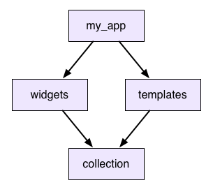
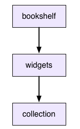

# 패키지 버전 관리 가이드

pub 패키지 관리자는 버전 관리를 하는데 도움을 준다. 이번에는 버전 관리의 역사와 pub의 버전 관리 접근 방식에 대해 간략히 알아보자.

## 버전 관리의 역사

현대 소프트웨어 개발, 특히 웹 개발은 많은 기존 코드를 재사용하는 데 크게 의존한다. 여기에는 과거 작성한 코드뿐만 아니라 타사의 코드, 큰 프레임 워크에서 작은 유틸리티 라이브러리에 이르기까지 많은 것이 포함된다. 애플리케이션이 수십 개의 서로 다른 패키지와 라이브러리에 의존하는 것은 이처럼 드문 일이 아니다.

이는 생각보다도 매우 강력한 효력을 발휘한다. 몇 주 만에 수백만 명의 사용자를 확보한 사이트를 구추하는 소규모 웹 스타트업의 이야기를 볼 때, 그들이 이를 달성할 수 있는 이유는 오픈 소스 커뮤니티 덕분이라 할 수 있다.

하지만 이는 무료로 제공되지는 않는다. 코드 재사용, 특히 유지 관리하지 않는 코드 재사용에는 어려움이 있다. 앱에서 다른 사람이 개발한 코드를 사용하는 경우, 그들이 코드를 변경하면 어떻게 될까? 그들은 앱을 망가뜨리고 싶어하지 않으며, 이는 다들 마찬가지일 것이다. 따라서 이를 *버전관리*를 통해 해결하고자 한다.

## Name과 Number

외부 코드에 의존할 때, "내 앱은 `widgets`를 사용합니다." 라고만 말하지는 않는다. "내 앱은 `widgets 2.0.5`를 사용합니다." 라고 말한다. 이름과 버전 번호의 조합은 _변경 불가능한_ 코드 덩어리를 고유하게 식별한다. 업데이트하는 사람들은 원하는 모든 변경을 할 수 있지만 이미 릴리스된 버전은 건드리지 않겠다고 약속한다. 그들은 또 다른 `widgets 3.0.0`를 내놓을 수 있고 `2.0.5`에서는 사용하는 버전이 변경되지 않았기 때문에 전혀 영향을 미치지 않는다.

*변경 사항*을 적용하고 싶을 때는 항상 앱을 최신 버전으로 지정할 수 있으며 이를 위해 해당 개발자와 협력할 필요가 없다. 그러나 그렇다고 해서 문제가 완전히 해결되지는 않는다.

아래 내용에서 논의하는 버전 번호는 패키지 파일 이름에 설정된 버전 번호와 다를 수 있다. 여기에는 `-0`또는 `-beta`가 포함될 수 있다. 이러한 표기법은 종속성 해결에 영향을 미치지 않는다.

## 공유 종속성 해결

*종속성 그래프*가 실제로 *종속성 트리*일 때 특정 버전에 따라 잘 변경된다. 앱이 여러 패키지에 종속되고 해당 패키지가 자체 종속성을 갖는 경우와 같이 종속성이 겹치지 않는 한 모두 잘 동작한다.

다음 예시를 참고해보자



그래서 `my_app`은 `widgets`와 `templates`를 사용하고 이 둘은 모두 `collection`을 사용한다. 이 것을 **공유 종속성** 이라 한다. 하지만 `widgets`에서 `collection 2.3.5` 종속성을 사용하고 싶지 않고 `templates`에서 `collection 2.3.7`을 사용하고 싶다면 어떻게 할까? 버전에 동의하지 않으면 어떻게 될까?

### Unshared libraries (npm 접근 방식)

한 가지 옵션은 앱이 `collection`의 두 버전을 모두 사용하도록 하는 것이다. `widgets`와 `templates`는 다른 버전의 복사본을 각각 따로 가지게 된다.

이것이 `npm`이 `node.js`를 위해 하는 일이다. 다트에서는 어떨까? 다음 시나리오를 따라가며 보자.

1. `collection`이 일부 `Dictionary` 클래스를 정의한다.
2. `widgets`는 `collection 2.3.5`의 복사본에서 인스턴스를 얻는다. 이 후 `my_app`으로 전달한다.
3. `my_app`은 `templates`로 `Dictionary`를 넘긴다.
4. 이 후 순차적으로 `collection 2.3.7`에 전달된다.
5. 이를 사용하는 메서드에는 해당 `Dictionary` 형식 주석이 있다.

Dart에서는 `collection 2.3.5`와 `collection 2.3.7`은 완전히 관련없는 라이브러리이다. 한 쪽에서 클래스 인스턴스를 가져와 다른쪽의 `Dictionary` 메서드에 전달하면 두 `Dictionary`는 완전히 다른 유형이므로 일치하지 않는다.

이러한 이유로 Dart에서는 npm 모델이 적합하지 않다고 판단하고 다른 접근 방식을 가진다.

### Version lock (사용되지 않음)

대신, 패키지에 의존할 때 앱은 해당 패키지의 단일 사본만 사용한다. 공유 종속성이 있는 경우 이에 의존하는 모든 것이 사용할 버전에 대해 동의해야 한다. 만약 그렇지 않으면 오류가 발생한다.

하지만 이러한 접근 방법으로는 문제가 해결되지 않는다. 우리는 오류가 발생하면 이를 해결할 수 있어야 한다. 이전 npm의 예에서와 같은 상황에 처했다고 가정해보자. `widgets`와 `templates`를 사용하고 싶지만 서로 다른 `collection` 버전을 사용하고 있다. 어떻게 해결해야 할까?

이 접근 방식에서 제시할 수 있는 답은 둘 중 하나를 업그레이드 하는 것이다. `templates`에 맞추기 위해 `collection 2.3.7` 버전이 적용된 `widgets` 버전을 찾을 수 있을까?

대부분의 경우 답은 "No"일 것이다. 개발하는 입장에서 생각해보자 우리는 `widgets` 코드에 새로운 변경사항을 적용한 새 버전을 출시하려 한다. 어떻게 하면 보다 많은 사람들이 문제 없이 업그레이드 하도록 할 수 있을까? `collection`의 버전을 유지한다면 모든 사람이 문제 없이 새 버전으로 업그레이드할 수 있을 것이다.

우리가 종속성을 업그레이드 한다면 `widgets`를 업그레이드 하는 모든 사람은 좋든 싫든 `collection`을 업그레이드 해야한다. 이는 때에 따라 매우 힘든일이므로 종속성 버전을 올리고자 하는 동기가 저하된다. 이를 **버전 잠금** 이라고 한다.

### 버전 제약 (Dart의 접근 방식)

버전 잠금을 해결하기 위해 패키지가 종속성에 두는 제약을 느슨하게 한다. `widgets`및 `templates`가 모두 작업하는 버전의 *범위*를 나타낼 수 있다면 종속성을 새 버전으로 옮길 수 있는 충분한 여유가 생긴다. 범위에 겹치는 부분이 있는 한 둘다 만족하는 버전을 찾을 수 있다.

이는 [bundler](https://bundler.io/)가 따르는 모델이며 **pub**의 모델이기도 하다. `pubspec.yaml`에 종속성을 추가 할 때 허용할 수 있는 버전 범위를 지정할 수 있다. `widgets`의 `pubspec.yaml`이 다음과 같다면

```yaml
dependencies:
  collection: ">=2.3.5 <2.4.0"
```

`collection 2.3.7`에 대한 버전을 선택할 수 있을 것이다. 해당 버전은 `widgets`와 `templates` 모두의 제약 조건을 충족한다.

## 의미론적 버전

패키지에 종속성을 추가할 때 허용할 버전 범위를 지정하고 싶을 때가 있다. 어떤 범위를 선택해야 할지 어떻게 알 수 있을까? 전방 호환이 되어야 하므로 이상적으로는 범위가 아직 출시되지 않은 미래 버전을 포함한다. 하지만 아직 존재하지도 않는 새로운 버전에서 패키지가 작동할 것이라고 어떻게 확신할 수 있을까?

이를 해결하려면 버전 번호가 무엇을 의미하는지 **합의**해야 한다. 의존하는 패키지 개발자가 "이전 버전과 호환되지 않는 변경 사항을 만들면 주요 버전 번호를 올리겠다고 약속합니다."라고 선언했다고 가정해보자. 그들을 신뢰하고 `2.3.5` 패키지가 그들의 버전과 호환된다는 것을 알고 있다면 최대 `3.0.0`까지 작동할 것이라고 믿을 수 있다. 이를 `pubspec.yaml`에서 보면 다음과 같다.

```yaml
dependencies:
  collection: ^2.3.5
```

:::memo

이 예에서는 캐럿 구문을 사용하여 다양한 버전을 표현한다. `^2.3.5` 문자열은 "`3.0.0`을 제외한 `2.3.5`에서 `3.0.0`까지의 모든 버전 범위"를 의미한다. 자세한 내용은 [캐럿 구문](https://dart.dev/tools/pub/dependencies#caret-syntax)을 참고하자.

:::

이 작업을 하려면 우리는 약속들을 정리해 규칙을 만들어야 한다. 다행히도 이미 이전의 똑똑한 사람들이 모든 작업을 끝냈고, 이를 [의미론적 버전 관리](https://semver.org/spec/v2.0.0-rc.1.html)라 명명했다.

이는 버전 번호의 형식과 이후 버전 번호로 증가할 때의 정확한 API 동작 차이를 설명한다. Pub에서는 버전이 이런 방식으로 포맷되어야 하며, Pub 커뮤니티와 잘 어울리려면 패키지가 지정한 의미 체계를 따라야 한다. 또한 의존하는 패키지도 이를 따른다고 가정해야 한다.

의미론적 버전 관리가 `1.0.0` 이전 버전들 사이의 호환성을 약속하지는 않지만 Dart 커뮤니티 규칙에서는 이러한 버전들도 의미론적으로 처리한다. 각 숫자별로 해석해보면 `0.1.2`에서 `0.2.0`은 중대한 변경사항이 추가되었음을 나타내고 `0.1.3`은 새로운 기능이 추가되었음을 나타낸다. `0.1.2+1`과 같이 표시할 수도 있는데 이는 공개 API에 영향을 미치지 않는 변경을 나타낸다. 하지만 보다 단순하고 명확하게 관리하기 위해 `0.1.2+1`과 같은 명명 방식은 `1.0.0` 이후부터는 사용하지 않도록 하자.

## 제약 조건 해결

패키지를 정의할 때 사용하는 [직접 종속성(Immediate dependency)](https://dart.dev/tools/pub/glossary#immediate-dependency) 목록들을 직접 나열할 수 있다. 이러한 각 패키지에 대해 패키지에서 허용하는 버전 범위를 지정한다. 이러한 종속 패키지 각각은 고유한 종속성을 가질 수 있다. 이를 [이적 종속성(transitive dependency)](https://dart.dev/tools/pub/glossary#transitive-dependency)이라 한다. Pub은 이를 탐색하여 앱의 전체 종속성 그래프를 빌드한다.

그래프의 각 패키지에 대해 pub는 종속된 모든 것을 살펴보고, 모든 버전 제약 조건을 모아서 동시에 해결하려 한다. 우선 중첩되는 범위를 교차하여 얻어내고 해당 패키지에 릴리스된 실제 버전들 중 모든 제약 조건을 충족하는 가장 최신 버전을 선택한다.

`collection`을 예로 3개의 패키지가 다음과 같이 종속되어 있다고 가정해보자.

```
>=1.7.0
^1.4.0
<1.9.0
```

`collection`의 개발자들은 다음 버전을 아래와 같이 출시했다.

```
1.7.0
1.7.1
1.8.0
1.8.1
1.8.2
1.9.0
```

모든 범위에 맞는 가장 높은 버전 번호는 `1.8.2`이므로 pub에서는 이를 선택한다. 이 후 *앱과 앱에서 사용되는 모든 패키지*들은 모두 `collection 1.8.2`를 사용한다.

## 제약 컨텍스트

패키지 버전을 선택할 때 그에 종속된 모든 패키지를 고려한다는 사실은 중요한 결과를 낳는다. 패키지에 대해 선택되는 특정 버전은 해당 패키지를 사용하는 앱의 전역 속성이다.

다음의 예는 이것의 무엇을 의미하는지 보여준다. 앱이 두 개가 있다고 가정해보자. 다음은 그 것들의 `pubspec.yaml`이다.

```yaml
name: my_app
dependencies:
  widgets:
```

```yaml
name: other_app
dependencies:
  widgets:
  collection: "<1.5.0"
```

두 패키지는 아래와 같은 `pubspec.yaml`을 갖는 `widgets`에 의존한다.

```yaml
name: widgets
dependencies:
  collection: ">=1.0.0 <2.0.0"
```

`other_app` 패키지는 그 자체가 가지는 `collection`에 의존한다. 흥미로운 점은 `widgets` 패키지가 다른 버전 제약 조건을 가지고 있다는 것이다.

즉, `widgets` 패키지를 단독으로 보고 `collection`의 어떤 버전을 사용할지 알아낼 수는 없다. 이는 콘텍스트 상황에 따라 달라진다. `my_app`에서는 `widgets`는 `collection 1.9.9`를 사용할 것이다. 하지만 `other_app`의 `widgets`은 다른 제약 때문에 `collection 1.4.9`를 사용할 수 있다.

각 앱이 자체 `package_config.json` 파일을 갖는 이유가 여기있다. 각 패키지에 대해 선택된 구체적인 버전은 포함된 전체 종속성 그래프에 따라 달라진다.

## Exported dependencies에 대한 제약 조건 해결

패키지 작성자는 패키지 제약 조건을 신중하게 정의해야 한다. 아래 시나리오를 예시로 보자.



`bookshelf` 패키지는 `widgets`에 의존한다. 현재 `1.2.0`인 `widgets`패키지는 `collection`에서 `export package:collection/collection.dart`를 통해 내보내고, 이 버전은 `2.4.0`이다. `pubspec.yaml`로 보면 아래와 같다.

```yaml
name: bookshelf
dependencies:
  widgets: ^1.2.0
```

```yaml
name: widgets
dependencies:
  collection: ^2.4.0
```

패키지 `collection`이 `2.5.0`으로 업데이트 되었을 때를 보자. `collection 2.5.0`에는 `sortBackwards()` 라는 새 메서드가 포함되어 있다. 이는 `widgets`의 일부분이므로 `bookshelf`가 `collection` 종속성만 가지고 있더라도 `sortBackwards()`를 호출할 수 있다.

`widgets` API에 버전 번호가 명시되어 있지 않기 때문에 `bookshelf`를 사용하는 앱은 `sortBackwards()`를 호출할 때 충돌이 발생할 수 있다.

이러한 이유로 **Exported dependencies**를 다룰 때 패키지 작성자는 종속성의 상한과 하한에 대해 더 엄격한 제한을 유지하는 것이 좋다. 이 경우 `widgets` 패키지의 범위를 좁혀야 한다.

```yaml
name: bookshelf
dependencies:
  widgets: ">=1.2.0 <1.3.0"
```

```yaml
name: widgets
dependencies:
  collection: ">=2.4.0 <2.5.0"
```

`widgets`은 `1.2.0`이상 `1.3.0` 미만, `collection`은 `2.4.0`이상 `2.5.0` 미만으로 제약 조건을 수정했다.

이 규칙을 사용하면 하나가 직접적인 종속성이 아니더라도 사용자가 두 패키지의 올바를 버전을 모두 사용할 수 있다.

## 잠금 파일

그럼 pub에서 앱의 버전 제약을 해결하면 그 다음은 어떻게 될까? 최종 결과는 앱이 직접 또는 간접적으로 의존하는 모든 패키지의 전체 목록과 앱의 제약과 함께 작동하는 해당 패키지의 최상위 버전이다.

각 패키지에 대해 pub은 해당 정보를 가져와서 콘텐츠 해시를 계산하고, 둘다 앱의 디렉토리에 있는 `pubspec.lock` 잠금 파일에 쓴다. pub이 앱의 파일을 빌드할 때, `dart_tool/package_config.json` 잠금 파일을 사용하여 각 패키지의 어떤 버전을 참조해야 하는지 알아낸다. (그리고 어떤 버전을 선택했는지 궁금하다면 잠금 파일을 열어서 확인할 수 있다.)

다음으로 중요한 pub의 작업은 잠금 파일을 건드리지 않는 것이다. 앱에 대한 잠금 파일을 얻으면 pub은 사용자가 잠금 파일을 건드리라고 지시할 때까지 건들지 않는다. 이는 매우 중요하다. 의도하지 않고 앱에서 무작위 패키지의 새 버전을 자발적으로 사용하지 않는다는 의미이다. 앱이 잠기면 수동으로 잠금 파일을 업데이트하라고 지시할 때까지 잠긴 상태로 유지된다.

패키지가 앱용이라면 소스 제어 시스템에 잠금 파일을 체크인하자. 이렇게 하면 팀의 모든 구성원이 앱을 빌드할 때 모든 종속성의 정확히 동일한 버전을 사용하게 된다. 앱을 배포할 때도 이를 사용하여 프로덕션 서버에서 개발 중인 것과 정확히 동일한 패키지를 사용하고 있는지 확인할 수 있다.

## 문제가 생기는 경우들

물론, 모든 것은 종속성 그래프가 완벽하고 흠이 없다는 것을 전제로 한다. 버전 범위와 pub의 제약 조건 해결 및 의미론적 버전 관리를 사용하더라도 버전 충돌의 위험으로 부터 완전히 자유로울 수는 없다.

다음은 문제가 발생하는 예시들이다.

### 분리된 제약 조건을 가질 수 없음

앱이 `widgets`와 `templates`를 사용한다고 가정해 보자. `widgets` 에서는 `collection >=1.0.0 <2.0.0`을 사용하고 `templates`에서는 `collection >=3.0.0 <4.0.0`을 사용한다면 겹치는 버전 범위가 없다.

### 릴리스된 버전이 포함되지 않은 범위를 가지는 경우

공유 종속성에 대한 모든 제약 조건을 함께 넣은 좁은 범위가 있다고 가정해보자. 종속성의 버전이 `>=1.2.4 <1.2.6` 로 설정되어있다면 `1.2.4` 버전은 문제없이 동작할 것 이다. 하지만 만약 `1.3.0`을 사용한다면 범위를 벗어날 것이다.

### 불안정한 그래프 구조

이는 지금까지 pub의 버전 해결 프로세스에서 가장 어려운 부분이다. 이 프로세스는 종속성 그래프를 구축한 다음 모든 제약 조건을 해결하고 버전을 선택하는 것으로 설명되었다. 하지만 실제로는 그런식으로 동작하지 않는다. 버전을 선택하기 전에 전체 종속성 그래프를 어떻게 구축할 수 있을까? `pubspec.yaml` 자체로는 버전에 따라 다르다. 동일한 패키지라도 다른 버전을 불러온다면 다른 종속성 집합을 가지고 있을 수 있다.

패키지 버전을 선택하면 종속성 그래프 모양 자체가 변경된다. 그래프가 변경되면 제약 조건이 변경되어 다른 버전을 선택하게 되고, 이후 다시 실행된다.

때때로 이 과정은 결코 안정적인 해결책으로 정착되지 않는다. 예시를 보자

```yaml
name: my_app
version: 0.0.0
dependencies:
  yin: '>=1.0.0'
```

```yaml
name: yin
version: 1.0.0
dependencies:
```

```yaml
name: yin
version: 2.0.0
dependencies:
  yang: '1.0.0'
```

```yaml
name: yang
version: 1.0.0
dependencies:
  yin: '1.0.0'
```

이 모든 경우에, 앱에 맞는 구체적인 버전은 없으며, 이런 일이 발생하면 pub에서 오류를 보고하고 무슨 일이 일어나고 있는지 알려준다. 뭔가가 작동할 수 있다고 생각하지만 작동하지 않는 이상한 상태에 빠지지는 않을 것이다.

## 정리

* 코드 재사용에는 장점도 있지만, 패키지는 독립적으로 수정될 수 있어야한다.
* 버전 관리로 독립성을 확보할 수 있다. 구체적인 단일 버전에 의존하는 것은 유연성을 해친다. 공유 종속성을 활용하면 버전 잠금을 활용한다.
* 버전 잠금을 처리하려면 패키지가 다양한 버전에 의존해야한다. 그런 다음 Pub은 종속성 그래프를 탐색하여 사용자에게 가장 적합한 버전을 선택한다. 적절한 버전을 선택할 수 없는 경우 Pub에서 경고한다.
* 앱이 종속성에 대한 견고한 버전 세트를 갖추면 해당 세트는 잠금 파일에 고정된다. 그럼 앱을 실행하는 모든 머신이 동일한 종속성 버전을 사용하게 된다.
