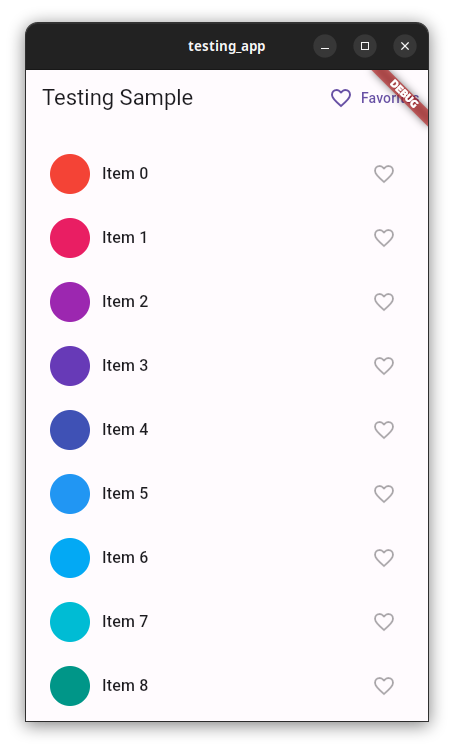

# 앱 빌드

다음으로, 앱을 테스트할 수 있도록 빌드합니다. 앱에는 다음과 같은 파일이 포함됩니다.

- `lib/models/favorites.dart` - 즐겨찾기 목록의 모델 클래스를 만듭니다.
- `lib/screens/favorites.dart` - 즐겨찾기 목록의 레이아웃을 만듭니다.
- `lib/screens/home.dart` - 항목 목록을 만듭니다.
- `lib/main.dart` - 앱이 시작되는 기본 파일입니다.

## 첫째, `lib/models/favorites.dart`에 `Favorites` 모델 만들기

> `lib` 디렉터리에 `models`라는 새로운 디렉터리를 만든 다음 `favorites.dart`라는 새 파일을 만듭니다. 이 파일에 다음 코드를 추가합니다.

### [lib/models/favorites.dart](https://github.com/flutter/codelabs/blob/main/testing_codelab/step_04/lib/models/favorites.dart)

```dart
import 'package:flutter/material.dart';

/// The [Favorites] class holds a list of favorite items saved by the user.
class Favorites extends ChangeNotifier {
  final List<int> _favoriteItems = [];

  List<int> get items => _favoriteItems;

  void add(int itemNo) {
    _favoriteItems.add(itemNo);
    notifyListeners();
  }

  void remove(int itemNo) {
    _favoriteItems.remove(itemNo);
    notifyListeners();
  }
}
```

## `lib/screens/favorites.dart`에 즐겨찾기 페이지 추가하기

> `lib` 디렉터리에 `screens`라는 새로운 디렉터리를 만들고 그 디렉터리에 `favorites.dart`라는 새 파일을 만듭니다. 이 파일에 다음 코드를 추가합니다.

### [lib/screens/favorites.dart](https://github.com/flutter/codelabs/blob/main/testing_codelab/step_04/lib/screens/favorites.dart)

```dart
import 'package:flutter/material.dart';
import 'package:provider/provider.dart';

import '../models/favorites.dart';

class FavoritesPage extends StatelessWidget {
  const FavoritesPage({super.key});

  static String routeName = 'favorites_page';

  @override
  Widget build(BuildContext context) {
    return Scaffold(
      appBar: AppBar(
        title: const Text('Favorites'),
      ),
      body: Consumer<Favorites>(
        builder: (context, value, child) => ListView.builder(
          itemCount: value.items.length,
          padding: const EdgeInsets.symmetric(vertical: 16),
          itemBuilder: (context, index) => FavoriteItemTile(value.items[index]),
        ),
      ),
    );
  }
}

class FavoriteItemTile extends StatelessWidget {
  const FavoriteItemTile(this.itemNo, {super.key});

  final int itemNo;

  @override
  Widget build(BuildContext context) {
    return Padding(
      padding: const EdgeInsets.all(8.0),
      child: ListTile(
        leading: CircleAvatar(
          backgroundColor: Colors.primaries[itemNo % Colors.primaries.length],
        ),
        title: Text(
          'Item $itemNo',
          key: Key('favorites_text_$itemNo'),
        ),
        trailing: IconButton(
          key: Key('remove_icon_$itemNo'),
          icon: const Icon(Icons.close),
          onPressed: () {
            Provider.of<Favorites>(context, listen: false).remove(itemNo);
            ScaffoldMessenger.of(context).showSnackBar(
              const SnackBar(
                content: Text('Removed from favorites.'),
                duration: Duration(seconds: 1),
              ),
            );
          },
        ),
      ),
    );
  }
}
```

## `lib/screens/home.dart`에 홈페이지 추가하기

> `lib/screens` 디렉터리에 `home.dart`라는 또 다른 파일을 새로 만듭니다. `lib/screens/home.dart`에 다음 코드를 추가합니다.

### [lib/screens/home.dart](https://github.com/flutter/codelabs/blob/main/testing_codelab/step_04/lib/screens/home.dart)

```dart
import 'package:flutter/material.dart';
import 'package:go_router/go_router.dart';
import 'package:provider/provider.dart';
import '../models/favorites.dart';
import 'favorites.dart';

class HomePage extends StatelessWidget {
  static String routeName = '/';

  const HomePage({super.key});

  @override
  Widget build(BuildContext context) {
    return Scaffold(
      appBar: AppBar(
        title: const Text('Testing Sample'),
        actions: <Widget>[
          TextButton.icon(
            onPressed: () {
              context.go('/${FavoritesPage.routeName}');
            },
            icon: const Icon(Icons.favorite_border),
            label: const Text('Favorites'),
          ),
        ],
      ),
      body: ListView.builder(
        itemCount: 100,
        cacheExtent: 20.0,
        padding: const EdgeInsets.symmetric(vertical: 16),
        itemBuilder: (context, index) => ItemTile(index),
      ),
    );
  }
}

class ItemTile extends StatelessWidget {
  final int itemNo;

  const ItemTile(this.itemNo, {super.key});

  @override
  Widget build(BuildContext context) {
    var favoritesList = Provider.of<Favorites>(context);

    return Padding(
      padding: const EdgeInsets.all(8.0),
      child: ListTile(
        leading: CircleAvatar(
          backgroundColor: Colors.primaries[itemNo % Colors.primaries.length],
        ),
        title: Text(
          'Item $itemNo',
          key: Key('text_$itemNo'),
        ),
        trailing: IconButton(
          key: Key('icon_$itemNo'),
          icon: favoritesList.items.contains(itemNo)
              ? const Icon(Icons.favorite)
              : const Icon(Icons.favorite_border),
          onPressed: () {
            !favoritesList.items.contains(itemNo)
                ? favoritesList.add(itemNo)
                : favoritesList.remove(itemNo);
            ScaffoldMessenger.of(context).showSnackBar(
              SnackBar(
                content: Text(favoritesList.items.contains(itemNo)
                    ? 'Added to favorites.'
                    : 'Removed from favorites.'),
                duration: const Duration(seconds: 1),
              ),
            );
          },
        ),
      ),
    );
  }
}
```

## `lib/main.dart`의 내용 바꾸기

> `lib/main.dart`의 내용을 다음 코드로 바꿉니다.

### [lib/main.dart](https://github.com/flutter/codelabs/blob/main/testing_codelab/step_04/lib/main.dart)

```dart
import 'package:flutter/material.dart';
import 'package:go_router/go_router.dart';
import 'package:provider/provider.dart';
import 'models/favorites.dart';
import 'screens/favorites.dart';
import 'screens/home.dart';

void main() {
  runApp(const TestingApp());
}

final _router = GoRouter(
  routes: [
    GoRoute(
      path: HomePage.routeName,
      builder: (context, state) {
        return const HomePage();
      },
      routes: [
        GoRoute(
          path: FavoritesPage.routeName,
          builder: (context, state) {
            return const FavoritesPage();
          },
        ),
      ],
    ),
  ],
);

class TestingApp extends StatelessWidget {
  const TestingApp({super.key});

  @override
  Widget build(BuildContext context) {
    return ChangeNotifierProvider<Favorites>(
      create: (context) => Favorites(),
      child: MaterialApp.router(
        title: 'Testing Sample',
        theme: ThemeData(
          primarySwatch: Colors.blue,
          useMaterial3: true,
        ),
        routerConfig: _router,
      ),
    );
  }
}
```

이제 앱이 완성되었지만 테스트는 하지 않았습니다.

> 앱을 실행합니다. 앱을 실행하면 다음 스크린샷과 같이 표시됩니다.



앱에 항목 목록이 표시됩니다. 아무 행에서나 하트 모양 아이콘을 탭하여 하트를 채우고 항목을 즐겨찾기 목록에 추가합니다. `AppBar`의 **Favorites** 버튼을 탭하면 즐겨찾기 목록이 포함된 두 번째 화면으로 이동합니다.

이제 앱을 테스트할 준비가 되었습니다. 다음 단계에서는 앱 테스트를 시작합니다.
