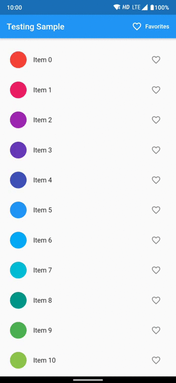

# Flutter 앱을 테스트하는 방법

> 이 문서는 Google Codelab [How to test a Flutter app](https://codelabs.developers.google.com/codelabs/flutter-app-testing#0)를 번역하여 아카이브함

# 소개

Flutter는 하나의 코드베이스를 사용해 모바일, 웹, 데스크톱을 대상으로 아름다운 네이티브 컴파일 애플리케이션을 빌드하기 위한 Google의 UI 툴킷입니다.

이 Codelab에서는 간단한 Flutter 앱을 빌드하고 테스트합니다. 앱은 상태를 관리하는 데 [Provider](https://pub.dev/packages/provider)\* 패키지를 사용합니다.

> Provider\*: Provider 외에도 Bloc, GetX 와 같은 상태관리 라이브러리도 활용 가능

## 학습할 내용

- 위젯 테스트 프레임워크를 사용하여 위젯 테스트를 만드는 방법
- integration_test 라이브러리를 사용하여 앱의 UI와 성능을 테스트하는 통합 테스트를 만드는 방법
- 단위 테스트를 활용하여 데이터 클래스(Provider)를 테스트하는 방법

## 빌드할 프로그램

이 Codelab에서는 먼저, 항목 목록이 있는 간단한 애플리케이션을 빌드합니다. 테스트에 바로 들어갈 수 있도록 소스 코드를 제공합니다. 앱은 다음과 같은 작업을 지원합니다.

- 즐겨찾기에 항목 추가
- 즐겨찾기 목록 보기
- 즐겨찾기 목록에서 항목 삭제

앱이 완성되면 다음과 같은 테스트를 작성합니다.

- 추가 및 삭제 작업의 유효성을 검사하는 단위 테스트
- 홈페이지 및 즐겨찾기 페이지의 위젯 테스트
- 통합 테스트를 사용하여 앱 전체의 UI 및 성능 테스트

Android에서 실행 중인 앱의 GIF
