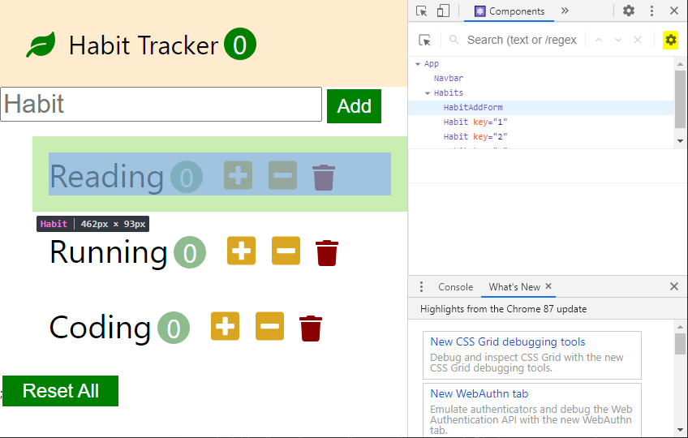
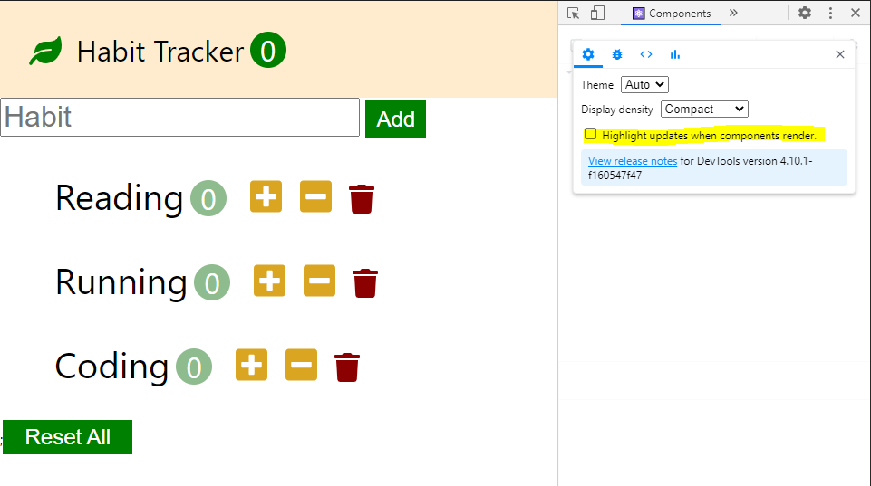

# Pure Component

## 목차

* [React의 중요한 컨셉](#react의-중요한-컨셉)
* [Habit Tracker 다시 살펴보기](#habit-tracker-다시-살펴보기)
* [Render 함수의 호출](#render-함수의-호출)
* [Component 정리](#component-정리)
* [PureComponent를 사용하는 이유](#pure-component를-사용하는-이유)
* [React Dev Tools로 re-render 확인하기](#react-dev-tools로-re-render-확인하기)
* [PureComponent와 memo](#pure-component와-memo)
* [Habit에 PureComponent 적용하기](#habit에-purecomponent-적용하기)

## React의 중요한 컨셉

```
1. 리액트는 Component들이다
2. 데이터가 조금이라도 업데이트 되면 전체적으로 어플리케이션이 다 re-render가 된다.
```

### React Component

|        Class        |    Function    |
| :-----------------: | :------------: |
|   React.Component   |    function    |
| React.PureComponent | memo(function) |
|                     |   React Hook   |

## Habit Tracker 다시 살펴보기

### src/index.js

```js
ReactDOM.render( // ReactDOM 라이브러리 활용
  <React.StrictMode>
    <App />	// 실제로 우리의 컴포넌트가 시작되는 곳
  </React.StrictMode>,
  document.getElementById("root")
  // "root"라는 ID를 가진 요소와 최상위 Component를 연결
);
```

### src/app.jsx

```js
class App extends Component {
  state = {}
  render() { // state에 따라 어떻게 표기될건지 UI가 정의된 부분
    return (
      <>
        // App에 포함된 자식요소 Navbar, Habits
        <Navbar /> // 자식요소가 없는 순수 Component
        <Habits // 자식요소를 가지고 있는 Component
          habits={this.state.habits}
        />
      </>
    );
  }
}
export default App;
```

### src/components/habits.jsx

```js
class Habits extends Component {
  state = {}
  render() {
    return (
      <>
      // HabitAddForm과 Habit 자식요소를 가지고 있다.
      <HabitAddForm />
      <ul>
        {this.props.habits.map(habit => 
          <Habit />
        )}
      </ul>;
      <button></button>
      </>
    )
  }
}

export default Habits;
```

## Render 함수의 호출

> app.jsx, habits.jsx, habit.jsx 등 각각의 Component render() 함수에 `console.log()`를 넣어주어 각각의 컴포넌트에서 render함수는 언제 호출되는지 알아보자

### 페이지를 새로고침하였을 때

> 처음 각 Component의 render() 함수에 console.log()를 넣어주게 되면 console.log()가 두 번씩 출력되는 것을 볼 수 있다.
>
> 그 이유는 다음과 같다.
>
> * `src/index.js`에서 `<React.StrictMode></React.StrictMode>`를 사용하면 한번 더 호출했을 때 잘못되는 건 없는지 검사하기 위해 두 번씩 호출한다.
> * 실제로 배포할 때는 정상적으로 한번만 동작한다. (개발하는 과정에서만 발생)
>
> 이번 시간에는 잘못되는 건 없는지 따로 검사해줄 필요가 없으므로 `<React.StrictMode></React.StrictMode>` 부분을 지우고 진행하였다.

```
app
navbar
habits
habit: Reading
habit: Running
habit: Coding
```

* 페이지를 새로고침 하면 모든 Component 가 다시 동작하여야 하므로 당연히 위와 같은 결과가 나올 것이라 예상하였을 것이다.

  하지만, 다음과 같은 경우에는 또 어떻게 될까?

### 각 버튼을 클릭하였을 때

```
app
navbar
habits
habit: Reading
habit: Running
habit: Coding
```

* habit Component의 버튼을 클릭하면 habit만 re-render 되는 것이 아니라 모든 Component가 re-render되는 것을 확인할 수 있다.

* 하지만 실제로는 React 자체에 VDOM(Virtual DOM)을 써서 업데이트 되어야 하는 요소만 DOM 요소에 업데이트 되기 때문에 성능에 문제가 없다.

* Chrome 검사창에서 Elements창을 열어놓고 버튼을 누르며 실제로 DOM요소가 어떻게 변하는지 보자!

  -> 변화가 일어나는 DOM요소 외에는 아무런 변화가 없는 것을 확인할 수 있을 것이다!

## Component 정리

React 어플리케이션은 state가 변화되면 전체적으로 Render가 다시 호출이 되지만,
Virtual DOM이라는 memory상에 Tree를 보관하고 있다가 이전과 지금 업데이트 된 것을 비교해서
실제로 필요한 부분만 DOM 요소에 업데이트 된다.

### 디버깅을 할 때 반드시 확인!!

위 의 이유로 디버깅을 하면서 `html elements part` 를 보고 페이지에서 `event`가 발생하였을 때 DOM 요소 전체가 깜빡이면서 나타나거나 변화가 많이 일어나면 어딘가 잘못되었다는 뜻!

## PureComponent를 사용하는 이유

> React VDOM에 의해 필요한 부분만 DOM 요소에서 업데이트 되므로 성능상에 문제가 없다는 것을 알게 되었다.
>
> 하지만, 그럼에도 불구하고 왜 Pure Component를 따로 사용해 주는 것일까?

### Life Cycle Method

* `componentDidUpdate()`: Component가 업데이트 될 때 마다 호출해주는 함수

  위 와 같은 함수를 사용해주게 되면 render() 함수가 동작할 때 마다 Component가 업데이트 된다고 판단해 매번 호출이 된다.

  이때 `componentDidUpdate()` 안에서 조금 무거운 일(로직)을 수행해야 한다면 예상하지 못한 화면깜빡임이나 불필요한 일들이 수행 될 수 있다.

```
React에서는 VDOM을 통해 DOM 요소만 관리해주므로 다른 부분에서 성능에 문제가 발생할 수 있다.
```

## React Dev Tools로 re-render 확인하기

```
Update가 되는 것을 Highlight 해준다.
 -> Component가 render될 때!
```

* Component 탭 오른쪽 위 톱니바퀴 모양

  (숨겨져 있을 수도 있다. 안보일 때는 창 크기를 키워주면 보인다.)



* Highlight updates when components render. 체크



## PureComponent와 memo

> Component의 state나 props에 변화가 없다면 render() 함수가 호출되지 않는다.

* [공식 문서 설명](https://reactjs.org/docs/react-api.html#reactpurecomponent)
* `React.Component` 는 `shouldComponentUpdate()` 를 구현하지 않았지만, `React.PureComponent` 는 `shouldComponentUpdate()`를 구현하였다. 

###  shouldComponentUpdate()

> 컴포넌트를 업데이트 해야할 지 안 해야 할지 알아보는 함수

* 이 전의 prop과 state를 Shallow(가볍게) 비교한다
* Shallow comparison(얇게 비교한다)의 의미
  * Object의 reference를 비교한다.
  * 반대 (Deep comparison)
    * 안의 데이터가 달라지면 다른 Object로 판단
* prop안에있는 Object의 내용이 바뀌어도 동일한 Object라면 render 함수가 호출되지 않는다.

## Habit에 PureComponent 적용하기

> `src/components/habit.jsx` 파일을 PureComponent로 바꿔보자
>
> -> 버튼을 눌러도 아무런 반응도 없다!
>
> 왜 그런걸까?

* habit은 `state`가 없고 props를 받아온다.

  이 props 안에있는 콜백함수들은 app 클래스 Component 안에 선언된 `handleIncrement()`와 같은 멤버변수들이 전달되기 때문에 한번 app이라는 Class가 만들어지고 난 이후에는 절대 변경되지 않는다.

* 따라서 Button을 누르게 되면 props의 habit이라는 Object 안에있는 Count만 변하기 때문에 결국은 동일한 Object로 판단한다.

* 따라서 `shouldComponentUpdate()`에서는 `false`를 반환하게 되고 `render()`가 호출 되지 않는다.

### 두가지 해결방법

1. 변화하는 것을 따로 빼서 Object로 전달한다.

   * `src/components/habits.jsx`

       ```html
       <Habit 
           key={habit.id} 
           habit={habit}
           count={habit.count} // 추가
       />
       ```
       
   * `src/components/habit.jsx`

       기존 코드

       ```js
       const { name, count } = this.props.habit;
       ```

       수정

       ```js
       const { name } = this.props.habit;
       const { count } = this.props;
       ```

2. Object 전체를 새로 만들어주기

   * `src/app.jsx`

     * `handleIncrement()`

         ```js
         handleIncrement = habit => {
             const habits = this.state.habits.map(item => {
                 if(item.id == habit.id) {
                     return { ...habit, count: habit.count + 1 }; 
                     // { ...habit } : habit의 key, value 들을 그대로 가져온다.
                 } 
                 return item;
             });
             this.setState({ habits });
         }
         ```
         
     * `handleDecrement()`

         ```js
         handleDecrement = habit => {
             const habits = this.state.habits.map(item => {
                 if(item.id == habit.id) {
                     const count = habit.count - 1;
                     return { ...habit, count: count < 0 ? 0 : count }; 
                     // { ...habit } : habit의 key, value 들을 그대로 가져온다.
                 } 
                 return item;
             });
             this.setState({ habits });
         }
         ```

     * `handleReset()`

         ```js
         handleReset = () => {
             const habits = this.state.habits.map(habit => {
                 if(habit.count !== 0) {
                     return { ...habit, count: 0 };
                 }
                 return habit;
             });
             this.setState({ habits });
         }
         ```


